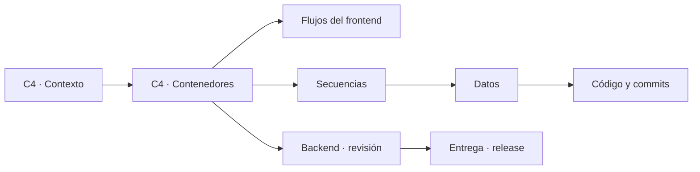

# Mapa de arquitectura Puntazo

Documentación independiente y navegable del estado real de Puntazo. Los archivos Markdown y sus bloques Mermaid son la fuente de verdad; la aplicación web sólo los transforma en una experiencia visual.

El mapa distingue **implementado**, **mock** y **propuesto** para no confundir el código actual con el spec de destino.

## Convenciones

- **Verde:** integración real con el backend.
- **Ámbar:** implementación mock o en memoria.
- **Azul:** interfaz y navegación.
- **Rojo:** brecha o contrato pendiente.

Use los nodos del diagrama para profundizar. La barra lateral permite saltar directamente a cualquier vista.
