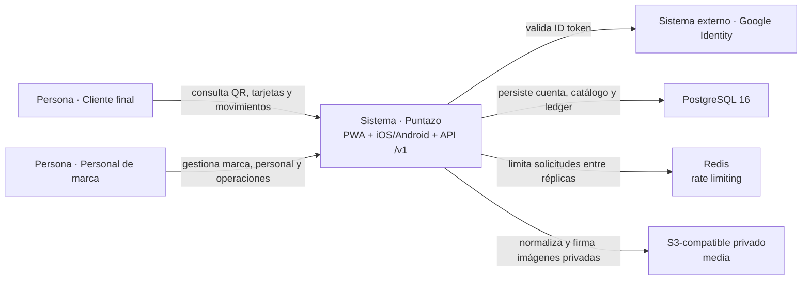

# C4 · Contexto del sistema

Puntazo conecta clientes finales y personal de marcas mediante una aplicación Expo
exportable como PWA y aplicaciones nativas. La API Go aplica identidad,
autorización comercial y transacciones de fidelidad sobre PostgreSQL; Redis y
storage S3-compatible sostienen controles operativos y media privada.

## Estado verificado

- Registro de clientes y alta demo de marcas usan API, PostgreSQL y respuestas
  versionadas. El alta demo crea propietario, sucursal y programa Sellos/Puntos;
  el primer beneficio completa el onboarding.
- Login, Google, refresh rotativo, verificación de email, reset, exportación y
  anonimización tienen rutas implementadas.
- Clientes, tarjetas, movimientos, CRUD comercial, personal, analíticas resumen
  y media privada cruzan la API. La app conserva estados de carga, error y
  recuperación en las consultas.
- Billing, analíticas por períodos/drill-down y backoffice no forman parte de
  `FREE_ACCESS_V1`.

## Referencias de código

- [Router versionado y grupos autenticados](https://github.com/am-p/app-loyalty/blob/b87b00ce41d94b4cc719934fc3cc1a8ff18803c1/cmd/server/router.go)
- [Cliente HTTP y reintento de sesión](https://github.com/gonzalotev/app-fidelidad/blob/1db7717e1aa28c2c1be7ba3538bfe9e22e0d0a01/src/core/api/client.ts)
- [Health/readiness de dependencias](https://github.com/am-p/app-loyalty/blob/b87b00ce41d94b4cc719934fc3cc1a8ff18803c1/internal/handler/health.go)
