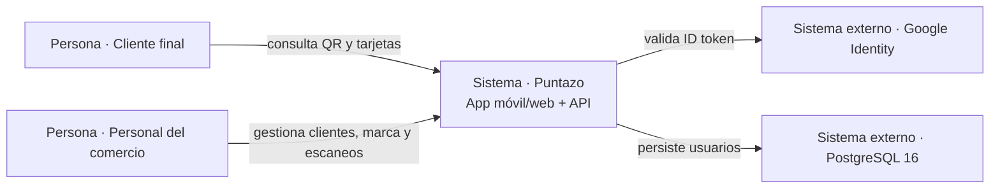

# C4 · Contexto del sistema

Puntazo conecta clientes finales y comercios mediante una aplicación Expo. El backend Go ofrece hoy únicamente identidad y sesión. Las funciones de fidelidad continúan dentro de servicios mock del frontend.

## Estado observado

- La app llama realmente a `/auth/register`, `/auth/login`, `/auth/google` y `/me`.
- Tarjetas, tienda, escaneo, perfil y analíticas se resuelven en memoria dentro del frontend.
- El backend sólo crea y consulta la tabla `users`.

## Referencias de código

- [Registro de rutas HTTP del backend](https://github.com/am-p/app-loyalty/blob/main/cmd/server/main.go#L43-L51)
- [Cliente HTTP central del frontend](https://github.com/gonzalotev/app-fidelidad/blob/main/src/core/api/client.ts#L25-L84)
- [Servicios mock de fidelidad](https://github.com/gonzalotev/app-fidelidad/blob/main/src/features/loyalty/services/loyaltyService.ts#L84-L146)
