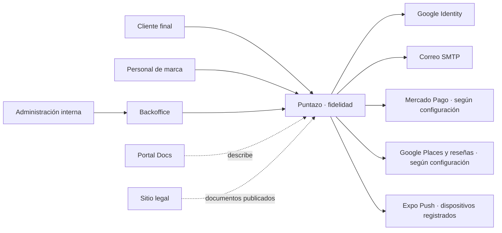

# C4 · Contexto

Revisión de fuentes y runtime del **02/10/2026, 22:10 UTC**. Los SHA y las diferencias por ambiente están en [Estado observado](#/runtime-snapshot). Esta revisión describe arquitectura e integración; no certifica todos los invariantes de negocio ni ejecuta operaciones sobre cuentas reales.

```mermaid
flowchart LR
 C[Cliente final] --> P[Puntazo · fidelidad]
 M[Personal de marca] --> P
 A[Administración interna] --> B[Backoffice]
 B --> P
 P --> G[Google Identity]
 P --> E[Correo SMTP]
 P --> MP[Mercado Pago · según configuración]
 P --> GP[Google Places y reseñas · según configuración]
 P --> X[Expo Push · dispositivos registrados]
 D[Portal Docs] -. describe .-> P
 L[Sitio legal] -. documentos publicados .-> P
 click P href "#/c4-containers" "Ver contenedores"
 click B href "#/backoffice-architecture" "Ver Backoffice"
```

- El cliente consulta su QR, tarjetas y movimientos. El personal acumula sellos/puntos y confirma canjes según su membresía y sucursal.
- `tipo_cuenta` identifica la cuenta; el rol pertenece a una membresía. El programa de fidelidad y la suscripción comercial son conceptos distintos.
- Backoffice administra clientes comerciales, precios y referidos con sesiones y roles propios.
- Google autentica identidad. Places ayuda a configurar el destino de reseñas; abrir ese destino no demuestra una reseña publicada.
- Docs y legales tienen despliegues independientes. Publicar un documento legal no acredita aprobación jurídica.

## Referencias de código

- [Rutas y límites de acceso](https://github.com/am-p/app-loyalty/blob/main/cmd/server/router.go)
- [Integraciones y workers](https://github.com/am-p/app-loyalty/blob/main/cmd/server/main.go)
