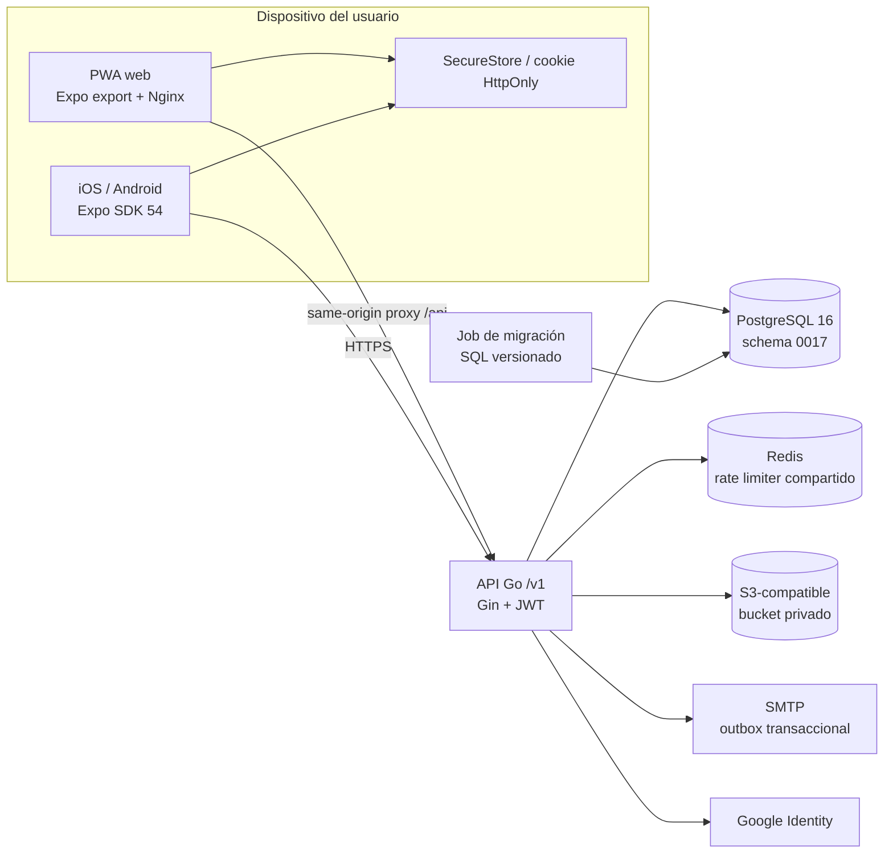

# C4 · Contenedores

## Tecnologías y estado

| Contenedor | Tecnología | Estado |
|---|---|---|
| Aplicación web | Expo SDK 54 exportada como PWA, Nginx y proxy same-origin | Implementado en el commit frontend fijado |
| Aplicaciones nativas | Expo SDK 54, React Native 0.81, IDs `com.puntazo.app` | Configurado; QA físico/publicación aún pendiente |
| API | Go 1.25, Gin, JWT, middleware de timeout/recovery/CORS/rate limit | Implementado |
| Datos | PostgreSQL 16, 17 migraciones numeradas, pool pgx | Implementado |
| Rate limiting | Redis compartido con fallback local sólo fuera de producción | Implementado |
| Media | S3-compatible privado, reencode y leases de reconciliación | Implementado; `S3_ENDPOINT` interno para operaciones y `S3_PUBLIC_ENDPOINT` sólo para GET presignado; homologación de credenciales pendiente |
| Correo | SMTP mediante outbox cifrado y worker con leases | Implementado; validación de proveedor/dominio pendiente |

## Frontera de release

- `FREE_ACCESS_V1` no expone billing ni cobros; el alta comercial exige
  código de acceso y costo cero.
- La API no crea tablas al arrancar. El job de migración aplica SQL y readiness
  exige la versión exacta configurada.
- PostgreSQL, Redis y el bucket no se publican. Sólo el proxy HTTPS debe exponer
  tráfico externo.
- Logos, iconos y beneficios se almacenan privados. WebP se valida por contenido
  y se re-encodea a JPEG/PNG; variantes de logo/icono limitan lado máximo a
  1024/512. Una falla transitoria de presign puede devolver el recurso persistido
  sin URL para recuperarla mediante listado posterior.
- `S3_ENDPOINT` permanece en la red privada para readiness, uploads y borrados.
  `S3_PUBLIC_ENDPOINT` sólo construye URLs `GET` presignadas y no publica el
  bucket, la consola ni las credenciales.
- Logs, métricas, backups, restore y QA físico son gates operativos, no efectos
  garantizados por este diagrama.

## Referencias de código

- [Composición de servidor y migrador](https://github.com/am-p/app-loyalty/blob/581776101221e31f513cbb939396f6b0603b386f/cmd/server/main.go)
- [Configuración de Redis, media y migraciones](https://github.com/am-p/app-loyalty/blob/581776101221e31f513cbb939396f6b0603b386f/internal/config/config.go)
- [Proxy y headers de la PWA](https://github.com/gonzalotev/app-fidelidad/blob/1db7717e1aa28c2c1be7ba3538bfe9e22e0d0a01/nginx/default.conf)
