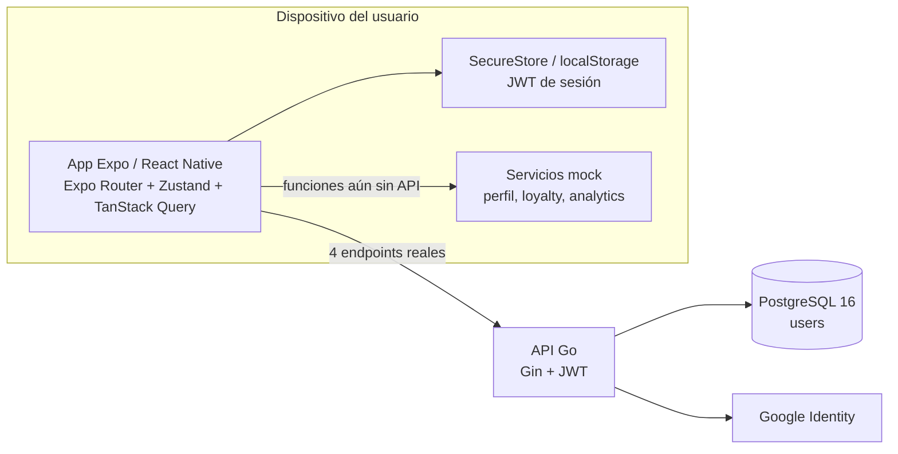

# C4 · Contenedores

La separación por contenedores evidencia el límite actual: sólo autenticación atraviesa la API; el resto vuelve a servicios locales de la aplicación.

## Tecnologías

| Contenedor | Tecnología | Estado |
|---|---|---|
| Aplicación | Expo SDK 54, React Native 0.81, Expo Router | Implementado |
| Estado cliente | Zustand y almacenamiento seguro/local | Implementado |
| Estado servidor | TanStack Query | Implementado; mayormente sobre mocks |
| API | Go 1.25, Gin, JWT | Implementado para autenticación |
| Datos | PostgreSQL 16 con pgx | Sólo tabla `users` |

## Referencias de código

- [Providers y restauración de sesión](https://github.com/gonzalotev/app-fidelidad/blob/afec4792729b48de4646168846ab221c96352f51/app/_layout.tsx#L42-L76)
- [Persistencia del token](https://github.com/gonzalotev/app-fidelidad/blob/afec4792729b48de4646168846ab221c96352f51/src/core/storage/tokenStorage.ts#L4-L32)
- [Bootstrap de API y PostgreSQL](https://github.com/am-p/app-loyalty/blob/f03b9aa202587510508a6f2a094b808f5ed6353d/cmd/server/main.go#L18-L51)
