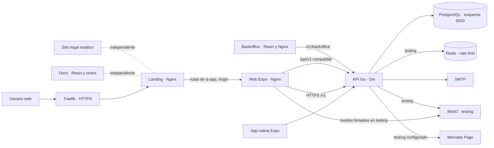

# C4 · Contenedores

Revisión de fuentes y runtime del **02/10/2026, 22:10 UTC**. Los SHA y las diferencias por ambiente están en [Estado observado](#/runtime-snapshot). Esta revisión describe arquitectura e integración; no certifica todos los invariantes de negocio ni ejecuta operaciones sobre cuentas reales.

```mermaid
flowchart LR
 U[Usuario web] --> T[Traefik · HTTPS]
 T --> L[Landing · Nginx]
 L -->|rutas de la app, /login| W[Web Expo · Nginx]
 N[App nativa Expo] --> API[API Go · Gin]
 W -->|HTTPS /v1| API
 W -->|/api/v1 compatible| API
 W -->|medios firmados en testing| S[MinIO · testing]
 B[Backoffice · React y Nginx] -->|/v1/backoffice| API
 API --> DB[(PostgreSQL · esquema 0033)]
 API -->|testing| R[(Redis · rate limit)]
 API -->|testing| S
 API --> E[SMTP]
 API -->|testing configurado| MP[Mercado Pago]
 D[Docs · React y vinext] -. independiente .- L
 LEG[Sitio legal estático] -. independiente .- L
 click API href "#/backend-components" "Ver backend"
 click W href "#/frontend-components" "Ver frontend"
 click DB href "#/data-current" "Ver datos"
 click B href "#/backoffice-architecture" "Ver Backoffice"
```

Cada ambiente conserva su propia API, base y objetos. El diagrama resume funciones; [Topología Coolify](#/coolify-deployment-topology) cuenta los recursos y distingue activos, preparados y retenidos.

| Contenedor | Tecnología y función |
|---|---|
| Landing | HTML/CSS/JS estáticos en Nginx; raíz pública de cada dominio y proxy del resto hacia la web |
| Web/PWA y app nativa | Expo SDK 54, React Native, Expo Router, Zustand y TanStack Query; servicios HTTP reales |
| API | Go, Gin, JWT, pgx; identidad, comercio, fidelidad, analíticas, suscripción, referidos y Backoffice |
| PostgreSQL | Persistencia, ledger, sesiones, outbox y notificaciones para SSE |
| Redis | Rate limit en testing; recurso productivo sin consumidor confirmado |
| MinIO | Medios privados y URLs firmadas en testing; no conectado a la API productiva observada |
| Backoffice | UI independiente; mismo origen para sus rutas API; producción preparada sin contenedor |
| Docs / legales | Publicaciones transversales separadas de los datos del producto |

## Entrada y compatibilidad

La landing sirve `/` y redirige las antiguas páginas divididas a secciones de la misma página. El resto pertenece a Expo: `/login`, rutas autenticadas, manifest y service worker. Testing conserva `/api/v1` y el prefijo público de medios para clientes instalados. No se atribuye al Compose anterior el tráfico actual: está detenido.

Producción informa esquema `0033`, pero eso no implica paridad de configuración con testing. Ver [integraciones](#/integration-matrix) y [brechas operativas](#/implementation-gaps).

## Referencias de código

- [Bootstrap API](https://github.com/am-p/app-loyalty/blob/main/cmd/server/main.go)
- [Cliente HTTP Expo](https://github.com/gonzalotev/app-fidelidad/blob/main/src/core/api/client.ts)
- [Entrada y proxy landing](https://github.com/gagonzalez1/puntazo-landing/blob/main/nginx/default.conf)
