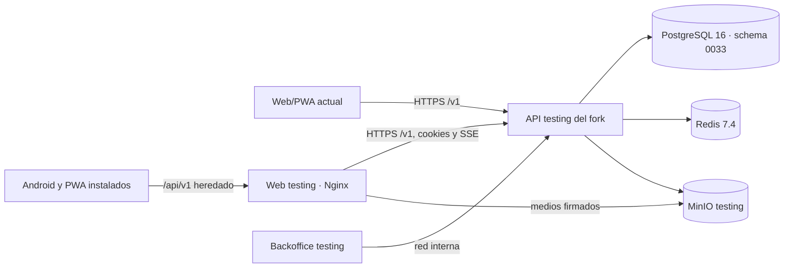
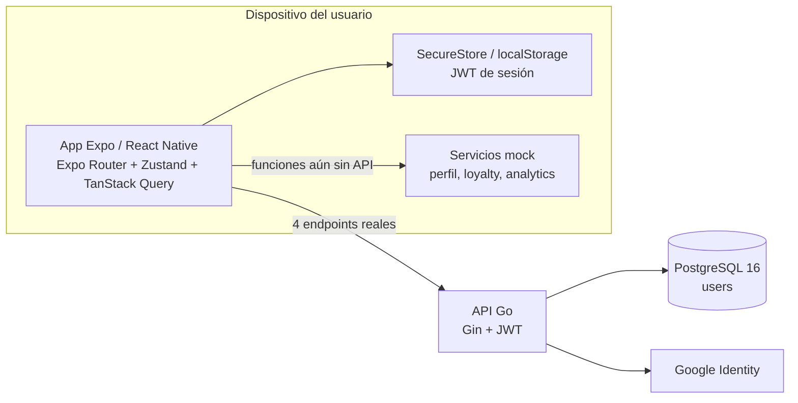

# C4 · Contenedores

## Testing desplegado · 01/10/2026

La web/PWA proviene de `gonzalotev/app-fidelidad:testing` (commit desplegado
`fc737a2`), sirve `testing.puntazo.pro/login` y compila con
`EXPO_PUBLIC_API_URL=https://api-testing.puntazo.pro`. La API proviene del fork
de publicación `gagonzalez1/app-loyalty:testing` (commit desplegado `ecd69be`),
responde en `api-testing.puntazo.pro/v1`, informa esquema `0033` y utiliza
PostgreSQL 16, Redis 7.4 y MinIO propios. Backoffice mantiene un despliegue
independiente y llega a la API por `puntazo-api-testing:8080`. El Compose
`puntazo-preview:testing` está detenido; sus volúmenes quedan retenidos.
Estos SHA son evidencia del corte, nunca selectores para futuros builds.

```mermaid
flowchart LR
    PWA[Web/PWA actual] -->|HTTPS /v1| API[API testing del fork]
    LEGACY[Android y PWA instalados] -->|/api/v1 heredado| WEB[Web testing · Nginx]
    WEB -->|HTTPS /v1, cookies y SSE| API
    WEB -->|medios firmados| MINIO[(MinIO testing)]
    BO[Backoffice testing] -->|red interna| API
    API --> PG[(PostgreSQL 16 · schema 0033)]
    API --> REDIS[(Redis 7.4)]
    API --> MINIO
```

`/api` continúa como proxy de compatibilidad y la URL de medios conserva
`testing.puntazo.pro/puntazo-staging-media`. El certificado de la API se
verifica por CA con profundidad 4 para su cadena actual. Los puertos de datos
no están publicados. Se comprobaron el mismo commit/esquema por las rutas
directa y heredada, la lectura de un medio firmado (200) y el rechazo sin
firma (403). Login/refresh con cuenta real y un evento firmado de Mercado Pago
de prueba permanecen pendientes de verificación externa.

## Documento anterior (histórico)

La separación descrita a continuación corresponde a una revisión anterior:
sólo autenticación atravesaba la API y el resto volvía a servicios locales.

```mermaid
flowchart LR
    subgraph DEVICE["Dispositivo del usuario"]
      EXPO["App Expo / React Native\nExpo Router + Zustand + TanStack Query"]
      TOKEN["SecureStore / localStorage\nJWT de sesión"]
      MOCKS["Servicios mock\nperfil, loyalty, analytics"]
    end

    API["API Go\nGin + JWT"]
    DB[("PostgreSQL 16\nusers")]
    GOOGLE["Google Identity"]

    EXPO -->|"4 endpoints reales"| API
    EXPO --> TOKEN
    EXPO -->|"funciones aún sin API"| MOCKS
    API --> DB
    API --> GOOGLE

    click EXPO href "#/frontend-components" "Ver componentes frontend"
    click MOCKS href "#/frontend-flows" "Ver flujos frontend"
    click API href "#/backend-components" "Ver componentes backend"
    click DB href "#/data-current" "Ver datos implementados"
```

## Tecnologías

| Contenedor | Tecnología | Estado |
|---|---|---|
| Aplicación | Expo SDK 54, React Native 0.81, Expo Router | Implementado |
| Estado cliente | Zustand y almacenamiento seguro/local | Implementado |
| Estado servidor | TanStack Query | Implementado; mayormente sobre mocks |
| API | Go 1.25, Gin, JWT | Implementado para autenticación |
| Datos | PostgreSQL 16 con pgx | Sólo tabla `users` |

## Referencias de código

- [Providers y restauración de sesión](https://github.com/gonzalotev/app-fidelidad/blob/main/app/_layout.tsx#L42-L76)
- [Persistencia del token](https://github.com/gonzalotev/app-fidelidad/blob/main/src/core/storage/tokenStorage.ts#L4-L32)
- [Bootstrap de API y PostgreSQL](https://github.com/am-p/app-loyalty/blob/main/cmd/server/main.go#L18-L51)
