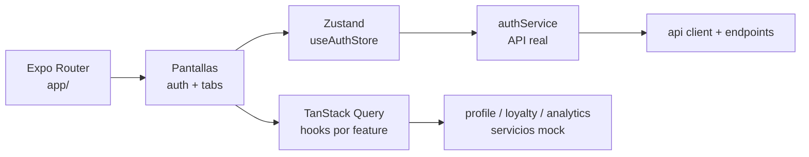

# C4 · Componentes del frontend

## Referencias de código

- [Layout raíz](https://github.com/gonzalotev/app-fidelidad/blob/99a350bd6e204a1f866d78dcfb20bd9bc108ffda/app/_layout.tsx#L27-L77)
- [Store de autenticación](https://github.com/gonzalotev/app-fidelidad/blob/99a350bd6e204a1f866d78dcfb20bd9bc108ffda/src/features/auth/store/useAuthStore.ts#L14-L107)
- [QueryClient](https://github.com/gonzalotev/app-fidelidad/blob/99a350bd6e204a1f866d78dcfb20bd9bc108ffda/src/core/queryClient.ts#L1-L10)
