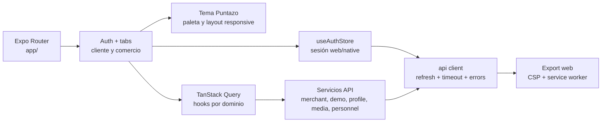

# C4 · Componentes del frontend

## Estado verificado

- Auth, onboarding demo, perfil/cuenta, comercio, sucursales, programas,
  beneficios, personal, clientes, tarjetas, analíticas, movimientos y media
  usan servicios HTTP reales contra `/v1`.
- Las mutaciones versionadas envían ETag/If-Match; invitaciones y confirmaciones
  envían UUID de idempotencia. El scanner conserva la misma clave para resolver
  respuestas inciertas.
- Web usa cookie de refresh HttpOnly con proxy same-origin; native conserva
  refresh en SecureStore. El cliente expira access tokens y rota sesiones.
- Media usa URLs firmadas temporales, renovación con backoff/circuit breaker y
  fallback visible cuando la persistencia ocurrió pero el presign no.
- La PWA tiene CSP parametrizada por API/proxy, service worker y harness Playwright;
  llamadas mutantes no se cachean.

## Referencias de código

- [Cliente HTTP y transporte de sesión](https://github.com/gonzalotev/app-fidelidad/blob/1db7717e1aa28c2c1be7ba3538bfe9e22e0d0a01/src/core/api/client.ts)
- [Servicios comerciales y media](https://github.com/gonzalotev/app-fidelidad/blob/1db7717e1aa28c2c1be7ba3538bfe9e22e0d0a01/src/features/merchant/services/mediaService.ts)
- [Configuración PWA y CSP](https://github.com/gonzalotev/app-fidelidad/blob/1db7717e1aa28c2c1be7ba3538bfe9e22e0d0a01/scripts/harden-web-export.mjs)
