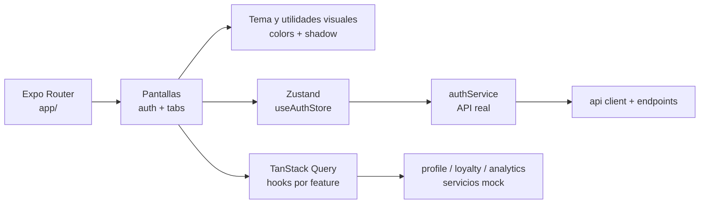

# C4 · Componentes del frontend

## Analíticas por período · entrega 01/10/2026

La rama `feat/analytics-periods-20261001` incorpora la selección diaria, semanal y mensual, navegación de fecha, estado de carga/error/vacío y gráfico de actividad. La pantalla consume el servicio de comercio y TanStack Query; la clave incluye marca, período y fecha, bajo el prefijo ya invalidado por operaciones de fidelidad. Conserva Históricas para resumen y actividad reciente. Esta entrega usa Expo SDK 54 y los tokens existentes. La PR #38 ya se integró en `gonzalotev/app-fidelidad:testing` (`b712c5d5e10154021955ae677935372eafdbdff5`); su despliegue en testing se verificó públicamente con `/analytics` HTTP 200 y bundle idéntico al del contenedor. Las cuatro vistas, navegación anterior y recarga de sesión se comprobaron en navegador con respuestas reales vacías; no se probó un dispositivo físico. El diagrama siguiente describe la arquitectura documental histórica, no el estado completo actual. Producción no se modifica.

Ver [el flujo y sus límites](#/flow-merchant-analytics). No hay fallback de métricas simuladas.

```mermaid
flowchart LR
    ROUTER["Expo Router\napp/"]
    SCREENS["Pantallas\nauth + tabs"]
    THEME["Tema y utilidades visuales\ncolors + shadow"]
    STORE["Zustand\nuseAuthStore"]
    QUERY["TanStack Query\nhooks por feature"]
    REAL["authService\nAPI real"]
    MOCK["profile / loyalty / analytics\nservicios mock"]
    HTTP["api client + endpoints"]

    ROUTER --> SCREENS
    SCREENS --> THEME
    SCREENS --> STORE
    SCREENS --> QUERY
    STORE --> REAL
    QUERY --> MOCK
    REAL --> HTTP

    click SCREENS href "#/frontend-flows" "Ver flujos por pantalla"
    click STORE href "#/flow-auth" "Ver autenticación"
    click MOCK href "#/implementation-gaps" "Ver brechas"
```

## Referencias de código

- [Layout raíz](https://github.com/gonzalotev/app-fidelidad/blob/main/app/_layout.tsx#L27-L77)
- [Store de autenticación](https://github.com/gonzalotev/app-fidelidad/blob/main/src/features/auth/store/useAuthStore.ts#L14-L107)
- [QueryClient](https://github.com/gonzalotev/app-fidelidad/blob/main/src/core/queryClient.ts#L1-L10)
- [Layout de tabs con paleta fija](https://github.com/gonzalotev/app-fidelidad/blob/main/app/(tabs)/_layout.tsx#L13-L139)
- [Utilidades compartidas de sombras](https://github.com/gonzalotev/app-fidelidad/blob/main/src/core/utils/shadow.ts#L1-L52)
