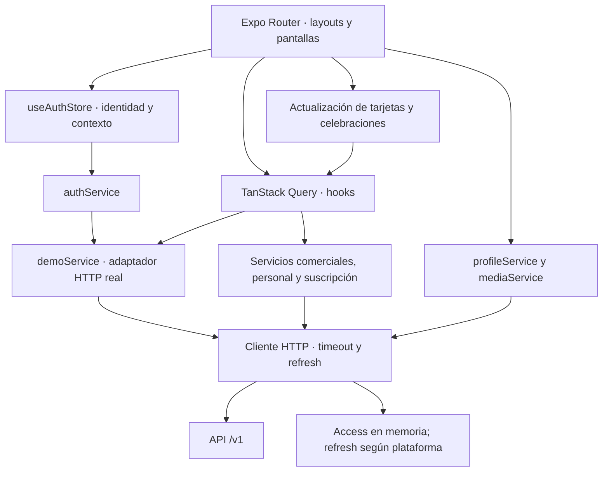

# C4 · Componentes frontend

Revisión de fuentes y runtime del **02/10/2026, 22:30–22:33 UTC**. Los SHA y las diferencias por ambiente están en [Estado observado](#/runtime-snapshot). Esta revisión describe arquitectura e integración; no certifica todos los invariantes de negocio ni ejecuta operaciones sobre cuentas reales.

```mermaid
flowchart TD
 R[Expo Router · layouts y pantallas] --> AUTH[useAuthStore · identidad y contexto]
 AUTH --> AS[authService]
 AS --> DS[demoService · adaptador HTTP real]
 R --> Q[TanStack Query · hooks]
 Q --> DS
 Q --> MS[Servicios comerciales, personal y suscripción]
 R --> PS[profileService y mediaService]
 R --> EV[Actualización de tarjetas y celebraciones]
 EV --> Q
 DS --> HTTP[Cliente HTTP · timeout y refresh]
 MS --> HTTP
 PS --> HTTP
 HTTP --> API[API /v1]
 HTTP --> TS[Access en memoria; refresh según plataforma]
```

`features/demo` conserva su nombre histórico, pero su servicio usa la API: no es prueba de datos simulados. Las pantallas muestran estados de carga, error y vacío a partir de respuestas del servidor.

- Router separa login/onboarding y pestañas. El acceso depende de cuenta activa, tipo de cuenta, membresías y contexto comercial.
- Zustand mantiene sesión, usuario, marcas y selección de sucursal. La selección local no otorga permisos en servidor.
- TanStack Query cachea e invalida lecturas tras escrituras. Los saldos confirmados vienen de movimientos persistidos.
- Access token en memoria. Web usa cookie HttpOnly para refresh; nativo guarda refresh en SecureStore. El cliente intenta una sola recuperación ante un 401 compatible.
- Web puede abrir SSE autenticado de tarjetas; el cliente combina actualización de consultas y comprobación de movimientos para las celebraciones.
- El helper de instalación PWA está integrado y publicado en las imágenes actuales de testing y landing testing. El corte final acredita sus SHA y salud; la instalación física en cada dispositivo no se verificó en esta revisión.

## Referencias de código

- [Layout y guards](https://github.com/gonzalotev/app-fidelidad/blob/main/app/(tabs)/_layout.tsx)
- [Store de identidad](https://github.com/gonzalotev/app-fidelidad/blob/main/src/features/auth/store/useAuthStore.ts)
- [Servicios de fidelidad](https://github.com/gonzalotev/app-fidelidad/blob/main/src/features/demo/services/demoService.ts)
- [Persistencia de sesión](https://github.com/gonzalotev/app-fidelidad/blob/main/src/core/storage/tokenStorage.ts)
- [Detector de movimientos](https://github.com/gonzalotev/app-fidelidad/blob/main/src/features/transactionCelebration/hooks/useCustomerMovementDetector.ts)
