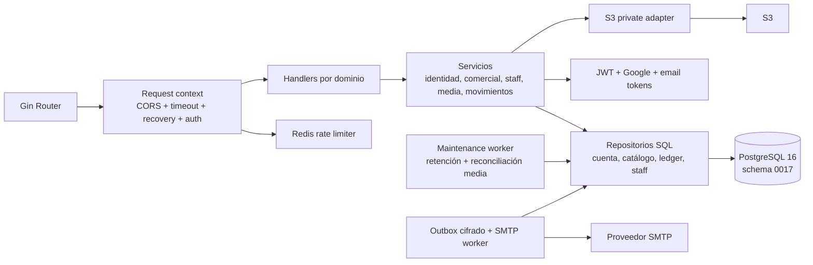

# C4 · Componentes del backend

## Responsabilidades verificadas

| Capa | Responsabilidad |
|---|---|
| Router/middleware | Agrupa rutas públicas y autenticadas; request ID, timeout, recovery, CORS, IP confiable y rate limit |
| Handlers | JSON, multipart, ETag/If-Match, errores HTTP y envelopes |
| Servicios | Reglas de identidad, cuenta, autorización por marca/sucursal, invitaciones, media y ledger |
| Repositorios | SQL parametrizado, migraciones versionadas, locks y snapshots |
| Maintenance | Retención operacional y reconciliación de uploads/borrados con leases |
| Operación | readiness de PostgreSQL/esquema/Redis/S3 y versionado de binario |

## Referencias fijadas

- [Router y rutas por dominio](https://github.com/am-p/app-loyalty/blob/6a2a8f0525df9e640d895e50e59b0e9a39960aab/cmd/server/routes_merchant.go)
- [Handler de movimientos](https://github.com/am-p/app-loyalty/blob/6a2a8f0525df9e640d895e50e59b0e9a39960aab/internal/handler/movement.go)
- [Servicio de media](https://github.com/am-p/app-loyalty/blob/6a2a8f0525df9e640d895e50e59b0e9a39960aab/internal/service/media.go)
- [Worker de mantenimiento](https://github.com/am-p/app-loyalty/blob/6a2a8f0525df9e640d895e50e59b0e9a39960aab/internal/maintenance/worker.go)
