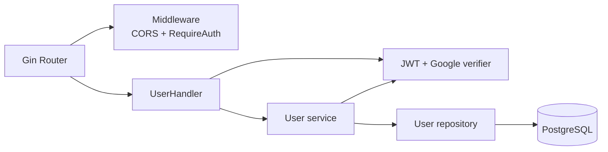

# C4 · Componentes del backend

## Referencias de código

- [Composición y rutas](https://github.com/am-p/app-loyalty/blob/f03b9aa202587510508a6f2a094b808f5ed6353d/cmd/server/main.go#L18-L51)
- [Handlers HTTP](https://github.com/am-p/app-loyalty/blob/f03b9aa202587510508a6f2a094b808f5ed6353d/internal/handler/user.go#L19-L170)
- [Repositorio SQL](https://github.com/am-p/app-loyalty/blob/f03b9aa202587510508a6f2a094b808f5ed6353d/internal/repository/user.go#L10-L58)

El diseño todavía no implementado de dominios, permisos y persistencia se mantiene
separado en el [índice de revisión del backend](#/backend-review-index).
