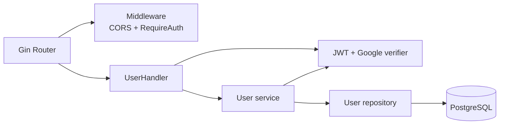

# C4 · Componentes del backend

## Analíticas por período · entrega 01/10/2026

La nueva lectura sigue router Gin → handler → service → repository pgx → ledger PostgreSQL. `GET /v1/marcas/{brand_id}/metricas/periodo` conserva la autorización de propietario del resumen histórico, calcula los límites calendarios en la zona de la marca y obtiene totales y serie en un snapshot de lectura. Utiliza el índice existente de marca/fecha, sin migración. Inputs inválidos usan los errores estables existentes. La implementación se promueve a su dueño mediante la PR oficial `am-p/app-loyalty` #26, todavía abierta. Para testing se integró mediante la PR #9 del fork en `gagonzalez1/app-loyalty:testing` (`f18ff083666e70954bfe8474a228dcca365f40bb`). El fork es fuente de publicación del entorno; no reemplaza al destino oficial. La API pública de testing reporta ese commit y esquema `0033`, con readiness HTTP 200. Producción no se modifica.

Ver [el flujo y sus límites](#/flow-merchant-analytics). El diagrama anterior es documental histórico; no es un inventario de dominios de la API actual.

```mermaid
flowchart LR
    ROUTER["Gin Router"]
    MIDDLE["Middleware\nCORS + RequireAuth"]
    HANDLER["UserHandler"]
    SERVICE["User service"]
    AUTH["JWT + Google verifier"]
    REPO["User repository"]
    DB[("PostgreSQL")]

    ROUTER --> MIDDLE
    ROUTER --> HANDLER
    HANDLER --> SERVICE
    HANDLER --> AUTH
    SERVICE --> AUTH
    SERVICE --> REPO
    REPO --> DB

    click HANDLER href "#/sequence-register" "Ver secuencia de registro"
    click AUTH href "#/sequence-google" "Ver Google Auth"
    click DB href "#/data-current" "Ver tabla users"
```

## Referencias de código

- [Composición y rutas](https://github.com/am-p/app-loyalty/blob/main/cmd/server/main.go#L18-L51)
- [Handlers HTTP](https://github.com/am-p/app-loyalty/blob/main/internal/handler/user.go#L19-L170)
- [Repositorio SQL](https://github.com/am-p/app-loyalty/blob/main/internal/repository/user.go#L10-L58)

El diseño todavía no implementado de dominios, permisos y persistencia se mantiene
separado en el [índice de revisión del backend](#/backend-review-index).
