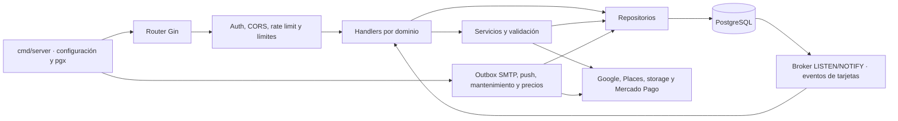

# C4 · Componentes backend

Revisión de fuentes y runtime del **02/10/2026, 22:10 UTC**. Los SHA y las diferencias por ambiente están en [Estado observado](#/runtime-snapshot). Esta revisión describe arquitectura e integración; no certifica todos los invariantes de negocio ni ejecuta operaciones sobre cuentas reales.

```mermaid
flowchart LR
 BOOT[cmd/server · configuración y pgx] --> ROUTER[Router Gin]
 ROUTER --> MW[Auth, CORS, rate limit y límites]
 MW --> H[Handlers por dominio]
 H --> S[Servicios y validación]
 H --> REPO[Repositorios]
 S --> REPO
 REPO --> PG[(PostgreSQL)]
 S --> EXT[Google, Places, storage y Mercado Pago]
 BOOT --> WORK[Outbox SMTP, push, mantenimiento y precios]
 WORK --> REPO
 WORK --> EXT
 PG --> SSE[Broker LISTEN/NOTIFY · eventos de tarjetas]
 SSE --> H
 click PG href "#/data-current" "Ver persistencia"
```

| Dominio | Entrada implementada |
|---|---|
| Identidad | Registro, login, Google, refresh/logout, verificación y recuperación, cambio de email |
| Cuenta | `/v1/me`, foto, exportación y baja |
| Comercio | Marcas, sucursales, programas SELLOS/PUNTOS, beneficios, imágenes, personal e invitaciones |
| Cliente | QR/código, tarjetas, historial, push y solicitudes de reseña |
| Operación | Preview, acumulación, canje y consulta de resultado por clave idempotente |
| Analíticas | Resumen e historial por día/semana/mes a partir del ledger y zona horaria de la marca |
| Suscripción y referidos | Checkout, resultado, cancelación, webhook, códigos, atribuciones y recompensas |
| Backoffice | Login/cookie, clientes, campañas, influenciadores, precios, historial y liquidación |

REST tiene plazo de 12 segundos; el stream SSE se registra por separado y revalida sesión. Backoffice tiene sesiones propias, respuestas sin caché, límite de cuerpo y cabecera de escritura. Los repositorios usan PostgreSQL para permisos, transacciones y versiones. Los providers de media, rate limit, correo y cobro dependen del entorno.

Las migraciones se ejecutan con `cmd/migrate`; `0033` es el esquema observado. No se crea una única tabla `users` al iniciar el servidor.

## Referencias de código

- [Router](https://github.com/am-p/app-loyalty/blob/main/cmd/server/router.go)
- [Rutas comerciales](https://github.com/am-p/app-loyalty/blob/main/cmd/server/routes_merchant.go)
- [Rutas cliente](https://github.com/am-p/app-loyalty/blob/main/cmd/server/routes_customer.go)
- [Movimientos](https://github.com/am-p/app-loyalty/blob/main/internal/repository/movement.go)
- [Workers y proveedores](https://github.com/am-p/app-loyalty/blob/main/cmd/server/main.go)
- [Migrador](https://github.com/am-p/app-loyalty/blob/main/cmd/migrate/main.go)
