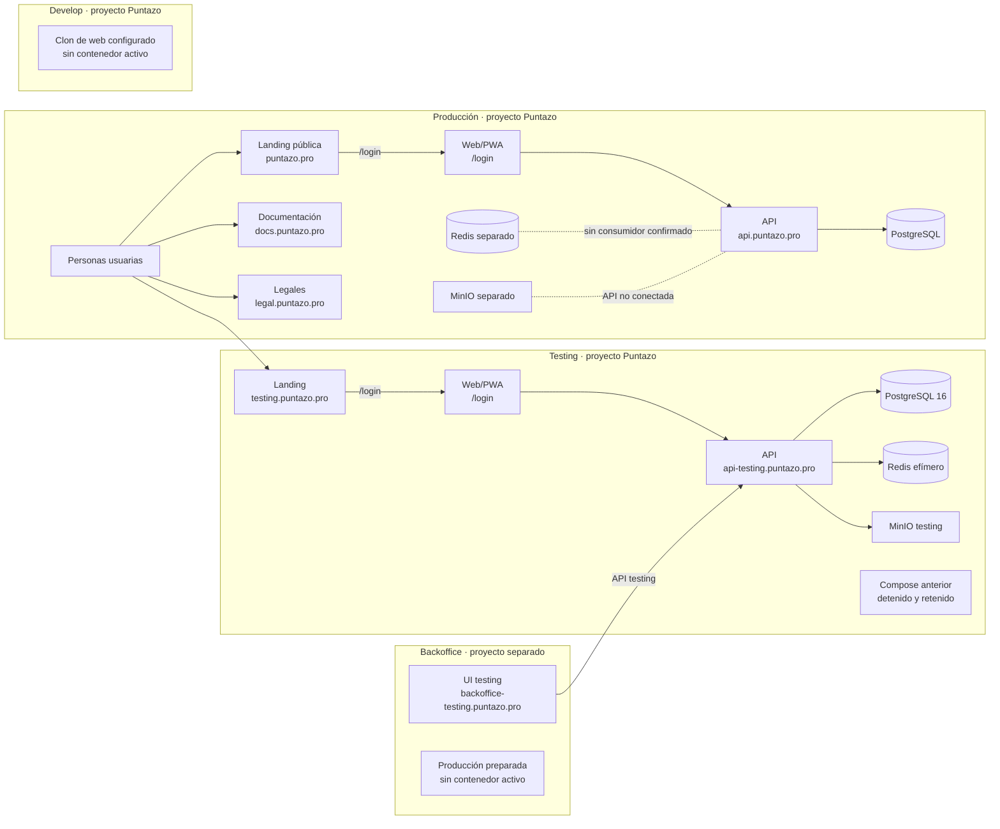

# Topología desplegada · Coolify

Esta vista resume cómo están distribuidos los recursos de Puntazo en Coolify.
La distribución se volvió a comprobar el **02/10/2026, 22:30–22:33 UTC**, mediante API oficial de Coolify y runtime Docker. Describe ese corte; el panel puede cambiar después. Ver [versiones y configuración observadas](#/runtime-snapshot).

El portal es público. Por eso muestra funciones y conexiones, pero omite IP de
administración, credenciales, UUID de Coolify, nombres de redes internas y otros
datos de operación. Los procedimientos detallados siguen en la documentación
privada de infraestructura. Para la arquitectura interna de la aplicación,
consultar [C4 · Contenedores](#/c4-containers).

## Mapa de ambientes

La flecha del Backoffice representa su integración con la API de testing. El
aislamiento estricto de red entre ambos proyectos no está confirmado en el
corte operativo; no se infiere sólo de que usen proyectos separados.

## Recursos por ambiente

| Ámbito | Recursos activos o preparados | Persistencia e integración |
|---|---|---|
| Producción Puntazo | Landing, web/PWA, API, PostgreSQL, Redis, MinIO, sitio de documentación y sitio legal | PostgreSQL guarda los datos de la API. Redis no tiene consumidor actual confirmado. MinIO está separado y la API productiva no está conectada a él. |
| Testing Puntazo | Landing, web/PWA, API, PostgreSQL, Redis, MinIO y Compose anterior detenido | Base y objetos son propios de testing. Redis es efímero. El Compose anterior permanece detenido y sus volúmenes se conservan durante la ventana de retención documentada. |
| Backoffice testing | UI de administración y conexión a la API de testing | Aplicación y ciclo de despliegue separados del proyecto Puntazo principal. |
| Develop Puntazo | Copia de web configurada desde `app-fidelidad:develop`, sin contenedor activo | Recurso adicional creado durante esta revisión; no se atribuye tráfico público ni una conexión API validada. |
| Backoffice producción | Recurso configurado, sin contenedor en ejecución | Preparado; no se considera un Backoffice productivo activo. |

El inventario del corte registra **18 recursos configurados**: 12 aplicaciones,
4 servicios de datos y 2 servicios adicionales, distribuidos entre Puntazo (production/testing/develop) y
Backoffice. El Compose anterior detenido cuenta como recurso retenido, no como
tráfico vigente. Los jobs puntuales ejecutados por Compose no se cuentan como
aplicaciones permanentes.

## Entrada y tráfico

- El dominio público `puntazo.pro` sirve la landing y conserva la aplicación
  web bajo `/login`.
- `testing.puntazo.pro` sirve la landing de testing y `/login` para su web/PWA.
- Las APIs de producción y testing se publican por HTTPS en dominios separados.
- Los sitios de documentación y legales son recursos web independientes.
- PostgreSQL, Redis y MinIO no publican puertos de datos directamente a
  Internet. La aplicación y sus servicios de datos se comunican mediante las
  redes administradas para cada entorno.

## Actualización de esta vista

Este resumen se genera a partir del inventario operativo, luego de quitar los
identificadores y procedimientos internos. Al cambiar un recurso, actualizar
primero el inventario de Coolify y después esta página para conservar sus
relaciones y estados. Las ramas y SHA de builds son evidencia de cada despliegue;
no son selectores para el siguiente.

## Configuración de API por ambiente

Testing usa Redis, media S3/MinIO, SMTP y Mercado Pago configurado. En producción, las variables de rate limit, media y cobro están ausentes y el código aplica `memory`, `disabled` y `disabled`; SMTP está configurado. `APP_ENV` tampoco está declarado como producción. La existencia de los recursos de datos no demuestra consumo por la API. Ambos `/version` informan esquema `0033`.

La UI testing y su landing publicaron los cambios PWA mientras se actualizaba este portal; sus imágenes coinciden con los HEAD testing del corte final. Docs/legal tienen ciclo de publicación independiente. [Procedimiento para actualizar Docs](#/documentation-sync-plan).

El inventario inicial tenía 17 recursos. Coolify creó una copia de web en `puntazo/develop` a las 22:10 UTC; el corte final incluye ese recurso sin contenedor y no lo considera una web disponible. La documentación privada de infraestructura debe conciliar ese ambiente adicional con la convención testing/production.
