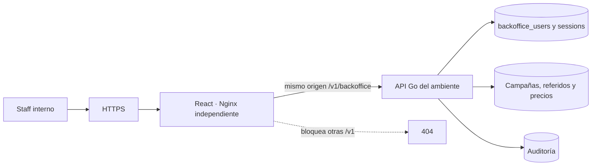

# Backoffice · Arquitectura e integración

Revisión de fuentes y runtime del **02/10/2026, 22:10 UTC**. Los SHA y las diferencias por ambiente están en [Estado observado](#/runtime-snapshot). Esta revisión describe arquitectura e integración; no certifica todos los invariantes de negocio ni ejecuta operaciones sobre cuentas reales.

Testing está activo y su `/healthz` responde 200. Producción está preparada y no tiene contenedor; su estado `exited` no se interpreta como una caída de un servicio previamente publicado.

- El repositorio privado `gagonzalez1/puntazo-backoffice` posee la UI y su empaquetado. `am-p/app-loyalty` posee API y migraciones.
- Login usa email/contraseña del staff. La API guarda sesión separada del JWT de producto y emite cookie HttpOnly, Secure bajo HTTPS y SameSite Strict, limitada a `/v1/backoffice`.
- Las escrituras autenticadas exigen `X-Backoffice-Request: 1`. Las funciones distinguen roles de administración y finanzas.
- Nginx sólo proxifica `/v1/backoffice/*`; las demás `/v1/*` responden 404. Mantiene resolución renovable del upstream y respuestas sin caché.
- UI muestra clientes comerciales, campañas, influenciadores/códigos, atribuciones/recompensas y precios/historial según contrato y rol. La API mantiene las operaciones financieras.
- La imagen testing usa `latest` y no lleva etiqueta de revisión: su SHA fuente **no quedó acreditado por metadatos runtime**. El HEAD testing consultado no se atribuye automáticamente a ese contenedor.

No se publican usuarios, contraseñas ni datos de cuentas en Docs. El aislamiento de red sigue pendiente de demostración en la topología operativa.

## Referencias de código

- [Sesiones y cookie internas](https://github.com/am-p/app-loyalty/blob/main/internal/handler/backoffice.go)
- [Rutas actuales](https://github.com/am-p/app-loyalty/blob/main/cmd/server/router.go)
- [Persistencia interna](https://github.com/am-p/app-loyalty/blob/main/migrations/0023_referrals.up.sql)
