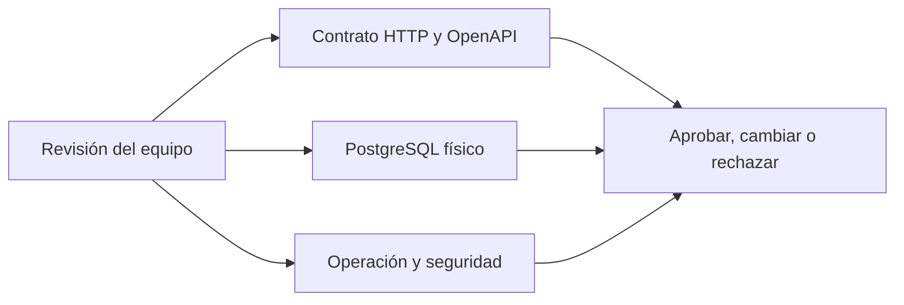

# Backend · Índice de revisión

> **PROPUESTA CODEX — NO APROBADA TODAVÍA.** Este bloque completa los huecos del
> backend para poder discutir un contrato concreto. No representa código implementado
> ni reemplaza una decisión del equipo.

## Qué ya quedó acordado

- Puntos, sellos y saldos usan únicamente números enteros.
- El cliente final no administra marcas en el MVP.
- Una marca puede tener varias sucursales y paga una unidad por cada sucursal.
- El saldo cliente–marca se comparte entre las sucursales activas de esa marca.
- El MVP 1 usa Sellos o Puntos, no ambos simultáneamente.
- La suscripción pertenece a la marca, no a la persona.

## Propuestas que requieren decisión humana

| Revisar | ID | Tema | Propuesta Codex |
|---|---|---|---|
| [ ] | `PC-01` | Fórmula de Puntos | Dinero en centavos enteros, división entera y descarte del resto |
| [ ] | `PC-02` | Backoffice | Identidad separada, MFA y roles Sistema, Finanzas y Soporte |
| [ ] | `PC-03` | Suscripción | Mes calendario, sin prorrateo y cambios en próxima renovación |
| [ ] | `PC-04` | HTTP | Envelope, errores, paginación, filtros, `If-Match` e idempotencia |
| [ ] | `PC-05` | Invitaciones | Token de un uso, 72 horas, email coincidente y revocación |
| [ ] | `PC-06` | Beneficios | Baja lógica y snapshot histórico; sin borrado físico normal |
| [ ] | `PC-07` | Imágenes | Storage S3-compatible privado, 5 MiB y borrado diferido |
| [ ] | `PC-08` | Analíticas | Resumen, serie temporal y drill-down paginado |
| [ ] | `PC-09` | PostgreSQL | Tipos, índices, checks y reglas `ON DELETE` |
| [ ] | `PC-10` | Concurrencia | Lock por tarjeta, idempotencia y tres reintentos con jitter |
| [ ] | `PC-11` | Migraciones | SQL versionado y estrategia expand/contract |
| [ ] | `PC-12` | Seguridad | Access de 15 min, refresh rotativo de 30 días y auditoría |
| [ ] | `PC-13` | Versionado | Toda ruta objetivo bajo `/v1` |
| [ ] | `PC-14` | Scan | Preview sin mutación antes de confirmar acumulación o canje |

## Orden sugerido para la reunión

1. Aprobar `PC-01`, `PC-03` y los precios comerciales, porque modifican datos y facturación.
2. Aprobar roles y permisos de `PC-02`.
3. Recorrer en [`openapi.yaml`](/openapi.yaml) un caso de alta de marca, scan, canje y cambio de suscripción.
4. Validar `PC-05`, `PC-06` y `PC-07`, que definen ciclos de vida.
5. Aprobar PostgreSQL, seguridad y operación antes de crear migraciones.

La versión detallada y normativa está en el [spec completo `v1.5-review`](#/backend-full-spec).
