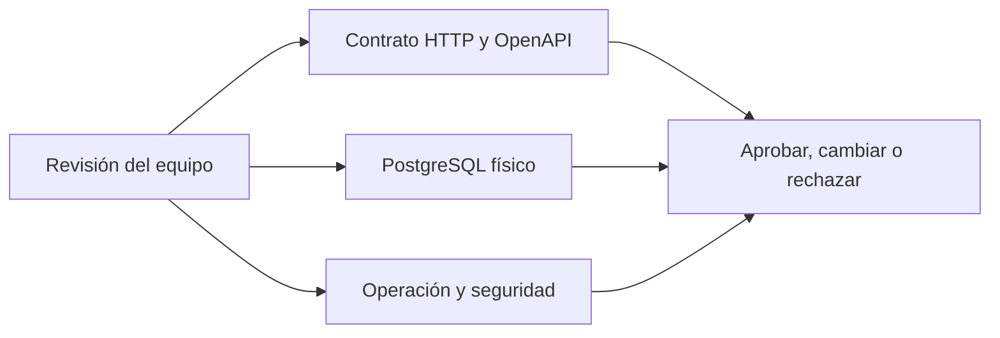

# Backend · Índice de revisión

> **AUTORIDAD MIXTA.** Las decisiones `PR-01` a `PR-09` fueron aprobadas por el
> usuario para la primera release. Siguen siendo contrato objetivo: no representan
> código implementado. Las `PC-xx` no cubiertas explícitamente continúan propuestas.

## Qué ya quedó acordado

- Puntos, sellos y saldos usan únicamente números enteros.
- El cliente final no administra marcas en el MVP.
- Una marca puede tener varias sucursales y paga una unidad por cada sucursal.
- El saldo cliente–marca se comparte entre las sucursales activas de esa marca.
- El MVP 1 usa Sellos o Puntos, no ambos simultáneamente.
- La suscripción pertenece a la marca, no a la persona.

## Decisiones aprobadas para la primera release

| Estado | ID | Alcance aprobado |
|---|---|---|
| [x] | `PR-01` | Release gratuita protegida por código de acceso y sin billing |
| [x] | `PR-02` | Puntos manuales `1..100000`; confirmación reforzada desde `10001`; beneficios hasta `10000000` |
| [x] | `PR-03` | Edición completa con `If-Match`, baja lógica y snapshots históricos |
| [x] | `PR-04` | Media privada S3-compatible, máximo 5 MiB |
| [x] | `PR-05` | Roles de marca/Backoffice e invitaciones de un uso con vigencia de 72 horas |
| [x] | `PR-06` | PWA, iOS y Android; identificador nativo `com.puntazo.app` |
| [x] | `PR-07` | Anonimización de cuenta preservando el ledger inmutable |
| [x] | `PR-08` | Gates de CI, SLO, backup/restore, incidentes y QA físico antes de producción |
| [x] | `PR-09` | Email verificado, proveedor de correo y recuperación segura con revocación de sesiones |

El registro normativo, las exclusiones y la frontera de implementación están en
[Decisiones de preparación productiva](#/backend-decision-log).

## Propuestas que todavía requieren decisión humana

| Revisar | ID | Tema | Propuesta Codex |
|---|---|---|---|
| [~] | `PC-01` | Fórmula de Puntos | Sustituida para la primera release por ingreso manual según `PR-02` |
| [ ] | `PC-02` | Backoffice | Identidad separada, MFA y roles Sistema, Finanzas y Soporte |
| [ ] | `PC-03` | Suscripción | Diferida: la primera release no crea billing ni suscripciones pagas |
| [x] | `PC-04` | HTTP | Aprobada en el alcance de edición, `If-Match`, envelopes e idempotencia de `PR-03` |
| [x] | `PC-05` | Invitaciones | Aprobada por `PR-05` |
| [x] | `PC-06` | Beneficios | Aprobada por `PR-03` |
| [x] | `PC-07` | Imágenes | Aprobada por `PR-04` |
| [ ] | `PC-08` | Analíticas | Resumen, serie temporal y drill-down paginado |
| [ ] | `PC-09` | PostgreSQL | Tipos, índices, checks y reglas `ON DELETE` |
| [ ] | `PC-10` | Concurrencia | Lock por tarjeta, idempotencia y tres reintentos con jitter |
| [ ] | `PC-11` | Migraciones | SQL versionado y estrategia expand/contract |
| [ ] | `PC-12` | Seguridad | Access de 15 min, refresh rotativo de 30 días y auditoría |
| [ ] | `PC-13` | Versionado | Toda ruta objetivo bajo `/v1` |
| [ ] | `PC-14` | Scan | Preview sin mutación antes de confirmar acumulación o canje |

## Próximo orden de decisión

1. Implementar y verificar el contrato gratuito aprobado sin activar rutas de billing.
2. Cerrar `PC-09` a `PC-12` antes de una migración productiva.
3. Resolver identidad fiscal/legal, precios y `PC-03` antes de diseñar cobros.
4. Aprobar `PC-08` si analíticas forma parte del corte productivo.

La versión detallada y normativa está en el [spec completo `v1.5-review`](#/backend-full-spec).
