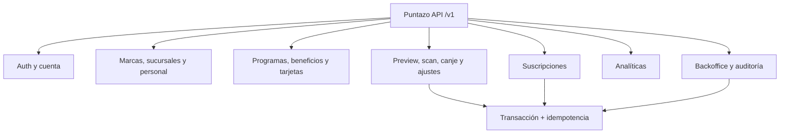

# Backend · Contrato API propuesto

> **PROPUESTA CODEX `PC-02` a `PC-08`, `PC-12` a `PC-14`.** El archivo
> [`openapi.yaml`](/openapi.yaml) es el contrato formal de transporte y debe revisarse
> antes de generar handlers o SDK.

## Convenciones propuestas

- Base URL: `/v1`.
- Recurso individual: `{ "data": {...}, "request_id": "..." }`.
- Colección: agrega `pagination` con `page`, `page_size`, `total_items` y `total_pages`.
- Error: `code`, `message`, `details` y `request_id`.
- Mutaciones concurrentes: `If-Match` y respuesta `412 PRECONDITION_FAILED`.
- Scan, canje, ajustes y suscripciones: header `Idempotency-Key` UUID obligatorio.
- Paginación MVP: página 1, tamaño 20 por defecto y máximo 100.
- Un recurso de otra marca responde `404` para no revelar su existencia.

## Contratos de mayor riesgo

| Operación | Request determinante | Resultado |
|---|---|---|
| `POST /movimientos/preview` | QR, sucursal, operación, importe o beneficio | Cálculo temporal sin mutar saldo |
| `POST /movimientos/scan` | `preview_id`, QR, sucursal, centavos y moneda | Movimiento `CREDITO` y saldo posterior |
| `POST /movimientos/canje` | `preview_id`, QR, sucursal y beneficio | Movimiento `DEBITO` y remanente |
| `POST /backoffice/.../suscripciones` | plan, sucursales, inicio y motivo | Suscripción y snapshots de precio |
| `PATCH /backoffice/suscripciones/{id}` | acción discriminada y motivo | Cambio inmediato o programado |
| `POST /marcas/{id}/invitaciones` | email, rol y sucursales | Invitación de un solo uso |

## Autorización propuesta

- `PROPIETARIO`: configuración total de su marca y personal.
- `ADMINISTRADOR`: configuración, sucursales y personal, salvo convertir propietarios.
- `OPERADOR`: scan/canje sólo en sucursales asignadas.
- `SOPORTE`: lectura y ajustes con motivo; no factura.
- `FINANZAS`: suscripciones; no ajusta saldos.
- `ADMIN_SISTEMA`: planes y operación interna completa, siempre auditada.

El cliente final sólo accede a `/clientes/me` y a sus propias tarjetas y movimientos.
