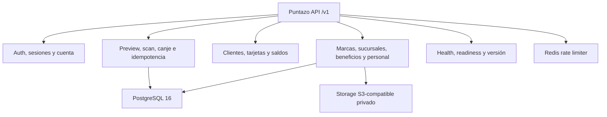

# Backend · Contrato API implementado

> **Fuente: código.** El contrato canónico es [openapi.yaml](/openapi.yaml) y
> coincide con la implementación verificada en el backend
> [50e95e9407ee5ffaccfc3cebcbef464d24f26427](https://github.com/gagonzalez1/app-loyalty/tree/50e95e9407ee5ffaccfc3cebcbef464d24f26427),
> rama `staging`; no implica integración en `main` ni en el upstream.
> Cada operación declarada `IMPLEMENTED` en ese archivo tiene handler, persistencia,
> autorización y pruebas en esa revisión. Las extensiones futuras de billing no
> forman parte de este contrato.

## Convenciones implementadas

- Base versionada: `/v1`; las respuestas usan `data` y `request_id`.
  Las colecciones agregan `pagination`.
- Mutaciones editables usan `If-Match` con ETag fuerte y devuelven
  `412 PRECONDITION_FAILED` cuando falta, es inválido o está desactualizado.
- Alta demo y mutaciones de movimientos usan `Idempotency-Key` UUID; un replay
  devuelve el resultado persistido sin duplicar efectos.
- `X-Client-Platform: web` transporta refresh mediante cookie HttpOnly,
  Secure y SameSite=Strict; `native` recibe el refresh en JSON.
- `/health/ready` valida PostgreSQL, la versión exacta del esquema, Redis y
  storage privado S3 cuando media está habilitado.
- `S3_ENDPOINT` se usa para readiness, uploads y borrados internos; las URLs
  `GET` presignadas usan `S3_PUBLIC_ENDPOINT` limpio y separado para no filtrar
  el host privado.
- `SELLOS` acredita una unidad por acumulación. `PUNTOS` recibe
  `cantidad_puntos` sólo en preview, entre 1 y 100.000; la confirmación
  consume el snapshot inmutable. Los beneficios aceptan 1..10.000.000.
- Registro de cliente y alta demo exigen email, contraseña de 10..72 bytes
  compatibles con bcrypt. Login por contraseña requiere email verificado.
  Verificación y reset responden `202` genérico; los tokens son de un uso,
  hash en base y vencen a las 24 h y 1 h.
- Los movimientos conservan `operation`, `branch_id`, `benefit_id` y
  snapshots históricos de programa/beneficio. La resolución de una operación
  incierta usa `GET /movimientos/idempotencia/{idempotency_key}`.

## Operaciones de mayor riesgo

| Dominio | Operaciones implementadas | Garantía observable |
|---|---|---|
| Salud | `GET /health/live`, `GET /health/ready`, `GET /version` | `200` con `status: ok`; readiness devuelve `503` si falla una dependencia |
| Identidad | registro, login, Google, refresh, logout, verificación y reset | sesiones rotativas; revocación al reutilizar/resetear |
| Cuenta | `GET/PATCH/DELETE /me`, `GET /me/export` | ETag, exportación autorizada, anonimización `202` preservando ledger |
| Comercio | marcas, sucursales, programa y beneficios | edición, reactivación y baja lógica; tipo de programa se bloquea con beneficios/movimientos |
| Personal | invitaciones y `/marcas/{brand_id}/personal/{id_membresia}` | identificador es membership_id entero; invitación de un uso, UUID, 72 h |
| Media | listar/subir/eliminar imágenes privadas | WebP se decodifica y re-encodea a JPEG/PNG; logo/icono se reducen a 1024/512; URL firmada puede omitirse si el presign falla |
| Fidelidad | clientes, tarjetas, preview, scan y canje | transacción serializable, locks, reintentos acotados e idempotencia |

## Autorización implementada

- `PROPIETARIO` configura la marca y personal según sus invariantes.
- `ADMINISTRADOR` tiene alcance global de la marca; no recibe sucursales
  asignadas y no puede convertir propietarios.
- `OPERADOR` sólo puede operar y consultar las sucursales incluidas en
  `branch_ids`/`sucursal_ids`; el servidor exige al menos una asignación.
- Un recurso fuera de la marca o del alcance responde `404` cuando corresponde,
  sin revelar ownership. `ACCOUNT_MODE_CONFLICT` evita convertir una cuenta
  cliente no vacía al aceptar una invitación.

## Referencias fijadas

- [Router y grupos autenticados](https://github.com/gagonzalez1/app-loyalty/blob/50e95e9407ee5ffaccfc3cebcbef464d24f26427/cmd/server/router.go)
- [Rutas de movimientos](https://github.com/gagonzalez1/app-loyalty/blob/50e95e9407ee5ffaccfc3cebcbef464d24f26427/cmd/server/routes_movement.go)
- [Handlers de personal y media](https://github.com/gagonzalez1/app-loyalty/blob/50e95e9407ee5ffaccfc3cebcbef464d24f26427/internal/handler/staff.go)
- [Health/readiness](https://github.com/gagonzalez1/app-loyalty/blob/50e95e9407ee5ffaccfc3cebcbef464d24f26427/internal/handler/health.go)

Billing, analíticas por período, backoffice y otras operaciones que no aparecen en
el OpenAPI canónico continúan fuera del alcance de esta release.
