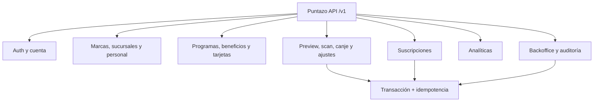

# Backend · Contrato API propuesto

> **AUTORIDAD MIXTA.** `PR-01` a `PR-09` están aprobadas para `FREE_ACCESS_V1`.
> El archivo [`openapi.yaml`](/openapi.yaml) es el contrato formal de transporte;
> las operaciones siguen sin implementar y billing permanece diferido.

## Convenciones propuestas

- Base URL: `/v1`.
- Recurso individual: `{ "data": {...}, "request_id": "..." }`.
- Colección: agrega `pagination` con `page`, `page_size`, `total_items` y `total_pages`.
- Error: `code`, `message`, `details` y `request_id`.
- Mutaciones concurrentes: `If-Match` y respuesta `412 PRECONDITION_FAILED`.
- Scan, canje, ajustes y suscripciones: header `Idempotency-Key` UUID obligatorio.
- Paginación MVP: página 1, tamaño 20 por defecto y máximo 100.
- Un recurso de otra marca responde `404` para no revelar su existencia.
- Puntos: carga manual `1..100000`; preview marca confirmación reforzada desde `10001`.
- Movimientos preservan el transporte v1 existente: `operation`, `branch_id`,
  `benefit_id` y respuestas con `id`, `balance_before`, `amount`, `balance_after`.
- Beneficios: `requisito_cantidad` entre `1` y `10000000`.
- Primera release: alta comercial con código, costo cero y ninguna ruta de billing activa.
- Producción: login por contraseña requiere email verificado. El registro puede
  responder `verification_required: true` y omitir por completo la sesión.
- Solicitudes de verificación y reset responden siempre `202` genérico. Sus tokens
  se almacenan hasheados, son de un uso y vencen a las 24 h y 1 h respectivamente.
- Google sólo marca el email local como verificado si el ID token trae
  `email_verified=true`; un reset exitoso revoca todas las sesiones.

## Contratos de mayor riesgo

| Operación | Request determinante | Resultado |
|---|---|---|
| `POST /movimientos/preview` | `operation`, QR/código, `branch_id` y sólo aquí `cantidad_puntos` o `benefit_id` | Snapshot temporal con `id`, `balance_before`, `amount` y `balance_after` |
| `POST /movimientos/scan` | `preview_id`, QR/código y `branch_id`; no reenvía puntos | Consume snapshot inmutable y crea movimiento `CREDITO` |
| `POST /movimientos/canje` | `preview_id`, QR/código, `branch_id` y `benefit_id` | Consume snapshot inmutable, crea `DEBITO` y conserva remanente |
| `PATCH /me` | `If-Match` + `{nombre, apellido?, alias?, foto_url?}` | Perfil actualizado con nueva versión |
| `GET /me/export` | Sesión autenticada | Exportación JSON de perfil, membresías, tarjetas y movimientos |
| `DELETE /me` | `If-Match` + `{confirmacion:"ANONIMIZAR"}` y `auth_time <= 10 min` | Anonimización con sesiones revocadas y ledger preservado |
| `POST /marcas/{id}/invitaciones` | email, rol y sucursales | Invitación de un solo uso |
| `POST /auth/email-verification/request` | `{email}` | `202` genérico; token de un uso por 24 h |
| `POST /auth/email-verification/confirm` | `{token}` | Marca el email como verificado |
| `POST /auth/password-reset/request` | `{email}` | `202` genérico; token de un uso por 1 h |
| `POST /auth/password-reset/confirm` | `{token,new_password}` | Cambia la clave y revoca sesiones |

## Autorización propuesta

- `PROPIETARIO`: configuración total de su marca y personal.
- `ADMINISTRADOR`: configuración, sucursales y personal, salvo convertir propietarios.
- `OPERADOR`: scan/canje sólo en sucursales asignadas.
- `SOPORTE`: lectura y ajustes con motivo; no factura.
- `FINANZAS`: suscripciones; no ajusta saldos.
- `ADMIN_SISTEMA`: planes y operación interna completa, siempre auditada.

El cliente final sólo accede a `/clientes/me` y a sus propias tarjetas y movimientos.

Las rutas de planes y suscripciones están marcadas `DEFERRED_BILLING` en OpenAPI.
No forman parte de `FREE_ACCESS_V1` y no deben exponerse hasta una decisión comercial,
fiscal y legal posterior.
