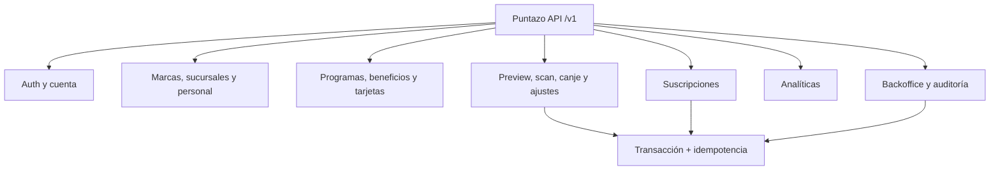

# Backend · Contrato API propuesto

> **AUTORIDAD MIXTA.** `PR-01` a `PR-08` están aprobadas para `FREE_ACCESS_V1`.
> El archivo [`openapi.yaml`](/openapi.yaml) es el contrato formal de transporte;
> las operaciones siguen sin implementar y billing permanece diferido.

## Convenciones propuestas

- Base URL: `/v1`.
- Recurso individual: `{ "data": {...}, "request_id": "..." }`.
- Colección: agrega `pagination` con `page`, `page_size`, `total_items` y `total_pages`.
- Error: `code`, `message`, `details` y `request_id`.
- Mutaciones concurrentes: `If-Match` y respuesta `412 PRECONDITION_FAILED`.
- Scan, canje, ajustes y suscripciones: header `Idempotency-Key` UUID obligatorio.
- Paginación MVP: página 1, tamaño 20 por defecto y máximo 100.
- Un recurso de otra marca responde `404` para no revelar su existencia.
- Puntos: carga manual `1..100000`; preview marca confirmación reforzada desde `10001`.
- Beneficios: `requisito_cantidad` entre `1` y `10000000`.
- Primera release: alta comercial con código, costo cero y ninguna ruta de billing activa.

## Contratos de mayor riesgo

| Operación | Request determinante | Resultado |
|---|---|---|
| `POST /movimientos/preview` | QR, sucursal, operación, cantidad manual de puntos o beneficio | Cálculo temporal sin mutar saldo |
| `POST /movimientos/scan` | `preview_id`, QR, sucursal y `cantidad_puntos` cuando aplica | Movimiento `CREDITO`, snapshots y saldo posterior |
| `POST /movimientos/canje` | `preview_id`, QR, sucursal y beneficio | Movimiento `DEBITO` y remanente |
| `PATCH /me` | `If-Match` + `{nombre, apellido?, alias?, foto_url?}` | Perfil actualizado con nueva versión |
| `GET /me/export` | Sesión autenticada | Exportación JSON de perfil, membresías, tarjetas y movimientos |
| `DELETE /me` | `If-Match` + `{confirmacion:"ANONIMIZAR"}` y `auth_time <= 10 min` | Anonimización con sesiones revocadas y ledger preservado |
| `POST /marcas/{id}/invitaciones` | email, rol y sucursales | Invitación de un solo uso |

## Autorización propuesta

- `PROPIETARIO`: configuración total de su marca y personal.
- `ADMINISTRADOR`: configuración, sucursales y personal, salvo convertir propietarios.
- `OPERADOR`: scan/canje sólo en sucursales asignadas.
- `SOPORTE`: lectura y ajustes con motivo; no factura.
- `FINANZAS`: suscripciones; no ajusta saldos.
- `ADMIN_SISTEMA`: planes y operación interna completa, siempre auditada.

El cliente final sólo accede a `/clientes/me` y a sus propias tarjetas y movimientos.

Las rutas de planes y suscripciones están marcadas `DEFERRED_BILLING` en OpenAPI.
No forman parte de `FREE_ACCESS_V1` y no deben exponerse hasta una decisión comercial,
fiscal y legal posterior.
