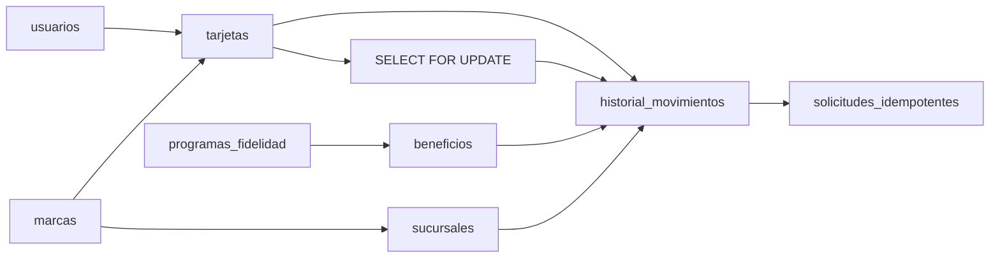

# Backend · PostgreSQL físico propuesto

> **PROPUESTA CODEX `PC-09`, `PC-10` y `PC-11`.** No son migraciones ejecutadas.

## Tipos e invariantes

| Concepto | PostgreSQL propuesto |
|---|---|
| IDs | `BIGINT GENERATED ALWAYS AS IDENTITY` |
| Tiempo | `TIMESTAMPTZ` UTC |
| Email | `CITEXT` único |
| Estado/rol | `TEXT` + `CHECK` |
| Dinero | `BIGINT` en unidad mínima + `CHAR(3)` |
| Saldos y cantidades | `BIGINT`, nunca negativos |
| Optimismo | `version INTEGER NOT NULL DEFAULT 1` |

Un movimiento guarda `operacion` y `sentido` por separado. `ACUMULACION` siempre
es `CREDITO`; `CANJE`, `DEBITO`; un `AJUSTE` admite ambos. `cantidad` es siempre
positiva y el check verifica la aritmética entre saldo anterior y posterior.

## Eliminación y trazabilidad

- Usuarios, marcas, sucursales, tarjetas y beneficios: baja lógica y FKs `RESTRICT`.
- Historial: nunca se elimina y nunca queda huérfano.
- Asignaciones sin historia: `CASCADE` sólo en correcciones administrativas.
- Beneficio canjeado: conserva snapshot de nombre y requisito.
- Imagen: desvinculación inmediata y borrado del objeto después de 24 horas.

## Índices mínimos

- Email, Google ID y QR hasheado únicos.
- Membresía única por usuario y marca; índice por marca, rol y activo.
- Tarjeta única por usuario y marca.
- Programa único por marca y tipo; máximo uno activo en MVP 1.
- Suscripción activa única por marca.
- Movimiento por tarjeta y fecha descendente; por sucursal y fecha.
- Operación y tipo de saldo únicos para evitar doble escritura.
- Invitación pendiente única por marca y email.

## Transacción de saldo

1. Reservar idempotencia.
2. Validar actor, sucursal, marca, plan y suscripción.
3. Crear tarjeta con `ON CONFLICT DO NOTHING` cuando falta.
4. Bloquear tarjeta con `SELECT ... FOR UPDATE`.
5. Revalidar beneficio y calcular con enteros.
6. Actualizar saldo, insertar movimiento y persistir respuesta.
7. Confirmar todo en un único commit.

El orden de locks es tarjeta → beneficio → suscripción. Los errores PostgreSQL
`40001` y `40P01` admiten hasta tres reintentos con jitter.
