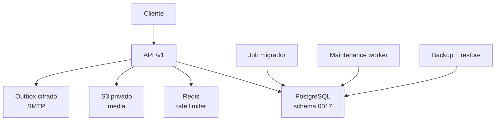

# Backend · Seguridad y operación

La revisión combina controles comprobados en el backend con gates que sólo pueden
cerrarse en un ambiente de staging/producción. La presencia de un endpoint o un
worker no sustituye la homologación de sus dependencias.

## Estado implementado

- `/health/live` responde `200` con `status: ok`.
- `/health/ready` responde `200` únicamente cuando PostgreSQL responde, la
  versión de esquema coincide con `EXPECTED_SCHEMA_VERSION`, Redis está listo y
  S3 responde cuando media está habilitado. Una dependencia no disponible devuelve
  `503 DEPENDENCY_UNAVAILABLE`.
- `/version` informa versión, SHA declarado en `GIT_COMMIT` y esquema esperado.
  Configurar `EXPECTED_SCHEMA_VERSION` no ejecuta migraciones.
- El migrador aplica SQL numerado con advisory lock; la API no crea tablas al
  arrancar. La base de esta release requiere 17 migraciones.
- El rate limiter usa Redis compartido y claves derivadas; el fallback local está
  permitido sólo fuera de producción. Producción exige Redis TLS y cierre ante
  dependencia no disponible.
- El worker de mantenimiento aplica retención acotada y reconcilia uploads
  interrumpidos/borrados mediante leases persistidos, sin borrar dentro del request.

## Sesiones, identidad y límites

- Access JWT dura 900 segundos. Refresh es opaco, hasheado, rotativo y distinto
  por transporte: cookie web HttpOnly/Secure/SameSite=Strict o JSON native en
  SecureStore.
- Reutilizar un refresh rotado revoca su familia. Reset de contraseña revoca
  sesiones activas. Tokens de verificación/reset son one-use y se guardan como hash,
  con expiración de 24 h/1 h.
- Login, identidad, onboarding y movimientos tienen rate limits con `Retry-After`;
  límites distribuidos requieren Redis configurado.
- JSON tiene límite de 1 MiB. Los endpoints multipart limitan cada imagen a 5 MiB
  antes de decodificar; uploads tienen límites globales y por actor.
- Logs estructurados incluyen request ID, ruta, status y duración sin JWT, QR,
  tokens, contraseñas ni cuerpos sensibles.

## Media privada implementada

- S3-compatible privado con credenciales de mínimo privilegio y SSE `AES256`
  enviado en cada upload cuando media está habilitado.
- `S3_ENDPOINT` es el endpoint interno para readiness, uploads y borrados.
  `S3_PUBLIC_ENDPOINT` sólo se usa para firmar lecturas `GET`; debe ser una URL
  HTTP(S) limpia, y en producción HTTPS. Las operaciones de escritura nunca
  dependen de ese endpoint público.
- El backend autentica/autorizada al actor antes de decodificar, valida bytes reales
  y acepta JPEG, PNG y WebP. WebP se re-encodea a JPEG/PNG seguro.
- Límite de 5 MiB, 4096 px por lado y 16 megapíxeles para el archivo; logos se
  reducen proporcionalmente a 1024 px y iconos a 512 px. PostgreSQL conserva
  checksum, MIME normalizado, dimensiones y estado.
- URLs firmadas son efímeras y no son credenciales del cliente. Si el objeto ya
  quedó activo pero falla únicamente el presign, la respuesta de upload mantiene
  `201` y devuelve el recurso persistido sin `url`/`url_expires_at`; se
  recupera con `GET /marcas/{brand_id}/imagenes`.
- El borrado lógico retira la imagen de las lecturas y agenda el borrado físico;
  el worker reintenta con leases y no deja el objeto público.

## Autorización y trazabilidad

- `PROPIETARIO` configura la marca; `ADMINISTRADOR` tiene alcance global de
  marca; `OPERADOR` sólo puede usar las sucursales asignadas en `branch_ids`.
- Recursos de personal se identifican con `membership_id`, no `user_id`.
  El servidor exige coherencia de rol/asignaciones y bloquea cambios sobre sí mismo
  o sobre el último propietario.
- Mutaciones editables usan ETag/If-Match. Movimientos usan transacción serializable,
  locks, reintentos sólo para `40001`/`40P01` e idempotencia UUID.
- Auditoría detallada de Backoffice no está expuesta en la release gratuita; no
  debe presentarse como implementada.

## Evidencia pendiente antes de GO

| Gate | Evidencia requerida | Estado |
|---|---|---|
| PostgreSQL | Migración separada, backup cifrado, restore cronometrado y prueba con datos de staging | Pendiente de staging |
| Redis | TLS, límites compartidos, fail-closed y recovery probado | Pendiente de homologación |
| S3 | Upload/list/delete real, SSE, expiración de URL, reconciliación y permisos | Pendiente de homologación |
| SMTP | Dominio autenticado, entrega, rebotes/supresiones y enlaces HTTPS | Pendiente de homologación |
| Observabilidad | Dashboards, alertas, SLO acordados, dueño de guardia y runbook | Pendiente de configuración |
| PWA/native | HTTPS, cookies, cámara, instalación PWA, builds y QA físico iOS/Android | Pendiente de staging/QA |
| Rollback | Artefacto anterior y migración expand/contract o procedimiento compatible ensayado | Pendiente de ensayo |

> Los valores internos de disponibilidad, p95, RPO y RTO del checklist son
> **PROPUESTA OPERATIVA**, no SLA público ni evidencia de cumplimiento. El GO
> requiere resultados medidos y revisión humana.

## Referencias fijadas

- [Readiness y versionado](https://github.com/gagonzalez1/app-loyalty/blob/50e95e9407ee5ffaccfc3cebcbef464d24f26427/internal/handler/health.go)
- [Rate limiter Redis](https://github.com/gagonzalez1/app-loyalty/blob/50e95e9407ee5ffaccfc3cebcbef464d24f26427/internal/middleware/ratelimit.go)
- [Media privada y reconciliación](https://github.com/gagonzalez1/app-loyalty/blob/50e95e9407ee5ffaccfc3cebcbef464d24f26427/internal/service/media.go)
- [Worker de mantenimiento](https://github.com/gagonzalez1/app-loyalty/blob/50e95e9407ee5ffaccfc3cebcbef464d24f26427/internal/maintenance/worker.go)
