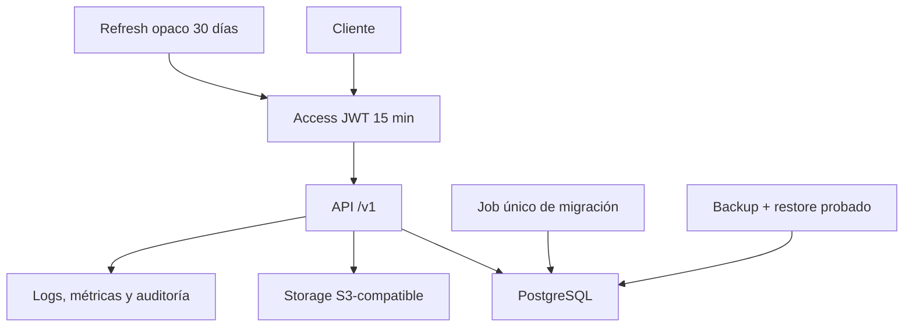

# Backend · Seguridad y operación propuestas

> **PROPUESTA CODEX `PC-07`, `PC-11` y `PC-12`.** Requiere revisión de seguridad e infraestructura.

## Sesiones y límites

- Access JWT: 15 minutos, audiencia separada para app y Backoffice.
- Refresh: token opaco hasheado, 30 días, rotación y detección de reutilización.
- MFA obligatorio para Backoffice en producción.
- Login: 10 intentos por IP cada 10 minutos, más límite por email.
- Scan/canje: 60 operaciones por operador y minuto.
- JSON: máximo 1 MiB. Imagen: máximo 5 MiB.

## Imágenes

- Bucket privado S3-compatible; claves generadas por backend.
- Sólo JPEG, PNG y WebP, validados por contenido real.
- Variantes normalizadas: logo `1024×1024`, icono `512×512`.
- Checksum SHA-256 y metadatos en PostgreSQL.
- Eliminar significa desvincular y programar; no borrar dentro del request.

## Migraciones

- SQL numerado y versionado en Git; sin crear tablas al iniciar la API.
- Job único antes del despliegue.
- Expand → código compatible → backfill → verificación → contract.
- Índices grandes con `CREATE INDEX CONCURRENTLY`.
- Backup verificado y rollback antes de cambios destructivos.

## Observabilidad y recuperación

- Logs JSON con `request_id`, actor, marca, ruta, status y duración, sin secretos.
- Métricas de latencia, 5xx, DB, scans, canjes, locks e idempotencias.
- Alertas iniciales: 5xx mayor a 2 % por 5 min, p95 mayor a 1 s o DB no disponible.
- Backups diarios, retención 30 días y restauración probada mensualmente.
- `/health/live`, `/health/ready` y `/version`; readiness comprueba esquema requerido.

Toda mutación de Backoffice registra actor, motivo y estados anterior/posterior en
una auditoría inmutable.
