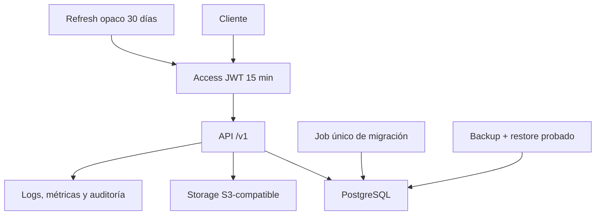

# Backend · Seguridad y operación propuestas

> **AUTORIDAD MIXTA.** Storage privado de hasta 5 MiB y evidencia operativa previa
> al release están aprobados en `PR-04` y `PR-08`. Sesiones, umbrales y diseño físico
> de migraciones siguen como `PROPUESTA CODEX PC-11/PC-12` hasta su revisión.

## Sesiones y límites

- Access JWT: 15 minutos, audiencia separada para app y Backoffice.
- Refresh: token opaco hasheado, 30 días, rotación y detección de reutilización.
- MFA obligatorio para Backoffice en producción.
- Login: 10 intentos por IP cada 10 minutos, más límite por email.
- Scan/canje: 60 operaciones por operador y minuto.
- JSON: máximo 1 MiB. Imagen: máximo 5 MiB.

## Imágenes

- Bucket privado S3-compatible; claves generadas por backend (`PR-04`, aprobado).
- Sólo JPEG, PNG y WebP, validados por contenido real.
- Variantes normalizadas: logo `1024×1024`, icono `512×512`.
- Checksum SHA-256 y metadatos en PostgreSQL.
- Eliminar significa desvincular y programar; no borrar dentro del request.
- El cliente no recibe credenciales del bucket; descarga mediante URL firmada breve
  o un endpoint autenticado y autorizado.

## Migraciones

- SQL numerado y versionado en Git; sin crear tablas al iniciar la API.
- Job único antes del despliegue.
- Expand → código compatible → backfill → verificación → contract.
- Índices grandes con `CREATE INDEX CONCURRENTLY`.
- Backup verificado y rollback antes de cambios destructivos.

## Observabilidad y recuperación

- Logs JSON con `request_id`, actor, marca, ruta, status y duración, sin secretos.
- Métricas de latencia, 5xx, DB, scans, canjes, locks e idempotencias.
- Alertas iniciales: 5xx mayor a 2 % por 5 min, p95 mayor a 1 s o DB no disponible.
- Backups diarios, retención 30 días y restauración probada mensualmente.
- `/health/live`, `/health/ready` y `/version`; readiness comprueba esquema requerido.

### Objetivos internos iniciales

> **PROPUESTA OPERATIVA; NO ES UN SLA PÚBLICO.** El responsable de producto y
> operaciones debe aceptar o sustituir estos valores antes del GO comercial.

| Indicador | Objetivo interno | Ventana / evidencia |
|---|---:|---|
| Disponibilidad API | `>= 99,5 %` | mensual, probes externos excluyendo mantenimiento anunciado |
| Latencia API | `p95 <= 1 s` | 5 min, separada por ruta y status |
| Errores servidor | `< 2 %` de respuestas | 5 min; page al superar el umbral |
| Recuperación de datos | `RPO <= 24 h` | backup cifrado diario verificado |
| Recuperación de servicio | `RTO <= 4 h` | restore aislado y runbook cronometrado |

La release no se habilita con dashboards vacíos: se exige tráfico sintético, alertas
probadas, propietario de guardia y un restore completo documentado. El checklist
canónico está en [`docs/delivery/01-production-release-checklist.md`](#/production-release-checklist).

## Incidentes y rollback

- Severidad: `SEV-1` pérdida/corrupción o exposición de datos; `SEV-2` login,
  scan/canje o acceso comercial indisponible; `SEV-3` degradación con workaround.
- `SEV-1/2` exige incident commander, canal, bitácora temporal y actualización a
  responsables; toda comunicación externa necesita dueño identificado.
- Detener escrituras si hay corrupción potencial. Conservar logs y evidencia sin
  copiar secretos ni PII a tickets o chats.
- Rollback de aplicación usa el artefacto inmutable anterior. Una migración sólo se
  revierte si su `down` fue ensayado; de lo contrario se restaura servicio con código
  compatible y una migración correctiva expand/contract.
- Tras recuperar: validar health, smoke test de login/preview/scan/canje, reconciliar
  idempotencias y movimientos, y completar postmortem sin culpables.

Toda mutación de Backoffice registra actor, motivo y estados anterior/posterior en
una auditoría inmutable.
