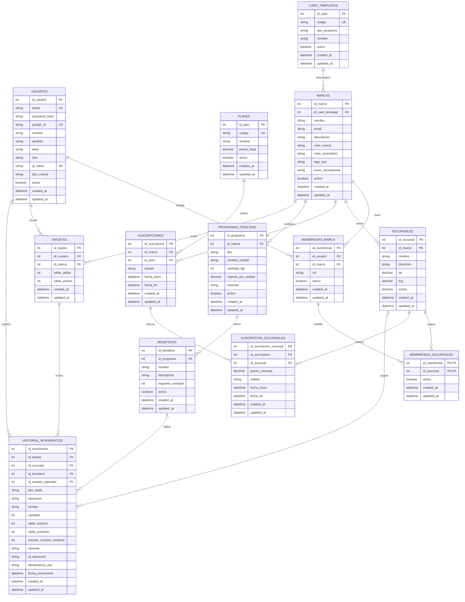

# Backend para Puntazo — spec corregido

Estado: **borrador consolidado para revisión del equipo**  
Versión: `v1.5-review`  
Fecha: **19 de agosto de 2026**

> **IMPORTANTE:** las decisiones identificadas como `PROPUESTA CODEX PC-xx` fueron
> diseñadas por Codex a partir del contexto disponible. No representan todavía una
> decisión aprobada ni una funcionalidad implementada. El equipo debe aprobarlas,
> modificarlas o rechazarlas usando el índice siguiente.

## 0. Índice de revisión del equipo

### 0.1 Cómo leer el documento

| Etiqueta | Significado |
|---|---|
| `ACORDADO` | Decisión de negocio confirmada durante las conversaciones con el equipo |
| `PROPUESTA CODEX` | Diseño completado por Codex para evitar huecos; requiere revisión humana |
| `IMPLEMENTADO` | Comportamiento comprobado en el código actual |
| `FUTURO` | Diseño reservado para una versión posterior al MVP |

### 0.2 Propuestas que deben revisarse

| Revisar | ID | Tema | Propuesta resumida | Sección |
|---|---|---|---|---|
| [ ] | `PC-01` | Puntos enteros | Calcular con importes en centavos enteros, dividir y descartar el resto | 15.1 |
| [ ] | `PC-02` | Backoffice | Autenticación separada, MFA y roles `ADMIN_SISTEMA`, `FINANZAS`, `SOPORTE` | 15.2 |
| [ ] | `PC-03` | Suscripción | Ciclo mensual sin prorrateo en MVP; cambios en próxima renovación | 15.3 |
| [ ] | `PC-04` | Contrato HTTP | Envelope uniforme, códigos estables, paginación y filtros comunes | 16 |
| [ ] | `PC-05` | Invitaciones | Token de un solo uso, vencimiento 72 h, email coincidente y revocación | 17 |
| [ ] | `PC-06` | Beneficios | `DELETE` lógico; nunca borrar físicamente si existe historial | 18 |
| [ ] | `PC-07` | Imágenes | Storage S3-compatible, validación, metadatos y borrado diferido | 19 |
| [ ] | `PC-08` | Analíticas | Contratos JSON comunes para resumen, series y drill-down paginado | 20 |
| [ ] | `PC-09` | PostgreSQL | Tipos físicos, `CHECK`, FKs, índices y reglas `ON DELETE` | 21 |
| [ ] | `PC-10` | Concurrencia | Locks por tarjeta/suscripción, idempotencia y reintentos controlados | 22 |
| [ ] | `PC-11` | Migraciones | Migraciones SQL versionadas y despliegue expand/contract | 23 |
| [ ] | `PC-12` | Sesiones y seguridad | Access token corto, refresh rotativo, rate limits y auditoría | 24 |
| [ ] | `PC-13` | Versionado API | Servir el contrato objetivo bajo `/v1` y migrar las cuatro rutas actuales | 16.5 |
| [ ] | `PC-14` | Confirmación de scan | Preview sin mutación antes de acumular o canjear | 16.6 |

### 0.3 Archivos que forman el contrato

1. Este documento define negocio, permisos, persistencia y decisiones.
2. `openapi.yaml` define rutas, requests, responses y errores HTTP.
3. `puntazo-docs/docs/backend/00-review-index.md` presenta el índice visual para humanos y LLM.
4. El código sólo se considera implementado cuando coincide con estos contratos y tiene migraciones y pruebas.

## Evolución desde `backend-spec.html`

Este apartado registra cómo evolucionó el contrato desde el HTML original hasta este documento. Resume y hace trazables las correcciones surgidas de la relectura técnica, la reunión del 13 de agosto y las definiciones de negocio validadas entre el 14 y el 15 de agosto.

### Fuentes consideradas

1. `backend-spec.html`: primera definición del backend, basada principalmente en el comportamiento de los mocks del frontend.
2. `reelectura-documentacion.md`: observaciones, inconsistencias y preguntas detectadas durante la reunión.
3. Código actual de frontend y backend: utilizado para separar lo implementado de lo documentado o simulado.
4. Definiciones de negocio posteriores: marca con varias sucursales, saldo compartido, facturación por sucursal y evolución de Sellos/Puntos.

### Cambios acumulados

| Área | En `backend-spec.html` | En el documento actual |
|---|---|---|
| Producto | Se presenta como LoyaltyPro | Se documenta como Puntazo |
| Unidad comercial | La entidad principal es `tiendas`; cada usuario comercio queda asociado a una tienda | La entidad principal es `marcas`; cada marca posee una o más `sucursales` |
| Franquicias | No existe una definición consistente para varias sucursales de una misma marca | No se crea una entidad `franquicias`: una franquicia se representa como una marca con varias sucursales |
| Cuentas | Un único `Usuario` toma el rol `CLIENTE_FINAL` o `TIENDA` según el plan contratado | `tipo_cuenta` distingue `CLIENTE_FINAL` y `PERSONAL_MARCA`; el cliente final no administra marcas en el MVP |
| Administración | Un usuario de tipo tienda administra implícitamente una sola tienda | Una cuenta de personal puede integrar y administrar varias marcas mediante `membresias_marca` |
| Personal y permisos | No se modelan empleados, roles internos ni asignaciones operativas | Se agregan `PROPIETARIO`, `ADMINISTRADOR` y `OPERADOR`, además de asignaciones en `membresias_sucursales` |
| Identidad del cliente | `usuarios` y `clientes_finales` duplican email, nombre y fechas | Se unifican en `usuarios`; tarjetas y QR usan directamente `id_usuario` |
| Registro | El plan elegido durante el onboarding determina el rol de la cuenta | El usuario elige `CLIENTE_FINAL` o `PERSONAL_MARCA`; el primer propietario crea su marca y los demás ingresan por invitación |
| Planes | `GRATIS`, `TIENDA_SELLOS` y `TIENDA_PUNTOS`; el plan contiene el beneficio y determina el rol | Los planes de marca son `SELLOS` y `PUNTOS`; `AMBOS` queda preparado e inactivo para un MVP posterior |
| Cliente final | El plan `GRATIS` crea una suscripción y determina su rol | El alta del cliente es gratuita y no crea una suscripción; genera usuario, QR y sesión |
| Suscripción | Pertenece al usuario, guarda un precio mensual y se crea o edita desde endpoints públicos | Pertenece exclusivamente a la marca y factura cada sucursal mediante `suscripcion_sucursales`; Backoffice administra sus cambios |
| Alta de marca | La tienda surge como efecto lateral de contratar un plan comercial | `POST /marcas` crea la marca y asigna al usuario autenticado el rol `PROPIETARIO` |
| Contratos POST | Un único alta de suscripción mezcla usuario, rol, tienda y plan | Se separan `POST /auth/register`, `POST /marcas`, alta de sucursales, aceptación de invitaciones y suscripción de Backoffice |
| Sucursales | Son dependencias de una tienda sin incidencia clara en permisos, operación o cobro | Son puntos operativos, ámbitos de autorización y unidades facturables; una sucursal suspendida no puede operar |
| Configuración de fidelidad | Tipo, reglas de Sellos/Puntos y beneficio quedan repartidos entre plan, tienda y catálogos fijos | `programas_fidelidad` concentra las reglas por marca y permite evolucionar de un programa activo a Sellos y Puntos simultáneos |
| Beneficios | `beneficios` identifica el tipo de fidelidad y `premios` guarda recompensas por tienda | `beneficios` representa recompensas configurables, vinculadas al programa y con un requisito numérico de canje |
| Tarjetas | La tarjeta relaciona cliente–tienda mediante una clave compuesta | La tarjeta relaciona usuario cliente–marca, tiene identidad propia y una restricción única por usuario y marca |
| Saldos | `sellos` y `puntos` pertenecen a cada tienda | `saldo_sellos` y `saldo_puntos` conviven en la tarjeta y se comparten entre todas las sucursales de la marca |
| Sellos | Cada scan suma uno y el contador entra en un ciclo al completar la meta | Cada compra suma una cantidad fija configurada; el canje descuenta sólo la cantidad requerida |
| Puntos | Cada scan suma un valor fijo configurado en la tienda | Los puntos son enteros, dependen del importe y se calculan en backend; `PC-01` propone la fórmula exacta |
| Canje | El flujo mezcla el ciclo de Sellos con el descuento de saldo | El canje valida saldo y descuenta exactamente `requisito_cantidad`, conservando el remanente |
| Vigencia | No queda cerrada una política uniforme para premios | Los beneficios no vencen ni manejan stock durante el MVP |
| Movimientos | Registra cliente, tienda, sucursal, tipo, cantidad y fecha | Registra tarjeta, sucursal, operador, beneficio, tipo de saldo, operación, saldos anterior/posterior, importe e idempotencia |
| Consistencia | No se especifica protección frente a scans repetidos o escrituras concurrentes | Actualización de saldo y movimiento son transaccionales; `idempotency_key` evita duplicados |
| Rutas de comercio | Se utiliza el contexto implícito `/tiendas/me` | Se utilizan rutas explícitas `/marcas/{id_marca}` para soportar múltiples marcas y controlar autorización |
| Clientes del comercio | `/tiendas/me/clientes` devuelve clientes de una tienda | `/marcas/{id_marca}/clientes` devuelve tarjetas y saldos consolidados de la marca |
| Analíticas | Un único endpoint de métricas de tienda | Métricas de marca diarias, semanales, mensuales y drilldown, con filtro opcional por sucursal |
| Modelo visual | El HTML enumera tablas de forma independiente | Se agrega un DER con relaciones, claves y cardinalidades del modelo consolidado |
| Decisiones abiertas | Las ambigüedades quedan intercaladas en el contrato | Se identifican decisiones resueltas y pendientes con IDs, impacto y prioridad |

### Elementos que se conservaron

- API REST con JSON, JWT Bearer y mensajes de error en español.
- Registro por email, login, Google OAuth y restauración de sesión con `GET /me`.
- QR personal opaco para identificar al cliente durante la operación.
- Personalización visual de la marca: colores, logo, icono de recompensa y plantilla de tarjeta.
- Lectura del perfil y las tarjetas del cliente final.
- Separación conceptual entre acumulación, canje e historial de movimientos.

La tabla de la sección 3 destaca específicamente los cambios que invalidan contratos o supuestos del HTML original. Las decisiones todavía no cerradas se concentran en la sección 13.

## 1. Alcance y precedencia

Este documento consolida el spec de julio, las notas de la reunión del 13 de agosto, el código actual y las decisiones de negocio tomadas durante las revisiones del 14 y 15 de agosto.

Las decisiones más recientes tienen precedencia. Los puntos no definidos se marcan como **PENDIENTE** y no deberían implementarse mediante supuestos silenciosos.

## 2. Principios vigentes

- API REST y JSON con JWT Bearer.
- Errores con forma `{ "message": "texto en español" }`.
- Todas las entidades persistidas incluyen `created_at` y `updated_at`.
- Una marca puede tener varias sucursales.
- Programa, beneficios, diseño de tarjeta y saldos pertenecen a la marca.
- Las sucursales son puntos operativos y unidades facturables.
- Los saldos se acumulan y canjean en cualquier sucursal activa de la misma marca.
- Cada empleado usa una cuenta individual.
- `usuarios` contiene la identidad común de clientes y personal; no existe una tabla separada `clientes_finales`.
- El cliente final se registra gratis y no posee una suscripción.
- El primer propietario registra su cuenta y crea la marca; el resto del personal ingresa mediante invitación.
- MVP 1 permite Sellos o Puntos, pero no ambos simultáneamente.
- MVP 2 podrá habilitar Sellos y Puntos juntos sin migrar tarjetas.
- Las suscripciones se originan en Backoffice.

## 3. Cambios que invalidan el spec anterior

| Tema | Spec anterior | Contrato corregido |
|---|---|---|
| Comercio | Una tienda asociada al usuario | Una marca con varias sucursales y usuarios |
| Usuario comercio | Rol global `TIENDA` | Cuenta `PERSONAL_MARCA` con membresías y roles |
| Administración | Un usuario por tienda | Un usuario puede administrar varias marcas |
| Identidad | Usuario y cliente final separados | Una única tabla `usuarios` contiene identidad, perfil y QR |
| Facturación | Suscripción por usuario | Suscripción de marca con ítem por sucursal |
| Cliente final | Suscripción al plan `GRATIS` | Alta gratuita sin registro en `suscripciones` |
| Fidelidad | Configuración dentro de tienda | Programas compartidos por todas las sucursales |
| Tarjeta | Cliente–tienda | Cliente–marca con saldo compartido |
| Canje | Reinicio ambiguo | Descuento exacto del requisito |
| Sucursales | Futuro | Parte del MVP operativo y de facturación |

## 4. Actores y autorización

### 4.1 Tipos de cuenta

```text
CLIENTE_FINAL
PERSONAL_MARCA
```

Una cuenta `CLIENTE_FINAL` no puede administrar marcas. Una cuenta `PERSONAL_MARCA` no actúa como cliente final en el MVP.

- `CLIENTE_FINAL`: requiere un `qr_token` y no crea filas en membresías ni suscripciones.
- `PERSONAL_MARCA`: puede estar temporalmente sin membresías durante el onboarding del primer propietario.

### 4.2 Roles de marca

```text
PROPIETARIO
ADMINISTRADOR
OPERADOR
```

- `PROPIETARIO`: controla marca, sucursales, empleados y suscripción.
- `ADMINISTRADOR`: gestiona la operación de la marca.
- `OPERADOR`: realiza scans y canjes en sucursales asignadas.

Un usuario puede integrar varias marcas mediante `membresias_marca`. Propietarios y administradores acceden a todas las sucursales de su marca; operadores requieren asignaciones explícitas en `membresias_sucursales`.

### 4.3 Backoffice

Backoffice crea y modifica suscripciones, habilita sucursales facturables y realiza ajustes auditados.

**PENDIENTE D-02:** definir autenticación, permisos y contratos restantes de actualización/cancelación de Backoffice.

## 5. Modelo de datos

### 5.1 `usuarios`

| Campo | Tipo | Notas |
|---|---|---|
| `id_usuario` | int PK | — |
| `email` | string unique | normalizado |
| `password_hash` | string nullable | null para cuenta Google |
| `google_id` | string unique nullable | OAuth |
| `nombre` | string | — |
| `apellido` | string nullable | — |
| `alias` | string nullable | perfil del cliente |
| `foto` | string URL nullable | — |
| `qr_token` | string unique nullable | requerido para `CLIENTE_FINAL` |
| `tipo_cuenta` | enum | `CLIENTE_FINAL` o `PERSONAL_MARCA` |
| `activo` | boolean | — |
| `created_at` | timestamp ISO | — |
| `updated_at` | timestamp ISO | — |

Restricciones:

- Se eliminan `usuarios.id_cliente`, `usuarios.id_tienda` y la tabla `clientes_finales`.
- `CLIENTE_FINAL` requiere `qr_token` y no puede tener una membresía activa en el MVP.
- `PERSONAL_MARCA` mantiene `qr_token = null` en el MVP.
- Una futura versión podrá permitir QR y membresías en la misma cuenta sin recrear su identidad.

### 5.2 `membresias_marca`

| Campo | Tipo | Notas |
|---|---|---|
| `id_membresia` | int PK | — |
| `id_usuario` | int FK | debe ser `PERSONAL_MARCA` |
| `id_marca` | int FK | — |
| `rol` | enum | `PROPIETARIO`, `ADMINISTRADOR`, `OPERADOR` |
| `activo` | boolean | — |
| `created_at` | timestamp ISO | — |
| `updated_at` | timestamp ISO | — |

Restricción: `UNIQUE (id_usuario, id_marca)`.

### 5.3 `membresias_sucursales`

| Campo | Tipo | Notas |
|---|---|---|
| `id_membresia` | int FK, PK compuesta | — |
| `id_sucursal` | int FK, PK compuesta | — |
| `activo` | boolean | — |
| `created_at` | timestamp ISO | — |
| `updated_at` | timestamp ISO | — |

Un operador debe tener al menos una asignación activa en una sucursal perteneciente a la misma marca de su membresía.

### 5.4 `planes`

| Campo | Tipo | Notas |
|---|---|---|
| `id_plan` | int PK | — |
| `codigo` | string unique | `SELLOS`, `PUNTOS`; `AMBOS` futuro |
| `nombre` | string | — |
| `precio_base` | decimal | opcional |
| `activo` | boolean | — |
| `created_at` | timestamp ISO | — |
| `updated_at` | timestamp ISO | — |

MVP 1 sólo permite `SELLOS` o `PUNTOS` para una marca. `AMBOS` queda reservado para MVP 2.

### 5.5 `marcas`

| Campo | Tipo | Notas |
|---|---|---|
| `id_marca` | int PK | — |
| `nombre` | string | requerido |
| `email` | string | contacto comercial |
| `descripcion` | string | — |
| `color_marca` | string hex | `#RRGGBB` |
| `color_secundario` | string hex | `#RRGGBB` |
| `logo_tipo` | string | icono o URL HTTPS |
| `icono_recompensa` | string | icono o URL HTTPS |
| `id_card_template` | int FK | — |
| `activo` | boolean | — |
| `created_at` | timestamp ISO | — |
| `updated_at` | timestamp ISO | — |

La marca no guarda `id_plan`: el plan se obtiene desde su suscripción activa.

### 5.6 `sucursales`

| Campo | Tipo | Notas |
|---|---|---|
| `id_sucursal` | int PK | — |
| `id_marca` | int FK | — |
| `nombre` | string | ej. `Caballito` |
| `direccion` | string | — |
| `lat` | decimal nullable | — |
| `lng` | decimal nullable | — |
| `activo` | boolean | estado operativo |
| `created_at` | timestamp ISO | — |
| `updated_at` | timestamp ISO | — |

Las sucursales heredan programas, beneficios, plantilla y saldos de la marca.

### 5.7 `suscripciones`

| Campo | Tipo | Notas |
|---|---|---|
| `id_suscripcion` | int PK | — |
| `id_marca` | int FK | titular |
| `id_plan` | int FK | — |
| `estado` | enum | `PENDIENTE`, `ACTIVA`, `CANCELADA`, `VENCIDA` |
| `fecha_inicio` | timestamp ISO | — |
| `fecha_fin` | timestamp ISO nullable | — |
| `created_at` | timestamp ISO | — |
| `updated_at` | timestamp ISO | — |

Máximo una suscripción activa por marca.

### 5.8 `suscripcion_sucursales`

| Campo | Tipo | Notas |
|---|---|---|
| `id_suscripcion_sucursal` | int PK | — |
| `id_suscripcion` | int FK | — |
| `id_sucursal` | int FK | — |
| `precio_mensual` | decimal | snapshot unitario |
| `estado` | enum | `ACTIVA`, `SUSPENDIDA`, `CANCELADA` |
| `fecha_inicio` | timestamp ISO | — |
| `fecha_fin` | timestamp ISO nullable | — |
| `created_at` | timestamp ISO | — |
| `updated_at` | timestamp ISO | — |

Restricciones:

- `UNIQUE (id_suscripcion, id_sucursal)`.
- La sucursal pertenece a la marca titular.
- El total mensual suma los ítems activos.
- Suspender una sucursal bloquea operaciones allí, sin eliminar saldos.

### 5.9 `programas_fidelidad`

| Campo | Tipo | Notas |
|---|---|---|
| `id_programa` | int PK | — |
| `id_marca` | int FK | — |
| `tipo` | enum | `SELLOS` o `PUNTOS` |
| `nombre_unidad` | string | sellos, puntos, estrellas |
| `cantidad_fija` | int nullable | Sellos por compra |
| `importe_por_unidad_centavos` | bigint nullable | importe entero requerido por punto |
| `moneda` | string nullable | ISO 4217, ej. `ARS` |
| `activo` | boolean | — |
| `created_at` | timestamp ISO | — |
| `updated_at` | timestamp ISO | — |

Restricciones:

- `UNIQUE (id_marca, tipo)`.
- Sellos requiere `cantidad_fija > 0`.
- Puntos requiere `importe_por_unidad > 0` y moneda.
- MVP 1: máximo un programa activo por marca.
- MVP 2: pueden estar activos Sellos y Puntos.

**RESUELTO D-07:** la configuración vive en `programas_fidelidad`.

**ACORDADO D-14-A:** los puntos se almacenan, acumulan y descuentan únicamente como números enteros.

**PROPUESTA CODEX `PC-01` — PENDIENTE DE REVISIÓN:** representar importes monetarios
en centavos enteros y calcular `puntos_generados = importe_compra_centavos /
importe_por_punto_centavos` mediante división entera. El resto se descarta y no se
arrastra a otra compra. Consulte la sección 15.1 para ejemplos y casos límite.

### 5.10 `beneficios`

| Campo | Tipo | Notas |
|---|---|---|
| `id_beneficio` | int PK | — |
| `id_programa` | int FK | saldo que consume |
| `nombre` | string | — |
| `descripcion` | string | — |
| `requisito_cantidad` | int | saldo a descontar |
| `activo` | boolean | — |
| `created_at` | timestamp ISO | — |
| `updated_at` | timestamp ISO | — |

No vencen ni manejan stock en el MVP.

**RESUELTO D-04:** el canje descuenta `requisito_cantidad` y conserva el saldo restante.

### 5.11 `tarjetas`

Una tarjeta representa cliente–marca y comparte saldos entre sucursales.

| Campo | Tipo | Notas |
|---|---|---|
| `id_tarjeta` | int PK | — |
| `id_usuario` | int FK | debe ser `CLIENTE_FINAL` |
| `id_marca` | int FK | — |
| `saldo_sellos` | int | default `0` |
| `saldo_puntos` | int | default `0` |
| `created_at` | timestamp ISO | — |
| `updated_at` | timestamp ISO | — |

Restricciones: `UNIQUE (id_usuario, id_marca)` y saldos no negativos.

### 5.12 `historial_movimientos`

| Campo | Tipo | Notas |
|---|---|---|
| `id_movimiento` | int PK | — |
| `id_tarjeta` | int FK | — |
| `id_sucursal` | int FK nullable | obligatorio para compra/canje |
| `id_beneficio` | int FK nullable | requerido para canje |
| `id_usuario_operador` | int FK nullable | responsable |
| `tipo_saldo` | enum | `SELLOS` o `PUNTOS` |
| `operacion` | enum | `ACUMULACION`, `CANJE`, `AJUSTE` |
| `sentido` | enum | `CREDITO` suma; `DEBITO` descuenta |
| `cantidad` | int | magnitud positiva |
| `saldo_anterior` | int | — |
| `saldo_posterior` | int | — |
| `importe_compra_centavos` | bigint nullable | requerido para Puntos |
| `moneda` | string nullable | ISO 4217 |
| `id_operacion` | UUID | agrupa movimientos |
| `idempotency_key` | string | evita duplicados |
| `fecha_movimiento` | timestamp ISO | — |
| `created_at` | timestamp ISO | — |
| `updated_at` | timestamp ISO | no cambia en operación normal |

Restricciones:

- `UNIQUE (idempotency_key, tipo_saldo)`.
- `cantidad > 0`; la dirección nunca se expresa con números negativos.
- `saldo_posterior = saldo_anterior + cantidad` para `CREDITO` y
  `saldo_posterior = saldo_anterior - cantidad` para `DEBITO`.
- `ACUMULACION` exige `CREDITO`; `CANJE` exige `DEBITO`; `AJUSTE` admite ambos.
- Sucursal y tarjeta deben pertenecer a la misma marca.
- El operador debe tener permiso en la sucursal.
- Saldo y movimiento se escriben en una transacción.

### 5.13 `card_templates`

| Campo | Tipo | Notas |
|---|---|---|
| `id_card` | int PK | — |
| `codigo` | string unique | usado por frontend |
| `tipo_programa` | enum | `SELLOS`, `PUNTOS`, `AMBOS` |
| `nombre` | string | — |
| `activo` | boolean | — |
| `created_at` | timestamp ISO | — |
| `updated_at` | timestamp ISO | — |

**PENDIENTE D-06:** aprobar catálogo numérico y plantillas `AMBOS`.

### 5.14 Diagrama entidad–relación (DER)



Leyenda: `PK` clave primaria, `FK` clave foránea, `UK` valor único.

Notas:

- `MARCAS` concentra programa, beneficios, diseño y saldos.
- `SUCURSALES` concentra operación, personal y facturación.
- `USUARIOS` unifica identidad, perfil de cliente y autenticación; el QR sólo es obligatorio para `CLIENTE_FINAL`.
- `MEMBRESIAS_MARCA` y `MEMBRESIAS_SUCURSALES` expresan permisos, no identidades duplicadas.
- No se agrega `franquicias`: Café Aurora se modela como una marca con tres sucursales.
- `TARJETAS` mantiene ambos saldos, aunque MVP 1 sólo active uno.

## 6. Autenticación

Se conservan:

- `POST /auth/register`
- `POST /auth/login`
- `POST /auth/google`
- `GET /me`

### 6.1 `POST /auth/register`

El registro crea una identidad en `usuarios`. El frontend debe enviar el tipo de onboarding elegido; no envía rol ni plan.

```json
{
  "email": "carlos@gmail.com",
  "password": "secreto",
  "nombre": "Carlos",
  "apellido": "Mendoza",
  "tipo_cuenta": "CLIENTE_FINAL"
}
```

Validaciones:

- `tipo_cuenta` admite `CLIENTE_FINAL` o `PERSONAL_MARCA`.
- `CLIENTE_FINAL` genera un `qr_token` opaco y único.
- `PERSONAL_MARCA` no recibe rol ni marca durante el registro.
- El registro nunca crea una suscripción ni acepta `id_plan`.

### 6.2 Respuesta `201` de cliente final

```json
{
  "access_token": "jwt",
  "usuario": {
    "id_usuario": 501,
    "email": "carlos@gmail.com",
    "nombre": "Carlos",
    "apellido": "Mendoza",
    "tipo_cuenta": "CLIENTE_FINAL",
    "qr_token": "token-opaco"
  }
}
```

El cliente final queda operativo después del registro y no posee una fila en `suscripciones`.

### 6.3 Respuesta `201` de personal de marca

```json
{
  "access_token": "jwt",
  "usuario": {
    "id_usuario": 600,
    "email": "ana@cafeaurora.com",
    "nombre": "Ana",
    "apellido": "Pérez",
    "tipo_cuenta": "PERSONAL_MARCA"
  },
  "onboarding_estado": "MARCA_REQUERIDA"
}
```

El primer propietario continúa con `POST /marcas`. Los demás empleados se crean o vinculan mediante una invitación.

### 6.4 Invitaciones

- `POST /marcas/{id_marca}/invitaciones`: propietario o administrador invita y define rol y sucursales.
- `POST /invitaciones/{token}/aceptar`: el destinatario autenticado acepta y el backend crea la membresía.

El JWT identifica usuario y tipo de cuenta. Roles y asignaciones se consultan en las membresías para que una revocación sea inmediata.

## 7. Planes y suscripción

### 7.1 `GET /planes`

```json
[
  { "id_plan": 1, "codigo": "SELLOS", "nombre": "Sellos", "activo": true },
  { "id_plan": 2, "codigo": "PUNTOS", "nombre": "Puntos", "activo": true },
  { "id_plan": 3, "codigo": "AMBOS", "nombre": "Sellos + Puntos", "activo": false }
]
```

El catálogo contiene sólo planes contratables por marcas. `AMBOS` queda reservado para MVP 2; `GRATIS` no es una suscripción del cliente final.

### 7.2 Lectura de suscripción

- `GET /marcas/{id_marca}/suscripcion`

Devuelve cabecera, plan, ítems por sucursal y total mensual.

### 7.3 `POST /backoffice/marcas/{id_marca}/suscripciones`

Backoffice crea la suscripción e incluye las sucursales que pueden operar. El header `Idempotency-Key` es obligatorio para evitar altas duplicadas.

```json
{
  "id_plan": 1,
  "fecha_inicio": "2026-08-15T00:00:00Z",
  "sucursales": [
    { "id_sucursal": 101, "precio_mensual": 10000 },
    { "id_sucursal": 102, "precio_mensual": 10000 },
    { "id_sucursal": 103, "precio_mensual": 10000 }
  ]
}
```

Respuesta `201`:

```json
{
  "id_suscripcion": 900,
  "id_marca": 10,
  "plan": { "id_plan": 1, "codigo": "SELLOS" },
  "estado": "ACTIVA",
  "cantidad_sucursales": 3,
  "total_mensual": 30000
}
```

Backoffice también administra cambios de plan, suspensiones, cancelaciones y sucursales incluidas. Esas operaciones requieren contratos adicionales de actualización.

**PENDIENTE D-08:** confirmar precios, prorrateos, períodos y reglas de cobro.

## 8. Endpoints de marca y sucursal

Las rutas requieren membresía activa y permisos suficientes.

### 8.1 Marcas

- `GET /marcas`
- `POST /marcas`
- `GET /marcas/{id_marca}`
- `PUT /marcas/{id_marca}`

`GET /marcas` permite administrar más de una marca. El perfil incluye branding, plantilla, programas y beneficios.

`POST /marcas` sólo admite una cuenta `PERSONAL_MARCA` autenticada:

```json
{
  "nombre": "Café Aurora",
  "email": "contacto@cafeaurora.com"
}
```

Respuesta `201`:

```json
{
  "marca": {
    "id_marca": 10,
    "nombre": "Café Aurora",
    "email": "contacto@cafeaurora.com"
  },
  "membresia": {
    "id_membresia": 50,
    "id_usuario": 600,
    "rol": "PROPIETARIO"
  },
  "suscripcion": null
}
```

La marca y la membresía de propietario se crean en una misma transacción. Crear una marca no crea una suscripción.

El contrato deja de usar `/tiendas/me`, que no representa correctamente múltiples marcas.

### 8.2 Sucursales

- `GET /marcas/{id_marca}/sucursales`
- `POST /marcas/{id_marca}/sucursales`
- `PUT /marcas/{id_marca}/sucursales/{id_sucursal}`

Crear una sucursal no la habilita para operar: Backoffice debe incluirla en la suscripción.

Request de `POST /marcas/{id_marca}/sucursales`:

```json
{
  "nombre": "Caballito",
  "direccion": "Av. Rivadavia 5000"
}
```

### 8.3 Programas

- `GET /marcas/{id_marca}/programas`
- `PUT /marcas/{id_marca}/programas/{tipo}`

MVP 1: activar Sellos desactiva Puntos y viceversa. MVP 2: el plan `AMBOS` podrá mantener los dos activos.

### 8.4 Beneficios

- `GET /marcas/{id_marca}/beneficios`
- `POST /marcas/{id_marca}/beneficios`
- `PUT /marcas/{id_marca}/beneficios/{id_beneficio}`
- `DELETE /marcas/{id_marca}/beneficios/{id_beneficio}`

Se adopta `beneficios` en plural porque una marca puede ofrecer varios.

### 8.5 Personal e invitaciones

- `GET /marcas/{id_marca}/usuarios`
- `POST /marcas/{id_marca}/invitaciones`
- `PUT /marcas/{id_marca}/usuarios/{id_usuario}`
- `DELETE /marcas/{id_marca}/usuarios/{id_usuario}`

La invitación define rol y, para operadores, sucursales asignadas.

### 8.6 Imágenes

- `POST /marcas/{id_marca}/imagenes`

Multipart con archivo y tipo `logo | reward`.

### 8.7 Clientes de la marca

- `GET /marcas/{id_marca}/clientes`

```json
[
  {
    "id_tarjeta": 800,
    "id_usuario": 501,
    "id_marca": 10,
    "saldo_sellos": 3,
    "saldo_puntos": 0,
    "nombre_cliente": "Carlos Mendoza",
    "email_cliente": "carlos@gmail.com",
    "updated_at": "2026-08-14T12:00:00Z"
  }
]
```

**RESUELTO D-11:** comercio usa `/marcas/{id_marca}/clientes`; cliente usa `/clientes/me/tarjetas`.

## 9. Endpoints de cliente final

### 9.1 `GET /clientes/me`

Devuelve desde `usuarios` el perfil del cliente autenticado y su `qr_token` opaco.

### 9.2 `GET /clientes/me/tarjetas`

Cada tarjeta incluye saldos compartidos, branding, programas, beneficios y sucursales activas de la marca.

## 10. Movimientos y canjes

### 10.1 `POST /movimientos/scan`

El operador escanea al finalizar la compra.

```json
{
  "qr_token": "token-opaco",
  "id_sucursal": 101,
  "importe_compra_centavos": 450000,
  "moneda": "ARS",
  "preview_id": "uuid-del-preview"
}
```

Header obligatorio: `Idempotency-Key: uuid-del-dispositivo`.

Flujo:

1. validar operador y sucursal;
2. resolver marca desde sucursal;
3. validar suscripción e ítem facturable activos;
4. resolver usuario cliente por QR;
5. crear o bloquear tarjeta usuario–marca;
6. resolver programa activo;
7. Sellos: sumar `cantidad_fija`;
8. Puntos: calcular en backend según importe;
9. actualizar saldo y registrar movimiento en una transacción;
10. rechazar reintentos por idempotencia.

`importe_compra_centavos` es obligatorio para Puntos y opcional para Sellos.

### 10.2 Futuro programa combinado

**PENDIENTE D-13:** con `AMBOS`, definir si una compra suma ambos saldos o si el operador selecciona uno.

### 10.3 `POST /movimientos/canje`

```json
{
  "qr_token": "token-opaco",
  "id_sucursal": 102,
  "id_beneficio": 90,
  "preview_id": "uuid-del-preview"
}
```

Header obligatorio: `Idempotency-Key: uuid-del-dispositivo`.

Reglas:

1. resolver marca y tarjeta;
2. validar beneficio y programa;
3. validar saldo suficiente;
4. descontar exactamente `requisito_cantidad`;
5. conservar saldo restante;
6. registrar `CANJE` de forma transaccional e idempotente.

El beneficio puede canjearse en cualquier sucursal activa de la marca.

## 11. Analíticas

La marca necesita métricas consolidadas y por sucursal:

- `GET /marcas/{id_marca}/metricas/diarias`
- `GET /marcas/{id_marca}/metricas/semanales`
- `GET /marcas/{id_marca}/metricas/mensuales`
- `GET /marcas/{id_marca}/metricas/drilldown`

Filtro opcional: `?id_sucursal=101`. Sin filtro se consolidan todas.

**PROPUESTA CODEX `PC-08` — PENDIENTE DE REVISIÓN:** los contratos JSON exactos
quedan definidos en la sección 20 y en `openapi.yaml`; el equipo todavía debe
validar que cubran los gráficos y filtros finales del dashboard.

## 12. Reglas de negocio vigentes

1. Una marca agrupa todas sus sucursales.
2. Programas, beneficios, plantilla y saldos pertenecen a la marca.
3. `usuarios` es la única identidad para clientes finales y personal de marca.
4. Cliente final y personal de marca son tipos excluyentes durante el MVP.
5. El alta de cliente final genera QR y no genera una suscripción.
6. El registro de personal no asigna rol ni plan; `POST /marcas` asigna `PROPIETARIO` al creador.
7. Los demás empleados se incorporan mediante invitaciones y usan cuentas propias.
8. Plan y rol son conceptos independientes: el plan define fidelidad y la membresía define permisos.
9. Sólo las marcas poseen suscripciones.
10. La marca paga por cada sucursal incluida en su suscripción.
11. Una tarjeta es única por usuario cliente–marca.
12. El saldo puede usarse en cualquier sucursal activa de la marca.
13. MVP 1 permite Sellos o Puntos; MVP 2 podrá permitir ambos.
14. Todas las sucursales heredan la misma configuración.
15. Sellos suma una cantidad fija por compra.
16. Puntos se calculan en backend según el importe.
17. El canje descuenta el requisito y conserva el saldo restante.
18. Los beneficios no vencen ni manejan stock en el MVP.
19. Propietarios y administradores acceden a todas las sucursales.
20. Operadores sólo actúan en sucursales asignadas.
21. Cada movimiento registra sucursal y operador.
22. QR es opaco, único y no derivable de IDs.
23. Movimientos son transaccionales e idempotentes.
24. Imágenes se persisten como URL remota.
25. Errores mantienen `{ "message": "..." }`.

## 13. Decisiones

### 13.1 Resueltas

| ID | Decisión |
|---|---|
| D-01 | Usuario–comercio usa `membresias_marca` y `membresias_sucursales` |
| D-04 | Beneficio usa requisito numérico y descuenta sin reiniciar |
| D-05 | `usuarios` absorbe `clientes_finales`; QR, perfil y tarjetas referencian `id_usuario` |
| D-07 | Configuración vive en `programas_fidelidad` |
| D-11 | Endpoints separados para marca y cliente |
| D-R01 | Marca posee programas, beneficios, tarjetas y saldos |
| D-R02 | Sucursales comparten saldos y configuración |
| D-R03 | Suscripción de marca factura un ítem por sucursal |
| D-R04 | Empleados usan cuentas individuales y roles |
| D-R05 | MVP 1 usa Sellos o Puntos; MVP 2 podrá usar ambos |
| D-R06 | Cliente final se registra gratis y no posee suscripción |
| D-R07 | `POST /marcas` crea marca y membresía `PROPIETARIO` en una transacción |
| D-R08 | La suscripción pertenece sólo a la marca y se crea desde Backoffice |
| D-R09 | El catálogo base de marca usa `SELLOS`, `PUNTOS` y `AMBOS`; no incluye `GRATIS` |

### 13.2 Pendientes

| ID | Decisión | Impacto | Prioridad |
|---|---|---|---|
| D-02 | Revisar y aprobar el diseño de Backoffice de `PC-02` y `PC-12` | Suscripciones | Alta |
| D-03 | Capacidades, límites y precios comerciales finales; el contrato técnico queda propuesto en `PC-03` | Catálogo | Alta |
| D-06 | IDs de plantillas y diseños `AMBOS` | Frontend | Alta |
| D-08 | Revisar período, ausencia de prorrateo y cambios diferidos de `PC-03` | Facturación | Producto |
| D-10 | Revisar la baja lógica propuesta en `PC-06` | Historial | Media |
| D-12 | Revisar los contratos exactos propuestos en `PC-08` y `openapi.yaml` | Dashboard | Media |
| D-13 | Acumulación con ambos programas | MVP 2 | Futuro |
| D-14-A | **Acordado:** los Puntos siempre son enteros | Scan | Resuelto |
| D-14-B | Revisar la división entera, centavos y descarte del resto de `PC-01` | Scan | Alta |

## 14. Orden de implementación

1. Migración de `usuarios` unificado, marcas, membresías y sucursales.
2. Ajustar registro, login y `/me` a tipos de cuenta y permisos.
3. Implementar `POST /marcas` y creación transaccional del propietario.
4. Planes de marca, suscripción e ítems por sucursal.
5. Programas y validación Sellos/Puntos.
6. Branding y plantilla de marca.
7. Beneficios con requisito numérico.
8. QR y tarjetas usuario–marca.
9. Acumulación transaccional con operador e idempotencia.
10. Canjes por descuento.
11. Imágenes.
12. Analíticas consolidadas y por sucursal.
13. Plan `AMBOS` en MVP 2.

## 15. Propuestas operativas que completan las decisiones pendientes

Las siguientes subsecciones cierran huecos de implementación para que puedan
revisarse de forma concreta. Todas mantienen estado `PROPUESTA CODEX` hasta que el
equipo marque su casilla en el índice y registre la decisión final.

### 15.1 `PC-01` — Fórmula de Puntos con enteros

> **PROPUESTA CODEX `PC-01` — PENDIENTE DE REVISIÓN DEL EQUIPO.**

- Los saldos y movimientos de Puntos son `BIGINT` enteros.
- Los importes se transportan y almacenan en la unidad mínima de la moneda:
  centavos para ARS. No se usan `float` ni `decimal` para calcular puntos.
- `importe_por_punto_centavos` también es entero y mayor que cero.
- Fórmula: `puntos_generados = importe_compra_centavos / importe_por_punto_centavos`
  usando división entera positiva.
- El resto se descarta y no se acumula entre compras.
- Si el resultado es cero, se registra la compra sólo si el producto necesita
  auditoría de intentos; en el MVP se responde correctamente sin crear movimiento.
- El backend rechaza importes negativos, moneda diferente a la del programa y
  valores mayores al límite operativo configurado.

Ejemplos con `importe_por_punto_centavos = 100000` — ARS 1.000 por punto:

| Compra | Representación | Resultado |
|---|---:|---:|
| ARS 999 | `99900` | `0` puntos |
| ARS 1.000 | `100000` | `1` punto |
| ARS 4.500 | `450000` | `4` puntos |

Punto a confirmar por negocio: el valor inicial de `importe_por_punto_centavos`
para cada plan. La fórmula no debe quedar escrita de forma fija en el código.

### 15.2 `PC-02` — Backoffice y permisos

> **PROPUESTA CODEX `PC-02` — PENDIENTE DE REVISIÓN DEL EQUIPO.**

Backoffice usa una identidad separada de `usuarios` para que una cuenta interna no
pueda transformarse accidentalmente en cliente o empleado de una marca.

Tabla de soporte `usuarios_backoffice`:

| Campo | Tipo lógico | Regla |
|---|---|---|
| `id_usuario_backoffice` | bigint PK | identidad interna |
| `email` | email unique | normalizado |
| `password_hash` | string | bcrypt/Argon2id |
| `rol` | enum | `ADMIN_SISTEMA`, `FINANZAS`, `SOPORTE` |
| `mfa_secret_encrypted` | string nullable | obligatorio en producción |
| `activo` | boolean | revocación inmediata |
| `ultimo_login_at` | timestamp nullable | auditoría |
| `created_at`, `updated_at` | timestamp | — |

Matriz de permisos propuesta:

| Operación | Propietario | Administrador | Operador | Soporte | Finanzas | Admin sistema |
|---|:---:|:---:|:---:|:---:|:---:|:---:|
| Leer marca/sucursales | Sí | Sí | Asignadas | Sí | Sí | Sí |
| Editar marca/branding | Sí | Sí | No | No | No | Sí |
| Gestionar sucursales | Sí | Sí | No | No | No | Sí |
| Gestionar programas/beneficios | Sí | Sí | No | No | No | Sí |
| Invitar y revocar personal | Sí | Sí, excepto propietario | No | No | No | Sí |
| Scan y canje | Sí | Sí | Asignadas | No | No | No |
| Leer suscripción | Sí | Sí | No | Sí | Sí | Sí |
| Crear/cambiar/cancelar suscripción | No | No | No | No | Sí | Sí |
| Ajustar saldo manualmente | No | No | No | Sí, con motivo | No | Sí |
| Administrar planes y precios | No | No | No | No | No | Sí |

Endpoints propuestos:

- `POST /backoffice/auth/login`
- `POST /backoffice/auth/refresh`
- `POST /backoffice/auth/logout`
- `GET|POST /backoffice/planes`
- `GET|PUT /backoffice/planes/{id_plan}`
- `GET /backoffice/marcas/{id_marca}/suscripcion`
- `POST /backoffice/marcas/{id_marca}/suscripciones`
- `PATCH /backoffice/suscripciones/{id_suscripcion}`
- `PATCH /backoffice/suscripciones/{id_suscripcion}/sucursales/{id_sucursal}`
- `POST /backoffice/tarjetas/{id_tarjeta}/ajustes`
- `GET /backoffice/auditoria`

Toda mutación interna exige `motivo`, genera auditoría con actor, request ID,
valores anterior/posterior y nunca puede borrar historial.

### 15.3 `PC-03` — Precios, períodos y cambios de suscripción

> **PROPUESTA CODEX `PC-03` — PENDIENTE DE REVISIÓN DEL EQUIPO.**

- Moneda inicial: `ARS`.
- Todos los precios usan centavos enteros (`BIGINT`), nunca punto flotante.
- Período: mensual calendario en la zona `America/Argentina/Buenos_Aires`.
- Cada `suscripcion_sucursales.precio_mensual_centavos` es un snapshot del precio
  por sucursal al activarla.
- El MVP no prorratea. Activar una sucursal durante un período cobra el período
  completo; suspenderla no genera devolución y evita el cobro del período siguiente.
- Cambiar entre Sellos y Puntos se programa para el comienzo del período siguiente.
- La baja solicitada queda `CANCELACION_PROGRAMADA`; la marca continúa operativa
  hasta `fecha_fin_periodo` y luego pasa a `CANCELADA`.
- Una suspensión administrativa bloquea scans y canjes de inmediato, pero conserva
  tarjetas, saldos e historial.
- Renovación manual para MVP: Backoffice confirma el siguiente período. Un proveedor
  de pagos y la renovación automática quedan fuera del MVP.

Estados de suscripción propuestos:

```text
PENDIENTE -> ACTIVA -> CANCELACION_PROGRAMADA -> CANCELADA
                    -> SUSPENDIDA -> ACTIVA
                    -> VENCIDA
```

Campos físicos adicionales:

- `moneda CHAR(3)`
- `fecha_inicio_periodo TIMESTAMPTZ`
- `fecha_fin_periodo TIMESTAMPTZ`
- `cancelar_al_fin_periodo BOOLEAN`
- `id_plan_siguiente BIGINT NULL`
- `version INTEGER` para control optimista de cambios administrativos.

## 16. `PC-04` — Contrato HTTP común

> **PROPUESTA CODEX `PC-04` — PENDIENTE DE REVISIÓN DEL EQUIPO.**

El detalle normativo de rutas y esquemas vive en `openapi.yaml`. Estas convenciones
se aplican a todas las operaciones.

### 16.1 Respuestas

Un recurso individual se devuelve directamente dentro de `data`:

```json
{
  "data": { "id_marca": 10, "nombre": "Café Aurora" },
  "request_id": "req_01J..."
}
```

Una colección paginada usa:

```json
{
  "data": [],
  "pagination": {
    "page": 1,
    "page_size": 20,
    "total_items": 0,
    "total_pages": 0
  },
  "request_id": "req_01J..."
}
```

Los endpoints de autenticación conservan `access_token`, `refresh_token`,
`expires_in` y `usuario` en la raíz para facilitar el consumo del frontend.

### 16.2 Error uniforme

```json
{
  "code": "SALDO_INSUFICIENTE",
  "message": "El saldo disponible no alcanza para realizar el canje.",
  "details": { "saldo_actual": 3, "saldo_requerido": 5 },
  "request_id": "req_01J..."
}
```

`message` mantiene compatibilidad conceptual con el backend actual. `code` es
estable para clientes y `details` no incluye secretos ni datos internos.

| HTTP | Uso |
|---:|---|
| `200` | lectura o mutación exitosa |
| `201` | recurso creado |
| `202` | proceso aceptado que finaliza en segundo plano |
| `204` | eliminación lógica/revocación sin body |
| `400` | JSON o query mal formados |
| `401` | token ausente, inválido o vencido |
| `403` | autenticado sin permiso o sucursal no asignada |
| `404` | recurso inexistente dentro del ámbito visible |
| `409` | email duplicado, transición inválida o idempotencia conflictiva |
| `412` | versión `If-Match` desactualizada |
| `413` | imagen demasiado grande |
| `415` | formato de imagen no permitido |
| `422` | regla de negocio o validación de campos |
| `429` | límite de solicitudes excedido |
| `500` | error interno no recuperable |
| `503` | dependencia temporalmente no disponible |

Códigos funcionales mínimos:

`VALIDATION_ERROR`, `UNAUTHENTICATED`, `TOKEN_EXPIRED`, `FORBIDDEN`,
`RESOURCE_NOT_FOUND`, `EMAIL_ALREADY_EXISTS`, `MEMBERSHIP_REQUIRED`,
`BRANCH_NOT_ASSIGNED`, `SUBSCRIPTION_INACTIVE`, `PROGRAM_INACTIVE`,
`INVALID_QR`, `CARD_INACTIVE`, `INSUFFICIENT_BALANCE`, `BENEFIT_INACTIVE`,
`IDEMPOTENCY_CONFLICT`, `INVITATION_EXPIRED`, `INVITATION_EMAIL_MISMATCH`,
`INVITATION_ALREADY_USED`, `LAST_OWNER`, `INVALID_STATE_TRANSITION`,
`BRANCH_NOT_BILLABLE`, `PROGRAM_PLAN_MISMATCH`, `IMAGE_TOO_LARGE`,
`IMAGE_TYPE_NOT_ALLOWED`, `PREVIEW_EXPIRED`, `PRECONDITION_FAILED`,
`RATE_LIMITED`, `INTERNAL_ERROR` y `DEPENDENCY_UNAVAILABLE`.

### 16.3 Paginación, filtros y orden

- `page`: entero, default `1`, mínimo `1`.
- `page_size`: entero, default `20`, máximo `100`.
- `sort`: campo permitido por endpoint; nunca SQL arbitrario.
- `order`: `asc` o `desc`.
- Búsquedas textuales: `q`, normalizada y con mínimo 2 caracteres.
- Fechas: ISO 8601; `desde` inclusivo y `hasta` exclusivo.
- Toda colección debe retornar orden determinista con el ID como segundo criterio.

### 16.4 Idempotencia

`Idempotency-Key` es obligatorio en alta de suscripción, scan, canje y ajuste.

- Misma clave + mismo actor + mismo endpoint + mismo body: devuelve la respuesta
  original y el header `Idempotent-Replayed: true`.
- Misma clave con otro body: `409 IDEMPOTENCY_CONFLICT`.
- Retención propuesta: 72 horas para movimientos y 30 días para suscripciones.

Tabla técnica propuesta `solicitudes_idempotentes`: ámbito, clave, actor, marca,
hash canónico del request, estado, status HTTP, response JSON, recurso creado,
vencimiento y timestamps. `UNIQUE (ambito, idempotency_key)`. La reserva, la
mutación y la respuesta se escriben en la misma transacción.

### 16.5 `PC-13` — Versionado

> **PROPUESTA CODEX `PC-13` — PENDIENTE DE REVISIÓN DEL EQUIPO.**

El contrato objetivo se sirve bajo `/v1`. Durante una transición corta pueden
mantenerse aliases sin versión para `/auth/register`, `/auth/login`, `/auth/google`
y `/me`, con métricas de uso y fecha de retiro explícita. Todas las rutas nuevas
nacen únicamente versionadas.

### 16.6 `PC-14` — Preview y confirmación de scan

> **PROPUESTA CODEX `PC-14` — PENDIENTE DE REVISIÓN DEL EQUIPO.**

Antes de escribir saldo, `POST /movimientos/preview` valida QR, operador, sucursal,
suscripción y programa, y devuelve cliente, saldo actual, cantidad estimada y un
`preview_id` con vencimiento de cinco minutos. No reserva saldo.

La confirmación se realiza con `POST /movimientos/scan` o
`POST /movimientos/canje`, `Idempotency-Key` en header y el `preview_id`. La
transacción repite todas las validaciones: el preview mejora la experiencia, pero
no autoriza ni congela datos.

## 17. `PC-05` — Ciclo completo de invitaciones

> **PROPUESTA CODEX `PC-05` — PENDIENTE DE REVISIÓN DEL EQUIPO.**

Tabla `invitaciones_marca`:

| Campo | Regla |
|---|---|
| `id_invitacion` | bigint PK |
| `id_marca` | FK obligatoria |
| `email` | normalizado |
| `rol` | `ADMINISTRADOR` u `OPERADOR`; no invita propietarios |
| `token_hash` | SHA-256 unique; nunca guardar el token plano |
| `estado` | `PENDIENTE`, `ACEPTADA`, `REVOCADA`, `VENCIDA` |
| `expires_at` | 72 horas desde emisión |
| `invitado_por` | FK a `usuarios` |
| `aceptada_por` | FK nullable a `usuarios` |
| `created_at`, `updated_at`, `accepted_at`, `revoked_at` | auditoría |

Flujo:

1. Propietario o administrador crea invitación con rol y sucursales.
2. Backend invalida cualquier invitación pendiente previa para la misma marca/email.
3. Se envía un enlace con token de un solo uso.
4. El destinatario se registra como `PERSONAL_MARCA` o inicia sesión.
5. El email autenticado debe coincidir con el invitado.
6. Aceptar crea membresía y asignaciones en una transacción.
7. Reutilizar, aceptar vencida o revocada devuelve `409`.

Rutas:

- `GET|POST /marcas/{id_marca}/invitaciones`
- `POST /marcas/{id_marca}/invitaciones/{id_invitacion}/reenviar`
- `DELETE /marcas/{id_marca}/invitaciones/{id_invitacion}`
- `GET /invitaciones/{token}` — vista pública limitada, sin exponer miembros
- `POST /invitaciones/{token}/aceptar` — requiere autenticación

## 18. `PC-06` — Eliminación de beneficios

> **PROPUESTA CODEX `PC-06` — PENDIENTE DE REVISIÓN DEL EQUIPO.**

- `DELETE` cambia `activo=false` y completa `deleted_at`; no elimina la fila.
- Un beneficio inactivo no aparece en nuevas tarjetas ni permite canjes.
- El historial conserva `id_beneficio` y un snapshot de nombre/requisito para
  auditoría aun si la descripción cambia posteriormente.
- Reactivar se realiza mediante `PUT` y exige que el programa siga activo.
- El borrado físico sólo puede ocurrir en datos nunca referenciados, mediante una
  tarea administrativa explícita fuera del request normal.
- Si hay un canje concurrente, la transacción bloquea el beneficio y revalida
  `activo` antes de descontar saldo.

## 19. `PC-07` — Almacenamiento de imágenes

> **PROPUESTA CODEX `PC-07` — PENDIENTE DE REVISIÓN DEL EQUIPO.**

- Storage S3-compatible privado; el backend devuelve URL pública/CDN o firmada.
- Formatos: JPEG, PNG y WebP. Tamaño máximo: 5 MiB.
- El backend valida MIME real, dimensiones y contenido; no confía en extensión.
- Se generan variantes normalizadas: logo hasta `1024x1024` e icono hasta `512x512`.
- La clave del objeto es generada por backend y no contiene el nombre original.
- Tabla `archivos_marca`: ID, marca, tipo, object key, MIME, bytes, checksum,
  estado, creador y timestamps.
- `POST /marcas/{id_marca}/imagenes` crea archivo y devuelve su metadato.
- `DELETE /marcas/{id_marca}/imagenes/{id_archivo}` desvincula de inmediato y
  agenda el borrado físico después de 24 horas para permitir rollback.
- No se guardan URI `file://` ni `content://` del dispositivo.

## 20. `PC-08` — Responses de analíticas

> **PROPUESTA CODEX `PC-08` — PENDIENTE DE REVISIÓN DEL EQUIPO.**

Los endpoints diario, semanal y mensual comparten el mismo contrato:

```json
{
  "data": {
    "periodo": {
      "desde": "2026-08-01T03:00:00Z",
      "hasta": "2026-09-01T03:00:00Z",
      "zona_horaria": "America/Argentina/Buenos_Aires",
      "granularidad": "DIA"
    },
    "totales": {
      "clientes_activos": 120,
      "nuevos_clientes": 15,
      "acumulaciones": 340,
      "canjes": 22,
      "sellos_emitidos": 410,
      "puntos_emitidos": 875,
      "importe_compras_centavos": 154000000
    },
    "serie": [
      {
        "inicio": "2026-08-01T03:00:00Z",
        "acumulaciones": 12,
        "canjes": 1,
        "clientes_unicos": 10,
        "importe_compras_centavos": 4500000
      }
    ]
  },
  "request_id": "req_01J..."
}
```

Reglas:

- `id_sucursal` es opcional y debe pertenecer a la marca.
- Rango máximo: 366 días. Defaults: 7 días, 12 semanas o 12 meses según ruta.
- Las fechas se agrupan en la zona informada; default de la marca o Buenos Aires.
- Sólo se cuentan movimientos confirmados; reintentos idempotentes no duplican datos.
- `drilldown` devuelve movimientos paginados con cliente, sucursal, operador,
  operación, cantidad, saldos, importe y fecha.
- La primera implementación consulta PostgreSQL; vistas materializadas o un almacén
  analítico se evalúan sólo cuando las mediciones reales lo requieran.

## 21. `PC-09` — Diseño físico PostgreSQL

> **PROPUESTA CODEX `PC-09` — PENDIENTE DE REVISIÓN DEL EQUIPO.**

### 21.1 Convenciones de tipos

| Concepto lógico | PostgreSQL propuesto |
|---|---|
| IDs internos | `BIGINT GENERATED ALWAYS AS IDENTITY` |
| Fechas | `TIMESTAMPTZ NOT NULL` en UTC |
| Email | `CITEXT` con unique |
| Estados y roles | `TEXT` con `CHECK`; evita enums nativos difíciles de cambiar |
| Dinero | `BIGINT` en unidad mínima + `CHAR(3)` moneda |
| Puntos/sellos | `BIGINT` no negativo |
| Latitud/longitud | `NUMERIC(9,6)` |
| QR e idempotencia | UUID aleatorio o token opaco; hash cuando sea secreto |
| Versionado optimista | `INTEGER NOT NULL DEFAULT 1` |

### 21.2 Relaciones y `ON DELETE`

- Entidades con historia (`usuarios`, `marcas`, `sucursales`, `tarjetas`,
  `beneficios`) usan baja lógica y FKs `RESTRICT`.
- Tablas puramente de asignación (`membresias_sucursales`) usan `CASCADE` al borrar
  físicamente su membresía durante corrección administrativa sin historial.
- `historial_movimientos` usa `RESTRICT`; nunca debe quedar huérfano.
- Invitaciones pendientes pueden usar `CASCADE` con una marca sólo en limpieza de
  entornos; producción da de baja lógica a la marca.
- Archivos usan `RESTRICT` mientras estén vinculados y tarea diferida para storage.

### 21.3 Índices mínimos

- `usuarios (lower(email)) UNIQUE`, `usuarios (google_id) UNIQUE WHERE google_id IS NOT NULL`.
- `usuarios (qr_token_hash) UNIQUE WHERE qr_token_hash IS NOT NULL`.
- `membresias_marca (id_usuario, id_marca) UNIQUE` y `(id_marca, activo, rol)`.
- `sucursales (id_marca, activo)`.
- Suscripción activa: índice unique parcial por marca donde estado es operable.
- `programas_fidelidad (id_marca, tipo) UNIQUE` y unique parcial para el programa
  activo del MVP.
- `tarjetas (id_usuario, id_marca) UNIQUE` y `(id_marca, updated_at DESC)`.
- `historial_movimientos (id_tarjeta, fecha_movimiento DESC, id_movimiento DESC)`.
- `historial_movimientos (id_sucursal, fecha_movimiento DESC)`.
- `historial_movimientos (id_operacion, tipo_saldo) UNIQUE` para impedir que una
  misma operación escriba dos veces el mismo saldo.
- Idempotencia unique por actor, endpoint y clave.
- Invitación pendiente unique parcial por marca y email.

### 21.4 Checks

- Saldos, cantidades y precios `>= 0`; requisitos y divisores `> 0`.
- Moneda cumple `^[A-Z]{3}$`.
- Colores cumplen `^#[0-9A-Fa-f]{6}$`.
- `fecha_fin > fecha_inicio` cuando existe.
- Campos condicionales de Sellos/Puntos mediante `CHECK`.
- `sentido IN ('CREDITO','DEBITO')`, cantidad positiva y coherencia aritmética
  entre saldos anterior/posterior.
- Los invariantes entre tablas —por ejemplo sucursal y tarjeta de la misma marca—
  se validan en transacción porque un `CHECK` no consulta otras filas.

## 22. `PC-10` — Transacciones, locks y concurrencia

> **PROPUESTA CODEX `PC-10` — PENDIENTE DE REVISIÓN DEL EQUIPO.**

Scan, canje y ajuste ejecutan una única transacción:

1. reservar o leer la idempotencia;
2. validar actor, marca, sucursal y suscripción;
3. crear la tarjeta con `INSERT ... ON CONFLICT DO NOTHING` si falta;
4. bloquear tarjeta con `SELECT ... FOR UPDATE`;
5. bloquear/revalidar beneficio cuando corresponda;
6. calcular el nuevo saldo;
7. actualizar tarjeta con incremento de `version`;
8. insertar movimiento y snapshot;
9. guardar respuesta idempotente;
10. commit.

El orden de locks siempre es tarjeta → beneficio → suscripción para evitar deadlocks.
Ante `40001` o `40P01`, el servicio reintenta hasta tres veces con jitter. Agotados
los reintentos devuelve `503 DEPENDENCY_UNAVAILABLE` y conserva la misma clave.

Los cambios de suscripción bloquean la fila activa de la marca con `FOR UPDATE`.
Las lecturas normales usan `READ COMMITTED`; no se propone `SERIALIZABLE` global.

## 23. `PC-11` — Migraciones y despliegue de base

> **PROPUESTA CODEX `PC-11` — PENDIENTE DE REVISIÓN DEL EQUIPO.**

- Eliminar `CREATE TABLE IF NOT EXISTS` del arranque de la API.
- Usar migraciones SQL numeradas y versionadas en Git (`up` y `down` cuando sea
  realmente reversible).
- Ejecutar migraciones en un job único antes de iniciar la nueva versión.
- Estrategia expand/contract: agregar columnas/tablas compatibles, desplegar código
  dual, migrar datos, verificar y recién después retirar estructuras antiguas.
- Nunca renombrar/eliminar una columna usada por la versión anterior en el mismo deploy.
- Índices grandes se crean `CONCURRENTLY` fuera de una transacción.
- Antes de migraciones destructivas: backup verificado y plan de rollback.
- La API expone `/health/live`, `/health/ready` y `/version`; readiness falla si la
  versión de esquema requerida no está aplicada.

Secuencia inicial propuesta:

1. crear extensiones, tabla de migraciones y usuarios unificados;
2. migrar `users` actual conservando IDs;
3. crear marcas, membresías y sucursales;
4. crear suscripciones y planes;
5. crear programas, beneficios, tarjetas y movimientos;
6. crear tablas de soporte, índices y auditoría;
7. retirar `role`, `id_shop` e `id_client` sólo después de migrar consumidores.

## 24. `PC-12` — Sesiones, seguridad, auditoría y operación

> **PROPUESTA CODEX `PC-12` — PENDIENTE DE REVISIÓN DEL EQUIPO.**

### 24.1 Sesiones

- Access JWT: 15 minutos, algoritmo fijo y claims `sub`, `tipo_cuenta`, `aud`,
  `iss`, `iat`, `exp`, `jti`.
- Refresh token opaco: 30 días, hash persistido, rotación en cada uso y revocación
  de la familia ante reutilización.
- Roles de marca no se confían al JWT: se consultan desde membresías activas.
- Backoffice usa `aud=puntazo-backoffice`; la app usa `aud=puntazo-app`.
- `POST /auth/logout` revoca la sesión refresh; no necesita blacklist global del
  access token por su vida corta.

Tabla `sesiones_refresh`: usuario o usuario backoffice, token hash, familia, fecha
de vencimiento, revocación, IP resumida, user agent y timestamps.

### 24.2 Límites y seguridad

- Login/registro/Google: 10 intentos por IP cada 10 minutos y límite adicional por email.
- Scan/canje: 60 por operador por minuto, además de idempotencia.
- Upload: 20 por marca por hora.
- Body JSON máximo 1 MiB; imágenes máximo 5 MiB.
- CORS exige allowlist explícita en producción.
- Passwords nunca aparecen en logs; tokens, QR e invitaciones se guardan hasheados.

### 24.3 Auditoría y observabilidad

- `auditoria_sistema`: actor, ámbito, acción, recurso, motivo, estado anterior/nuevo,
  IP resumida, request ID y timestamp.
- Logs JSON con `request_id`, `actor_id`, `marca_id`, ruta, status y duración, sin PII sensible.
- Métricas: tasa de errores, latencia p50/p95/p99, conexiones DB, scans, canjes,
  conflictos idempotentes y fallos de upload.
- Alertas iniciales: error 5xx > 2 % durante 5 min, p95 > 1 s, DB no disponible,
  migración incompatible o crecimiento anormal de idempotencias fallidas.
- Backups de PostgreSQL diarios, retención 30 días y prueba mensual de restauración.

## 25. Relación con `openapi.yaml`

`openapi.yaml` es el contrato formal de transporte. Este Markdown prevalece para
reglas de negocio; OpenAPI prevalece para nombres de rutas, campos, tipos, códigos
HTTP y ejemplos. Una contradicción bloquea el merge hasta que ambos documentos se
actualicen en el mismo cambio.

El archivo debe validarse en CI y versionarse junto con este documento. Los SDK o
tipos de frontend deben generarse desde OpenAPI una vez que el equipo apruebe las
propuestas `PC-xx`.

