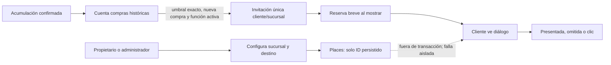

# Reseñas de Google · Contrato acordado v1

> **ACORDADO para esta funcionalidad el 2026-09-28.** El código está implementado en ramas feature y desplegado en testing; los flujos web público y Android en emulador tienen FULL PASS. iOS y prueba física siguen sin verificar. Esta aprobación tiene alcance específico; no aprueba el resto de las propuestas `PC-xx` ni convierte otras rutas objetivo de OpenAPI en rutas implementadas.

Este documento es la referencia del contrato congelado para la funcionalidad. Enlaces relacionados: [flujo del comercio](#/flow-merchant-profile), [flujo de tarjetas del cliente](#/flow-customer-cards), [matriz de integración](#/integration-matrix), [brechas](#/implementation-gaps) y [índice de revisión backend](#/backend-review-index).

## Reglas de negocio

- La función empieza desactivada. Valores iniciales: umbral `1`, mensaje `¿Cómo fue tu experiencia? Compartí tu opinión en Google.`, destino `MANUAL_LINK` y URL nula hasta configurarla.
- Una acumulación confirmada cuenta como una compra por cliente y sucursal, también en programas de puntos y sin importar el monto. Canjes y vistas previas no cuentan. Se conserva el conteo histórico aunque la función esté desactivada; no se crean invitaciones retroactivas.
- Sólo la nueva acumulación que hace que el total histórico alcance exactamente el umbral crea una invitación, y sólo si la función y la sucursal están activas. Hay como máximo una invitación de por vida por cliente y sucursal. Repetir una confirmación idempotente no suma otra compra.
- Desactivar la función o la sucursal cancela reservas e invitaciones pendientes. Cambiar la configuración no reinicia el historial ni amplía el límite de una invitación ya mostrada o cancelada.
- La consulta externa a Google ocurre fuera de la transacción de fidelidad. Un error o demora del proveedor nunca impide acreditar la compra.

## Configuración y permisos

Propietarios y administradores de la marca pueden leer, editar, buscar ubicaciones y consultar métricas de sus sucursales. Operadores y usuarios de otra marca no tienen acceso. La edición usa `PUT` con `ETag`/`If-Match`: la configuración inicial, incluso cuando aún no existe fila, tiene versión `1`; cada escritura incrementa versión y debe protegerse de escrituras concurrentes.

El mensaje es texto plano de hasta 500 caracteres Unicode. El umbral es un entero positivo, máximo `1000000`. Con la función activa, debe estar configurado exactamente el destino seleccionado. Se acepta un `place_id` de Google o un enlace manual HTTPS de los hosts oficiales acordados (`g.page`, `maps.app.goo.gl`, `maps.google.com`, `www.google.com`, `search.google.com`, `share.google`); se rechazan credenciales en URL, subdominios no permitidos y otros hosts. El servidor no visita enlaces manuales.

## API acordada e implementada en la versión indicada abajo

Prefijo `/v1`; se conserva el envelope existente `{data, request_id}` y los errores estándar de autenticación. Estas rutas forman parte de los commits de fuente y de la versión de testing citados en el estado de evidencia. La aprobación del contrato sigue separada de la verificación técnica.

| Método y ruta | Uso y resultado |
|---|---|
| `GET /marcas/:brand_id/sucursales/:resource_id/resenas` | Leer configuración editable y estado de Places. Devuelve `branch_id`, `enabled`, `purchase_threshold`, `message`, `destination_type`, `google_place_id`, `manual_review_url`, `version`, `places_available` y `review_url`. El fallo de Google deja `review_url` nula y la configuración disponible para editar. |
| `PUT /marcas/:brand_id/sucursales/:resource_id/resenas` | Actualizar sólo campos editables, con `If-Match`; no acepta campos derivados o de versión. |
| `POST /marcas/:brand_id/sucursales/:resource_id/resenas/busqueda` | Búsqueda autenticada y limitada por tasa, con consulta opcional de 3–300 caracteres; sin consulta usa nombre y dirección de la sucursal. Devuelve `place_id`, nombre, dirección, enlace de reseña y atribuciones transitorias opcionales `[{provider, provider_uri}]`. |
| `GET /marcas/:brand_id/sucursales/:resource_id/resenas/metricas` | Conteos de invitaciones únicas mostradas, omitidas y con clic (`shown`, `skipped`, `clicked`). |
| `GET /clientes/me/resenas/pendientes` | Invitaciones propias, de sucursal activa y con función activa, ordenadas de más antigua a más reciente. Excluye reservas ajenas vigentes y destinos que no se puedan resolver; esos casos quedan pendientes. |
| `POST /clientes/me/resenas/:invitation_id/reserva` | Reserva atómica y exclusiva por 60 segundos. Devuelve invitación, token y expiración. Revalida titular, sucursal y configuración; responde `409` si ya está reservada, mostrada o cerrada. |
| `POST /clientes/me/resenas/:invitation_id/eventos` | Registra `PRESENTADA`, `OMITIDA` o `CLIC` con token. Repetir el mismo evento es idempotente; omitir o registrar clic requiere presentación previa. |

La búsqueda usa Places API (New), campos mínimos `id`, `displayName`, `formattedAddress`, `googleMapsLinks.writeAReviewUri` y `attributions`; la resolución usa Place Details (New). `GOOGLE_PLACES_API_KEY` es opcional en runtime, privada y sólo del backend: sin clave la búsqueda informa dependencia no disponible, `places_available` es falso y el enlace manual sigue funcionando. La llamada externa tiene límite de 5 segundos. No se exponen errores o secretos del proveedor ni se persisten resultados o URLs de modo automático: sólo se guarda el ID de lugar. El enlace de reseña se resuelve al leer. Las atribuciones son transitorias y la interfaz incluye la marca Google Maps.

La invitación contiene `id`, `card_id`, `brand_id`, `branch_id`, `branch_name`, `operation_id`, `message`, `review_url` y `occurred_at`. La reserva devuelve `reservation_token` y `expires_at`. La respuesta de evento contiene `id`, `shown`, `skipped` y `clicked`. Una presentación ya aceptada conserva validez de token para la respuesta del mismo diálogo aunque pasen los 60 segundos; no se permite volver a presentar la invitación.

## Datos, migraciones y privacidad

El historial de operaciones ya existente aporta la cuenta histórica; la nueva entidad de invitación conserva la unicidad de por vida por cliente y sucursal, la operación de origen y los estados de entrega. Las reservas son leases temporales. Los eventos únicos sostienen métricas idempotentes. La exportación de cuenta incluye invitaciones y progreso; la anonimización elimina asociaciones y progreso personales.

La secuencia acordada preserva el orden: la fuente de esta funcionalidad parte de la migración `0021` y añade `0022`; el historial integrado conserva 28 versiones hasta `0028` (`0023`–`0028` pertenecen a backoffice/referidos). El baseline previo del entorno de testing era `0020`; se aplicó primero `0021` y después el conjunto integrado hasta `0028`. Nunca se renumeró `0021`. La migración contempla backfill del conteo histórico sin crear invitaciones. La integración no habilita notificaciones push de reseñas y preserva los overlays propios del preview. La base desplegada reporta ahora schema `0028`.

## Experiencia cliente y comercio

La configuración vive en la pantalla existente de sucursal para propietarios y administradores: habilitar, umbral, mensaje, buscar/seleccionar ubicación o usar enlace manual, vista previa, prueba del enlace y métricas. No se agregan dependencias previstas.

En cliente se revisan pendientes al entrar en primer plano a QR/tarjetas y cuando se actualizan las tarjetas existentes, sin polling. La revisión no bloquea el QR inicial. El diálogo espera a que termine la cola de celebraciones, haya cuenta correcta, app activa y ninguna otra ventana modal. Se presenta como máximo una invitación por entrada/actualización; cerrar o decir “Ahora no” la omite sin apilar otra. Una invitación reconocida localmente durante la sesión se deduplica, aunque el backend sigue siendo la autoridad.

Se difiere el intento sin conexión o si el proveedor no resuelve el destino, y se reintenta en la próxima entrada, reconexión o evento. La reserva se toma cuando la interfaz está lista. En web el enlace se abre sincrónicamente desde el gesto del usuario; en nativo usa `Linking`. Si falla la apertura, el diálogo queda disponible para reintentar. Un cambio de cuenta cancela el estado local. Notificaciones push nativas quedan fuera de alcance.

## Estado de evidencia

**Contrato:** acordado el 2026-09-28. **Fuentes:** backend [`b16371f`](https://github.com/am-p/app-loyalty/commit/b16371f9be8bc5008262234c51fed18298f93e13) (incluye migración `0022`) y frontend [`5a733e6`](https://github.com/gonzalotev/app-fidelidad/commit/5a733e62785af2cd0922a7cf50f0773cfc02b321), ambos en PRs fuente aún no fusionados a `main`: [backend #13](https://github.com/am-p/app-loyalty/pull/13) y [frontend #18](https://github.com/gonzalotev/app-fidelidad/pull/18). El backend pasó Go con PostgreSQL, `go vet` y race en la nueva base; el frontend fuente pasó TypeScript y 90 pruebas.

**Integración y despliegue de testing:** [PR de preview #10](https://github.com/gagonzalez1/puntazo-preview/pull/10) integró la funcionalidad. Para evitar sobrescribir cambios concurrentes de backoffice/referidos, la integración se reaplicó sobre el remoto fresco `e9d63af6a4368c6f19871a1fbd19465a2dd46f36`; el HEAD actual `testing` es `1ad62cdd007d0b45adbd26f2d93114c8e7ae9192`. La fuente de reseñas conserva `0022`, el preview retiene las 28 migraciones `0021`–`0028`, y backend Go/PostgreSQL con `go vet` pasaron sobre la nueva base. El runtime público reporta commit `1ad62cdd`, versión `0.8.0-testing`, schema `0028` y readiness `ok`. Coolify terminó el deployment `asgnwdkalmn4zhnxqabwpoes` el 2026-09-28 a las 16:51:13 UTC. El backup cifrado `puntazo-preview-20260928T164159Z.dump.enc` se verificó a las 16:42:13 UTC antes del despliegue; la verificación del guard de backup para este despliegue aún no está registrada aquí.

**Build y verificaciones web:** desde `1ad62cdd`, TypeScript, 89 pruebas frontend integradas, Expo Doctor 18/18, build web y seis casos funcionales del navegador (incluida la barrera de saludo) pasaron. La comprobación pública confirma que el bundle `entry-fc16c014fb18028d3fd5120b42d5cb20.js`, SHA-256 `08a2167bc3b0cf69e556a28845058a749d31d630cdb541db799c3276b2d1de8d`, coincide con el build local de `1ad62cdd`. El smoke público pasó. En la matriz web actual, 41 casos pasaron localmente y tres pruebas PWA pasaron en el origen público; una aparece en ambos conjuntos, cubriendo 43 casos distintos entre ambos entornos. Dos ejecuciones locales adicionales dieron errores de configuración (URL de API absoluta distinta de la URL `/api` del bundle y botón GIS real bloqueado en origen localhost); no se presentan como una única suite verde de 43 casos. La PWA pública verificó hidratación sin errores, metadatos de instalación, páginas de autenticación sin consumir acciones, modo offline del service worker y ausencia de cacheo de API.

**Aceptación web pública:** FULL PASS en `https://testing.puntazo.pro`. El recorrido real configuró Places y guardó la ubicación seleccionada, acreditó la primera compra y repitió la misma clave de idempotencia con igual operación; el cliente recibió SSE y vio el diálogo tras terminar la celebración. El navegador abrió la URL oficial exacta del lugar guardado. Las métricas agregadas de QA quedaron en `shown=7`, `skipped=0`, `clicked=7`. Recarga y segunda sesión/dispositivo del mismo cliente devolvieron `GET /resenas/pendientes=[]` y no mostraron otra invitación. La suite amplia con fixtures no compatibles con HTTPS no se considera aceptación; el FULL PASS se basa en el recorrido público real sin mocks y los checks PWA en el origen registrado.

**Android nativo:** FULL PASS en emulador Android API 36, Expo SDK 54, runtime `0.8.0-testing`. Para el cliente nuevo 58, la invitación permaneció sin reservar ni mostrar durante el saludo de bienvenida; apareció tras tocar **Entendido** y cerrar el panel. La mascota flotante no bloqueó el diálogo. Se abrió el `writeAReviewUri` oficial en Google Maps, se volvió a Puntazo y, tras forzar detención y reiniciar el proceso, no apareció otra invitación (`pending=[]`). Métricas finales: `shown=6`, `skipped=0`, `clicked=6`; el estado persistido confirmó presentación y clic. Logcat no registró advertencias del coordinador en ninguno de los dos procesos. Evidencia: `android-native-final-result.json`, `android-final-logcat-check.json` y capturas `android-final-*.png` bajo `artifacts/google-reviews/`.

**iOS y dispositivos físicos:** iOS no está verificado porque Xcode requiere aceptar la licencia. No hay evidencia de prueba en un dispositivo físico; el PASS Android corresponde al emulador API 36.
