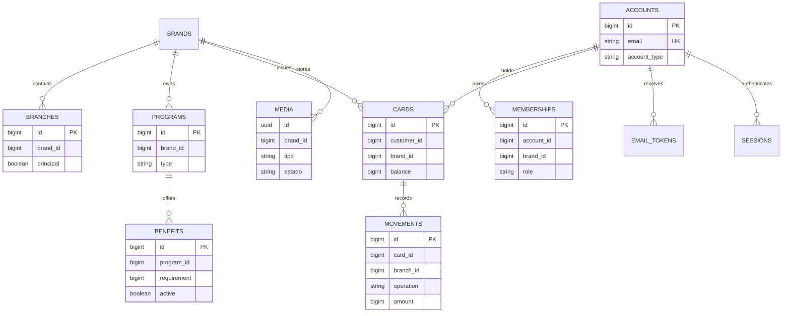

# Datos · Estado implementado

La base nueva de la release aplica 17 migraciones numeradas. El esquema incluye
cuentas verificables, sesiones rotativas, invitaciones y outbox, marcas/sucursales/
programas/beneficios, tarjetas/movimientos con snapshots, media privada,
idempotencia, retención y reconciliación. La API no crea tablas al arrancar.

La app no debe tomar este modelo como `Tienda` global: un actor puede tener varias
membresías y un operador queda restringido a sus `branch_ids`. El identificador
de recursos de personal es `membership_id`, no `user_id`.

## Referencias de código

- [Esquema y migraciones](https://github.com/gagonzalez1/app-loyalty/blob/50e95e9407ee5ffaccfc3cebcbef464d24f26427/migrations/0017_media_reconciliation.up.sql)
- [Modelo Go y relaciones](https://github.com/gagonzalez1/app-loyalty/blob/50e95e9407ee5ffaccfc3cebcbef464d24f26427/internal/model/model.go)
- [Servicios de dominio frontend](https://github.com/gonzalotev/app-fidelidad/blob/1db7717e1aa28c2c1be7ba3538bfe9e22e0d0a01/src/features/merchant/services/merchantService.ts)
