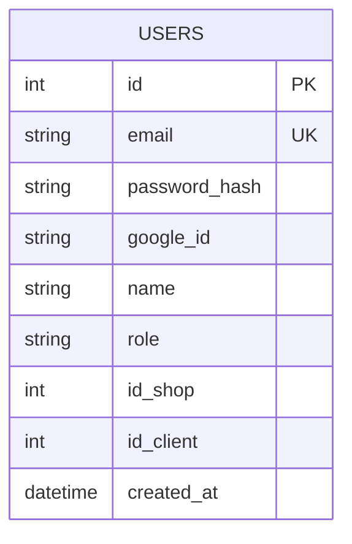

# Datos · Estado implementado

PostgreSQL contiene una sola tabla creada al iniciar el servidor. Tiendas, clientes, tarjetas, sucursales y movimientos permanecen como arrays/objetos en memoria en el frontend.

## Dos capas de datos

- [Modelo objetivo consolidado](#/data-target): propuesta marca–sucursal del spec `v1.5-review`.
- [Matriz pantalla–API](#/integration-matrix): qué datos ya viajan y cuáles siguen locales.

## Referencias de código

- [DDL de users](https://github.com/am-p/app-loyalty/blob/main/internal/repository/user.go#L10-L15)
- [Tipos de dominio del frontend](https://github.com/gonzalotev/app-fidelidad/blob/main/src/types/db.ts#L1-L89)
