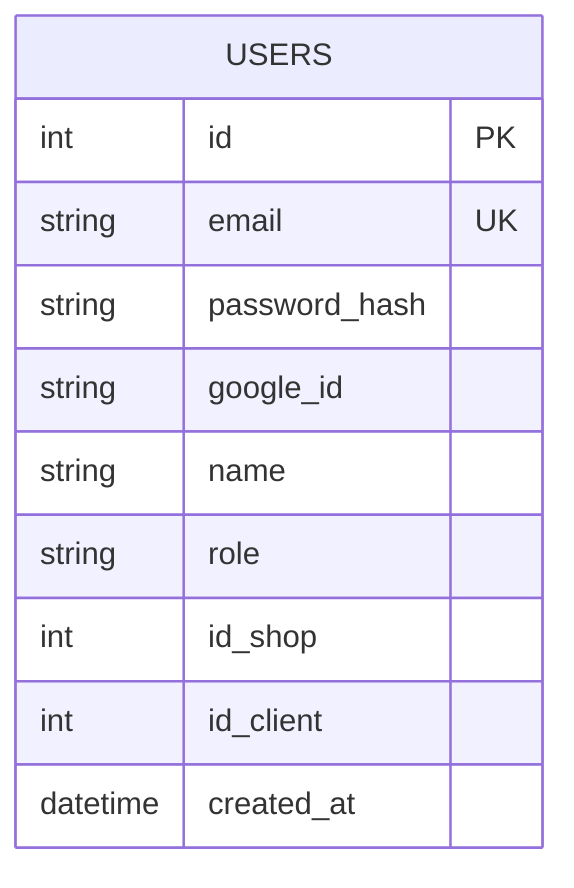

# Datos · Estado implementado

## Actualización de códigos · rama pendiente de integrar

Persistencia del candidato: `usuarios.codigo_usuario` nullable y único, tabla
`contadores_codigo_usuario` por prefijo y trigger de inmutabilidad (0033 tras
0032). El UPSERT y el INSERT del usuario comparten transacción. No se hace
backfill; la API publica el código efectivo anterior si la columna es NULL.
PK/FK y tiendas mantienen sus IDs numéricos.

Fuente y estado: [reconciliación de códigos](#/user-codes-reconciliation).
Implementado y probado en las ramas seleccionadas; no desplegado.

## Referencia histórica anterior a esta entrega

El material siguiente describe la revisión documental anterior. No confirma
el estado actual de main ni del runtime; contrastar con la rama elegida.

```mermaid
erDiagram
    USERS {
      int id PK
      string email UK
      string password_hash
      string google_id
      string name
      string role
      int id_shop
      int id_client
      datetime created_at
    }
```

PostgreSQL contiene una sola tabla creada al iniciar el servidor. Tiendas, clientes, tarjetas, sucursales y movimientos permanecen como arrays/objetos en memoria en el frontend.

## Dos capas de datos

- [Modelo objetivo consolidado](#/data-target): propuesta marca–sucursal del spec `v1.5-review`.
- [Matriz pantalla–API](#/integration-matrix): qué datos ya viajan y cuáles siguen locales.

## Referencias de código

- [DDL de users](https://github.com/am-p/app-loyalty/blob/main/internal/repository/user.go#L10-L15)
- [Tipos de dominio del frontend](https://github.com/gonzalotev/app-fidelidad/blob/main/src/types/db.ts#L1-L89)
