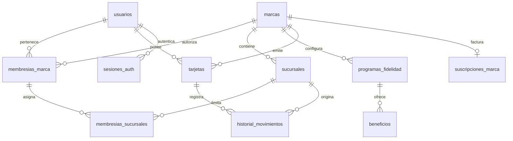

# Datos · Estado implementado

Revisión de fuentes y runtime del **02/10/2026, 22:10 UTC**. Los SHA y las diferencias por ambiente están en [Estado observado](#/runtime-snapshot). Esta revisión describe arquitectura e integración; no certifica todos los invariantes de negocio ni ejecuta operaciones sobre cuentas reales.

Ambas bases observadas contienen **41 tablas públicas**, incluida `schema_migrations`. Este DER muestra el núcleo y omite columnas/tablas auxiliares; no es un DDL completo.

```mermaid
erDiagram
 usuarios ||--o{ membresias_marca : pertenece
 marcas ||--o{ membresias_marca : autoriza
 marcas ||--o{ sucursales : contiene
 membresias_marca ||--o{ membresias_sucursales : asigna
 sucursales ||--o{ membresias_sucursales : limita
 marcas ||--o{ programas_fidelidad : configura
 programas_fidelidad ||--o{ beneficios : ofrece
 usuarios ||--o{ tarjetas : posee
 marcas ||--o{ tarjetas : emite
 tarjetas ||--o{ historial_movimientos : registra
 sucursales ||--o{ historial_movimientos : origina
 marcas ||--o| suscripciones_marca : factura
 usuarios ||--o{ sesiones_auth : autentica
```

| Grupo | Tablas principales y función |
|---|---|
| Identidad | `usuarios`, `sesiones_auth`, `tokens_identidad_email`, `contadores_codigo_usuario`; versiones, verificación y códigos inmutables |
| Tenancy | `marcas`, `sucursales`, `membresias_marca`, `membresias_sucursales`; roles y alcance por marca/sucursal |
| Fidelidad | `programas_fidelidad`, `beneficios`, `tarjetas`; sellos/puntos, saldos y versiones |
| Operación | `previews_movimiento`, `historial_movimientos`, `solicitudes_idempotentes`; confirmación, snapshots y deduplicación |
| Comercio | `accesos_demo`, `suscripciones_marca`, `invitaciones_marca`, `invitaciones_sucursales`, `archivos_marca` |
| Asíncrono | `email_outbox`, `push_tokens`, `push_notifications`, `eventos_mercado_pago` |
| Reseñas | `configuracion_resenas`, `progreso_resenas`, `invitaciones_resenas` |
| Referidos | `referral_campaigns`, `referral_influencers`, `referral_codes`, `referral_attributions`, `referral_charges`, `referral_rewards`, `referral_merchant_credit_allocations` |
| Administración | `backoffice_users`, `backoffice_sessions`, `backoffice_audit`, `subscription_prices` y tablas de cambios/items/historial de precios |

`0032` registra primer login y comienzo de trial, marcando como estimados los datos históricos. `0033` añade el código inmutable y su contador; los usuarios anteriores conservan el código heredado. El QR lo genera el servidor mediante HMAC y conserva su hash; no se construye como un ID visible en el frontend.

La baja conserva el ledger y anonimiza según el código de cuenta. La auditoría de todas las restricciones y políticas de retención queda fuera de este corte de arquitectura. El [DER objetivo](#/data-target) mantiene su carácter propuesto.

## Referencias de código

- [Migraciones actuales](https://github.com/am-p/app-loyalty/blob/main/migrations/README.md)
- [Núcleo inicial](https://github.com/am-p/app-loyalty/blob/main/migrations/0001_demo_sellos.up.sql)
- [Trial](https://github.com/am-p/app-loyalty/blob/main/migrations/0032_first_login_trial.up.sql)
- [Códigos](https://github.com/am-p/app-loyalty/blob/main/migrations/0033_user_codes.up.sql)
- [Baja y exportación](https://github.com/am-p/app-loyalty/blob/main/internal/repository/account.go)
