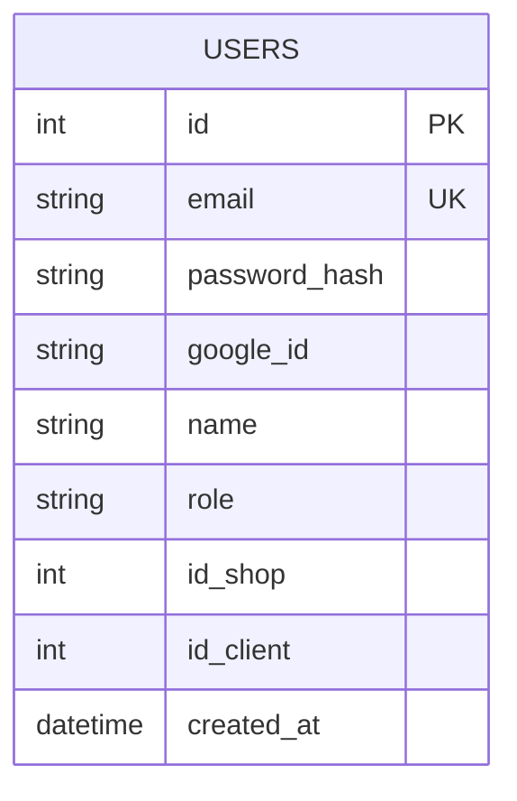

# Datos · Estado implementado

## Lectura analítica por período · entrega 01/10/2026

Esta entrega agrega lecturas reales de `historial_movimientos`, `tarjetas`, `marcas` y membresías vigentes. No crea tablas ni cambia saldos. Clientes atendidos es un conteo distinto de la identidad de cliente referida por la tarjeta; no equivale a tarjetas actualmente activas. Desactivar un cliente no borra las operaciones históricas del período. Las series cuentan acumulaciones y canjes confirmados, con ceros en intervalos sin actividad.

El esquema y párrafos siguientes corresponden al estado histórico del portal; no describen la base actual de testing. La nueva lectura está integrada en el fork backend `testing`, con promoción oficial aún abierta. La API de testing reporta `f18ff083666e70954bfe8474a228dcca365f40bb`, esquema `0033` y readiness HTTP 200; la web de testing también se verificó sirviendo el frontend integrado `b712c5d5e10154021955ae677935372eafdbdff5`. La comprobación pública usó respuestas vacías de un comercio sintético existente y no creó movimientos; las cantidades no vacías se comprobaron en la integración local anterior. Ver [el flujo y evidencia](#/flow-merchant-analytics).

```mermaid
erDiagram
    USERS {
      int id PK
      string email UK
      string password_hash
      string google_id
      string name
      string role
      int id_shop
      int id_client
      datetime created_at
    }
```

PostgreSQL contiene una sola tabla creada al iniciar el servidor. Tiendas, clientes, tarjetas, sucursales y movimientos permanecen como arrays/objetos en memoria en el frontend.

## Dos capas de datos

- [Modelo objetivo consolidado](#/data-target): propuesta marca–sucursal del spec `v1.5-review`.
- [Matriz pantalla–API](#/integration-matrix): qué datos ya viajan y cuáles siguen locales.

## Referencias de código

- [DDL de users](https://github.com/am-p/app-loyalty/blob/main/internal/repository/user.go#L10-L15)
- [Tipos de dominio del frontend](https://github.com/gonzalotev/app-fidelidad/blob/main/src/types/db.ts#L1-L89)
