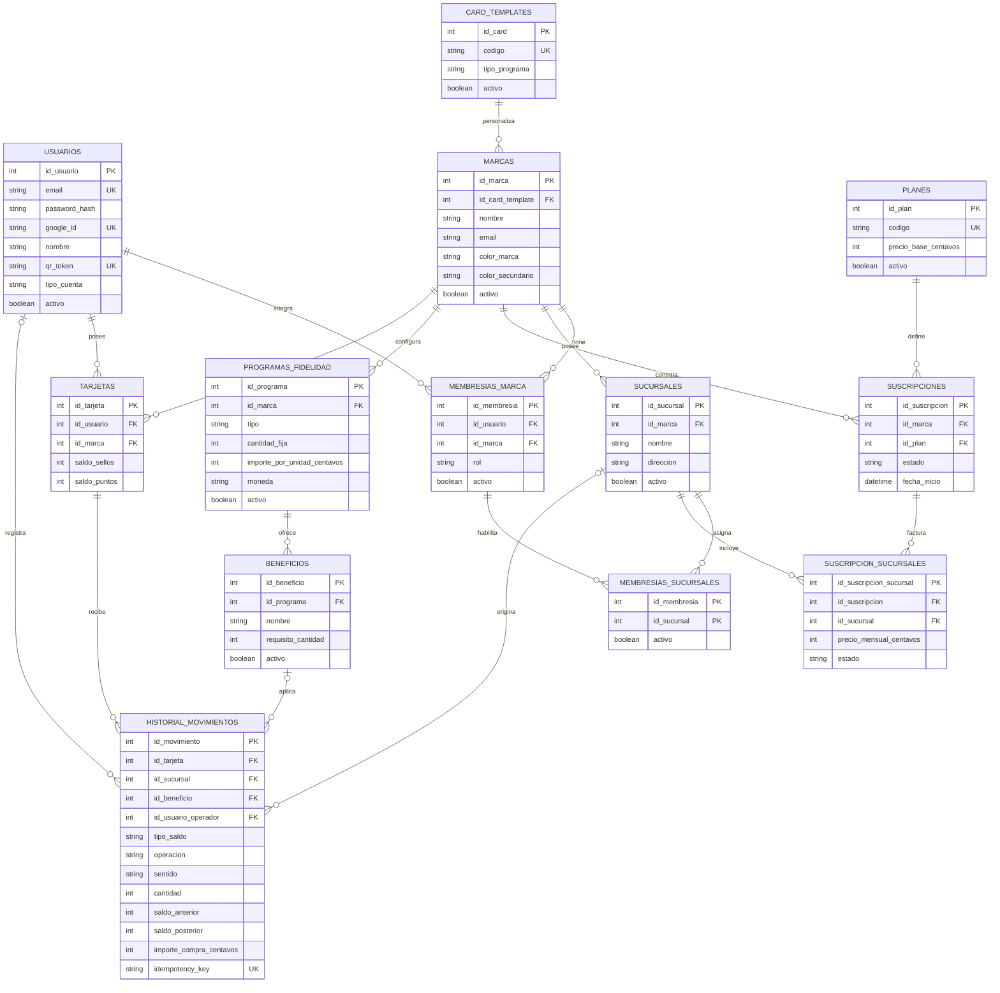

# Datos · Modelo objetivo v1.5-review

> Este diagrama **no representa migraciones implementadas**. Es la propuesta consolidada en `BACKEND_SPEC_CORREGIDO.md` para orientar el desarrollo.

## Decisiones que expresa

- `usuarios` unifica identidad, autenticación, perfil y QR; no existe `clientes_finales`.
- `tipo_cuenta` no es un plan. Distingue `CLIENTE_FINAL` de `PERSONAL_MARCA`.
- El rol operativo vive en `membresias_marca`: `PROPIETARIO`, `ADMINISTRADOR` u `OPERADOR`.
- Una marca posee varias sucursales. La suscripción pertenece a la marca y cobra cada sucursal activa.
- Una tarjeta representa cliente–marca; `saldo_sellos` y `saldo_puntos` se comparten entre todas sus sucursales.
- MVP 1 activa Sellos o Puntos. Guardar ambos saldos permite habilitar ambos programas después sin migrar tarjetas.
- Cada cambio de saldo produce un movimiento auditable e idempotente.
- Los puntos, sellos, importes y divisores usan enteros; no se usan valores de punto flotante.
- `sentido` separa crédito y débito sin almacenar cantidades negativas.

> La estructura de negocio combina decisiones acordadas con detalles físicos
> `PROPUESTA CODEX PC-09` y `PC-10`. Consulte el índice antes de implementar.

## Restricciones mínimas

| Entidad | Restricción |
|---|---|
| Membresía de marca | Única por usuario y marca |
| Tarjeta | Única por cliente final y marca; saldos no negativos |
| Programa | Único por marca y tipo; máximo uno activo en MVP 1 |
| Suscripción | Máximo una activa por marca |
| Ítem facturable | Único por suscripción y sucursal |
| Movimiento | Saldo y auditoría dentro de la misma transacción |

La fuente de detalle contractual sigue siendo `docs/BACKEND_SPEC_CORREGIDO.md` del workspace; este mapa la resume sin presentarla como código existente.
