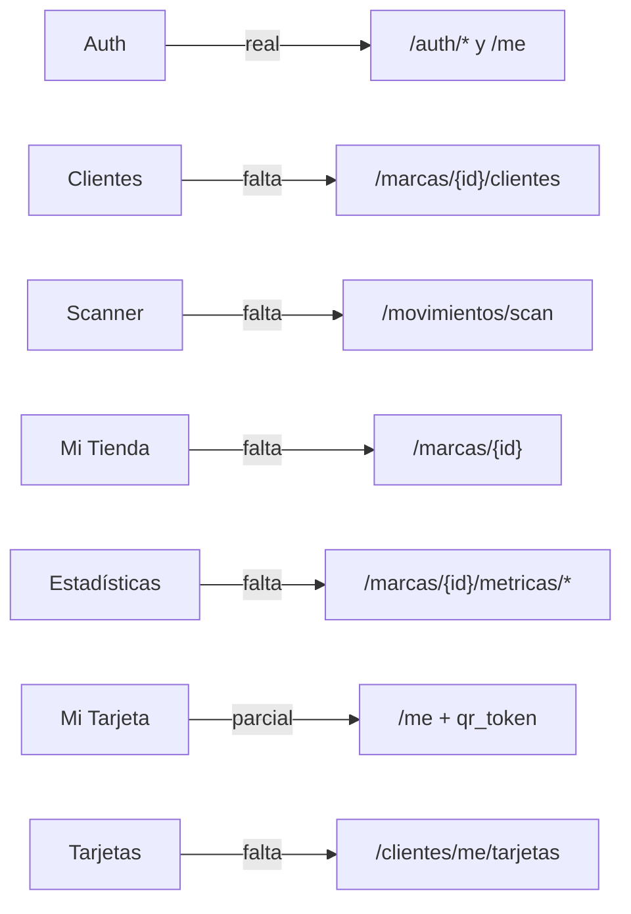

# Datos · Matriz pantalla–API

| Pantalla/flujo | Estado actual | Backend actual | Contrato necesario |
|---|---|---|---|
| Registro, login, Google | Real | Disponible | Ajustar tipo de cuenta y responses al spec |
| Verificación y reset de contraseña | No existe | No existe | `PR-09`: `202` anti-enumeración, tokens hasheados de 24 h/1 h y revocación de sesiones |
| Restaurar sesión | Real | `GET /me` | Ampliar usuario, membresías y contexto |
| Selección de plan | Local | No existe | Reemplazar por alta gratuita con código; billing diferido (`PR-01`) |
| Clientes del comercio | Mock | No existe | `GET /marcas/{id_marca}/clientes` |
| Scanner | Cámara real + saldo mock | No existe | Preview + confirmación transaccional; Puntos manuales `1..100000` (`PR-02`) |
| Perfil de marca | Mock | No existe | CRUD aprobado con `If-Match`, baja lógica, snapshots y media S3 privada |
| Analíticas | Mock | No existe | Endpoints de métricas por marca/sucursal |
| Pasaporte QR | Parcial | Usuario básico | QR opaco persistido en `usuarios` |
| Tarjetas del cliente | Mock | No existe | `GET /clientes/me/tarjetas` |
| Personal e invitaciones | No existe | No existe | Roles aprobados e invitaciones de un uso por 72 h (`PR-05`) |
| Cierre de cuenta | No existe | No existe | Anonimización autenticada que preserva ledger (`PR-07`) |

## ¿Se pueden conectar hoy?

Sí, **sólo para la autenticación actual y `GET /me`** en los commits documentados.
Verificación de email y reset todavía son objetivo `NOT_IMPLEMENTED`. El contrato
gratuito ya está aprobado, pero sigue sin implementar. Billing y suscripciones
pagas están explícitamente fuera de `FREE_ACCESS_V1`; no deben bloquear ni
simularse para conectar este corte.
