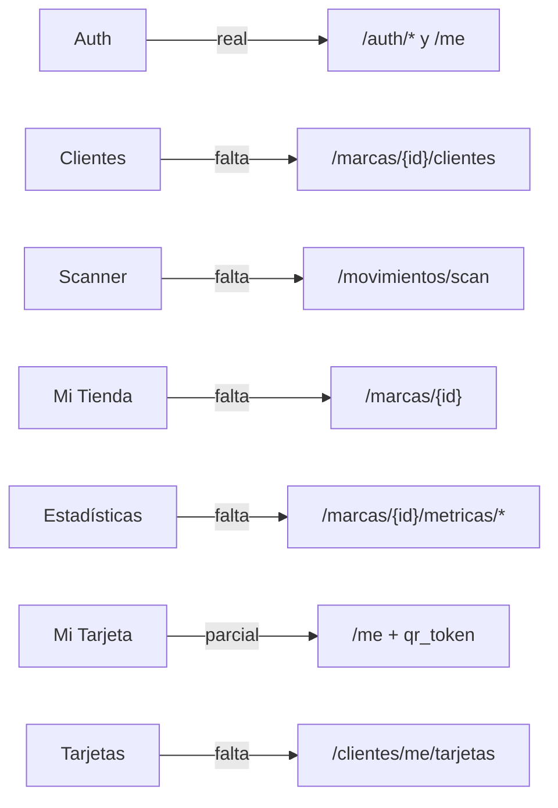

# Datos · Matriz pantalla–API

| Pantalla/flujo | Estado actual | Backend actual | Contrato necesario |
|---|---|---|---|
| Registro, login, Google | Real | Disponible | Ajustar tipo de cuenta y responses al spec |
| Restaurar sesión | Real | `GET /me` | Ampliar usuario, membresías y contexto |
| Selección de plan | Local | No existe | Separar onboarding, marca y Backoffice |
| Clientes del comercio | Mock | No existe | `GET /marcas/{id_marca}/clientes` |
| Scanner | Cámara real + saldo mock | No existe | `POST /movimientos/scan` transaccional |
| Perfil de marca | Mock | No existe | CRUD de marca, programas, beneficios y sucursales |
| Analíticas | Mock | No existe | Endpoints de métricas por marca/sucursal |
| Pasaporte QR | Parcial | Usuario básico | QR opaco persistido en `usuarios` |
| Tarjetas del cliente | Mock | No existe | `GET /clientes/me/tarjetas` |

## ¿Se pueden conectar hoy?

Sí, **sólo para autenticación y `GET /me`**. Antes de reemplazar cada mock se necesita implementar su contrato backend y adaptar el frontend al modelo marca–sucursal. No hay todavía compatibilidad funcional para fidelidad, suscripciones, tarjetas, perfil comercial ni analíticas.
