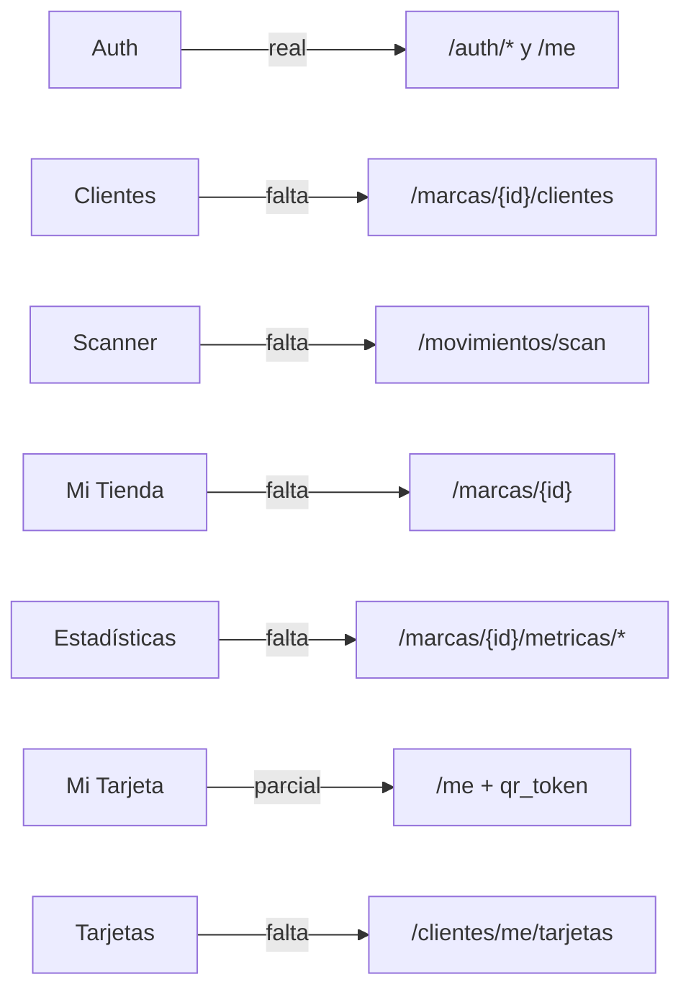

# Datos · Matriz pantalla–API

```mermaid
flowchart LR
    AUTH["Auth"] -->|"real"| AUTHAPI["/auth/* y /me"]
    CUSTOMERS["Clientes"] -->|"falta"| CLIENTAPI["/marcas/{id}/clientes"]
    SCAN["Scanner"] -->|"falta"| MOVEAPI["/movimientos/scan"]
    PROFILE["Mi Tienda"] -->|"falta"| BRANDAPI["/marcas/{id}"]
    ANALYTICS["Estadísticas"] -->|"falta"| METRICAPI["/marcas/{id}/metricas/*"]
    QR["Mi Tarjeta"] -->|"parcial"| ME["/me + qr_token"]
    CARDS["Tarjetas"] -->|"falta"| CARDAPI["/clientes/me/tarjetas"]

    click AUTH href "#/flow-auth" "Ver autenticación"
    click CUSTOMERS href "#/flow-merchant-customers" "Ver Clientes"
    click SCAN href "#/flow-merchant-scanner" "Ver Scanner"
    click PROFILE href "#/flow-merchant-profile" "Ver perfil"
    click ANALYTICS href "#/flow-merchant-analytics" "Ver analíticas"
    click QR href "#/flow-customer-passport" "Ver QR"
    click CARDS href "#/flow-customer-cards" "Ver tarjetas"
```

| Pantalla/flujo | Estado actual | Backend actual | Contrato necesario |
|---|---|---|---|
| Registro, login, Google | Real | Disponible | Ajustar tipo de cuenta y responses al spec |
| Restaurar sesión | Real | `GET /me` | Ampliar usuario, membresías y contexto |
| Selección de plan | Local | No existe | Separar onboarding, marca y Backoffice |
| Clientes del comercio | Mock | No existe | `GET /marcas/{id_marca}/clientes` |
| Scanner | Cámara real + saldo mock | No existe | `POST /movimientos/scan` transaccional |
| Perfil de marca | Mock | No existe | CRUD de marca, programas, beneficios y sucursales |
| Analíticas | Mock | No existe | Endpoints de métricas por marca/sucursal |
| Pasaporte QR | Parcial | Usuario básico | QR opaco persistido en `usuarios` |
| Tarjetas del cliente | Mock | No existe | `GET /clientes/me/tarjetas` |
| Configuración de reseñas de sucursal | Desplegada en testing | API `0.7.0-testing`, schema `0022`, readiness `ok`; fuentes feature aún sin merge a `main` | [`Reseñas de Google v1`](#/google-reviews-contract) |
| Invitaciones de reseña del cliente | Desplegadas en testing | Navegador verificado; no repetición desde segundo dispositivo pendiente | [`Reseñas de Google v1`](#/google-reviews-contract) |

## ¿Se pueden conectar hoy?

La rama base `main` de esta matriz sólo documenta autenticación y `GET /me`; la rama remota `testing` ya despliega reseñas en API `0.7.0-testing`, schema `0022` y readiness `ok`. La prueba de no repetición entre dispositivos sigue pendiente. Ver [evidencia, fuentes y release](#/google-reviews-contract) para separar ambos planos.
