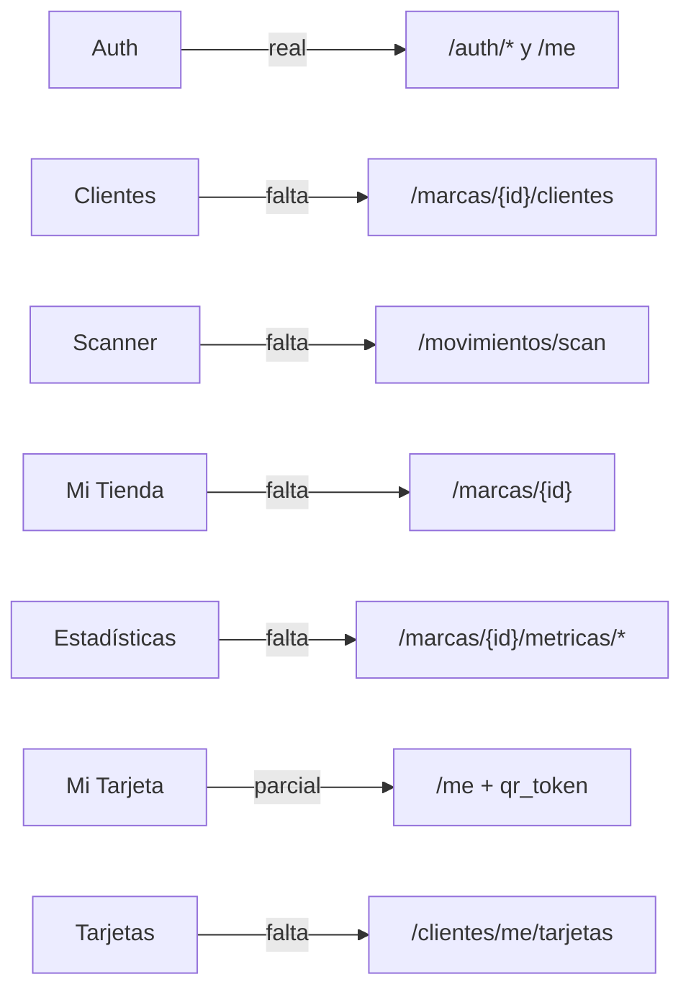

# Datos · Matriz pantalla–API

## Entrega analítica por períodos · 01/10/2026

| Vista | Fuente real en la entrega | Estado de promoción |
| --- | --- | --- |
| Históricas | `GET /v1/marcas/{id}/metricas/resumen` y movimientos recientes | Existente en fuentes actuales; captura de testing compatible |
| Diaria / Semanal / Mensual | `GET /v1/marcas/{id}/metricas/periodo?period=day|week|month&date=YYYY-MM-DD` | API y web desplegadas y verificadas en testing; promoción oficial backend abierta |

La ruta por período consolida todas las sucursales y exige propietario vigente; no usa los mocks antiguos. No implementa las rutas separadas o drill-down propuestos en `PC-08`. Ver [el flujo](#/flow-merchant-analytics). La topología y evidencia del runtime conservan su fecha propia.

## Entorno de testing observado · 01/10/2026

La web desplegada desde `gonzalotev/app-fidelidad:testing` (`fc737a2`) usa
`https://api-testing.puntazo.pro/v1`, atendido por
`gagonzalez1/app-loyalty:testing` (`ecd69be`, esquema `0033`). `/api/v1` sigue
como proxy compatible; MinIO y PostgreSQL son recursos separados del Compose
anterior. La URL de medios firmados respondió 200 y sin firma 403. Se verificó
CORS desde la web y el transporte de versión, SSE sin sesión (401) y rechazo
de webhook sin firma (401) en rutas directa/heredada. Login/refresh con una
cuenta sintética de testing respondió 200 en ambas rutas, incluidas cookies
con sus rutas correctas; la cuenta se anonimizó al terminar. Aún no se
verificó un evento firmado de Mercado Pago.

La matriz siguiente corresponde al estado anterior de la documentación, no
atribuye implementaciones ni mocks al runtime actual. Revisar las rutas y
reglas en los HEAD remotos de las fuentes dueñas antes de actualizar cada fila.

## Matriz anterior (histórica)

```mermaid
flowchart LR
    AUTH["Auth"] -->|"real"| AUTHAPI["/auth/* y /me"]
    CUSTOMERS["Clientes"] -->|"falta"| CLIENTAPI["/marcas/{id}/clientes"]
    SCAN["Scanner"] -->|"falta"| MOVEAPI["/movimientos/scan"]
    PROFILE["Mi Tienda"] -->|"falta"| BRANDAPI["/marcas/{id}"]
    ANALYTICS["Estadísticas"] -->|"falta"| METRICAPI["/marcas/{id}/metricas/*"]
    QR["Mi Tarjeta"] -->|"parcial"| ME["/me + qr_token"]
    CARDS["Tarjetas"] -->|"falta"| CARDAPI["/clientes/me/tarjetas"]

    click AUTH href "#/flow-auth" "Ver autenticación"
    click CUSTOMERS href "#/flow-merchant-customers" "Ver Clientes"
    click SCAN href "#/flow-merchant-scanner" "Ver Scanner"
    click PROFILE href "#/flow-merchant-profile" "Ver perfil"
    click ANALYTICS href "#/flow-merchant-analytics" "Ver analíticas"
    click QR href "#/flow-customer-passport" "Ver QR"
    click CARDS href "#/flow-customer-cards" "Ver tarjetas"
```

| Pantalla/flujo | Estado actual | Backend actual | Contrato necesario |
|---|---|---|---|
| Registro, login, Google | Real | Disponible | Ajustar tipo de cuenta y responses al spec |
| Restaurar sesión | Real | `GET /me` | Ampliar usuario, membresías y contexto |
| Selección de plan | Local | No existe | Separar onboarding, marca y Backoffice |
| Clientes del comercio | Mock | No existe | `GET /marcas/{id_marca}/clientes` |
| Scanner | Cámara real + saldo mock | No existe | `POST /movimientos/scan` transaccional |
| Perfil de marca | Mock | No existe | CRUD de marca, programas, beneficios y sucursales |
| Analíticas | Mock | No existe | Endpoints de métricas por marca/sucursal |
| Pasaporte QR | Parcial | Usuario básico | QR opaco persistido en `usuarios` |
| Tarjetas del cliente | Mock | No existe | `GET /clientes/me/tarjetas` |

## ¿Se pueden conectar hoy?

Sí, **sólo para autenticación y `GET /me`**. Antes de reemplazar cada mock se necesita implementar su contrato backend y adaptar el frontend al modelo marca–sucursal. No hay todavía compatibilidad funcional para fidelidad, suscripciones, tarjetas, perfil comercial ni analíticas.
