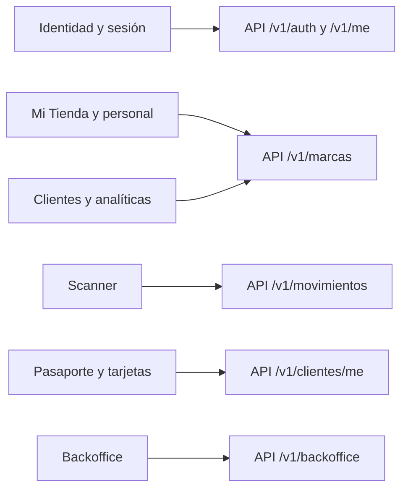

# Datos · Matriz pantalla–API

Revisión base de fuentes/runtime del **02/10/2026, 22:30–22:33 UTC**, actualizada para identidad y remediación de estrés al **07/10/2026**. Los SHA y las diferencias por ambiente están en [Estado observado](#/runtime-snapshot). Esta revisión describe arquitectura e integración; no certifica todos los invariantes de negocio ni ejecuta operaciones sobre cuentas reales.

```mermaid
flowchart LR
 AUTH[Identidad y sesión] --> A[API /v1/auth y /v1/me]
 M[Mi Tienda y personal] --> B[API /v1/marcas]
 C[Clientes y analíticas] --> B
 S[Scanner] --> O[API /v1/movimientos]
 Q[Pasaporte y tarjetas] --> D[API /v1/clientes/me]
 BO[Backoffice] --> E[API /v1/backoffice]
 click S href "#/sequence-scan" "Ver confirmación"
 click BO href "#/backoffice-architecture" "Ver sesión interna"
```

| Flujo | Integración verificada en código | Límite del despliegue observado |
|---|---|---|
| Registro y acceso | `/auth/register`, `/demo/comercios`, `/auth/login`, `/auth/google`; además `/auth/google/link` y `/auth/reauthenticate` en el candidato backend integrado. Sin vinculación automática por email; conflicto `409` | API testing `3d77120b…` healthy/readiness schema0035. Recent-auth/delete verificado para el fixture 4 (una cuenta sintética inactiva, cuatro sesiones totales/0 no revocadas, credenciales limpiadas, journal 1/cards 0/operator attribution 0); no se hizo GET bearer tras delete. Presupuestos direct/web independientes dieron 429 en sus límites; cadena alternada cross-route (11×401, último esperado 429) sigue en investigación; cuotas sin cambios. Google runtime pendiente; CAPTCHA apagado por falta de widget Turnstile |
| Sesión y perfil | `/auth/refresh`, `/auth/logout`, `/me`, foto, export/baja y cambio de email | SMTP configurado en ambos; no se enviaron correos en esta revisión |
| Contexto y personal | `/marcas`, sucursales, `/personal`, `/invitaciones` | Permisos se deciden en API, no por la pestaña visible |
| Clientes | `/marcas/:id/clientes`, búsqueda y paginación | Datos reales, no arrays de ejemplo |
| Scanner | Preview, scan/canje e idempotencia; QR o código de cliente | Requiere conexión; no se confirma offline |
| Mi Tienda | Marca/programa/beneficios/plantilla, edición versionada e imágenes | Media S3 activo en testing; deshabilitado en API productiva observada |
| Analíticas | Resumen + movimientos; `/metricas/periodo` con `day/week/month` | UI por períodos en testing; main publicado conserva resumen operativo |
| Cliente | QR/código, tarjetas, movimientos y SSE web | Los saldos pertenecen al usuario autenticado; fuente común en PostgreSQL |
| Suscripciones | Consulta, checkout, resultado, confirmación por email y cancelación | Mercado Pago configurado en testing; deshabilitado en producción |
| Referidos / Backoffice | Campañas, códigos, atribuciones, recompensas, precios e historial | UI testing activa; producción preparada sin contenedor |
| Push / reseñas | Token Expo, worker; configuración Places e invitaciones/eventos de reseña | Existencia en código no prueba entrega push ni reseña publicada |
| Instalación PWA asistida | Helper integrado en ramas testing frontend/landing | Integración frontend desplegada; landing healthy en `9d17179b…`; instalación física no verificada |

Las rutas de esta tabla son relativas a `/v1` salvo que se indique el prefijo. Su existencia se comprobó en el router real y las llamadas frontend. No se sustituyó por el OpenAPI objetivo. La revisión base comprobó versiones, salud, configuración no secreta y estructura de las bases. En el corte intermedio la API está desplegada healthy y el frontend está en `0fc06edc…`; landing `9d17179b…` healthy tras el retry del healthcheck IPv6; las métricas k6 y el backup/restore aislado se detallan en el plan de remediación.

## Referencias de código

- [Servicios cliente y movimientos](https://github.com/gonzalotev/app-fidelidad/blob/main/src/features/demo/services/demoService.ts)
- [Comercio](https://github.com/gonzalotev/app-fidelidad/blob/main/src/features/merchant/services/commercialService.ts)
- [Suscripción](https://github.com/gonzalotev/app-fidelidad/blob/main/src/features/merchant/services/subscriptionService.ts)
- [Rutas reales](https://github.com/am-p/app-loyalty/blob/main/cmd/server/router.go)
- [Analíticas de testing](https://github.com/gonzalotev/app-fidelidad/blob/testing/src/features/merchant/services/merchantService.ts)
