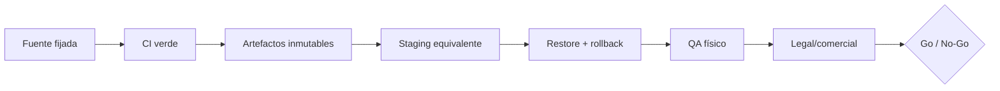

# Entrega · Checklist de producción

`PR-08` aprueba estos gates como condición de release y `PR-09` hace obligatorios
email verificado y proveedor de correo para producción. Marcar un ítem sólo con un
enlace verificable a ejecución, artefacto, dashboard, acta o runbook. Nada de este
documento prueba que la funcionalidad esté implementada.

## 1. Alcance y trazabilidad

- [ ] Alcance congelado como `FREE_ACCESS_V1`: código de acceso, costo cero y sin
  checkout, suscripción, renovación, cobro ni webhook de pagos.
- [ ] SHAs exactos de frontend, backend y documentación registrados una vez
  integrados. No actualizar `docs/meta/source-lock.json` con commits parciales.
- [ ] Matriz `PR-01..PR-09` enlazada a historias, pruebas y responsables.
- [ ] OpenAPI generado coincide byte a byte con el canónico y no contiene rutas de
  billing habilitadas para esta release.
- [ ] Inventario de variables por ambiente documentado sólo por nombre; valores y
  secretos permanecen en el gestor de secretos.

## 2. CI y cadena de suministro

- [ ] Documentación: catálogo, frontmatter, enlaces y lint/bundle de OpenAPI pasan.
- [ ] Backend: formato, lint/vet, unitarias, integración PostgreSQL, `go test -race`,
  pruebas de contrato OpenAPI y migración desde copia representativa pasan.
- [ ] Frontend: TypeScript, lint, unitarias/integración, `expo-doctor`, export web y
  smoke tests de PWA pasan con Expo SDK 54.
- [ ] Secret scanning, SAST y análisis de dependencias no tienen vulnerabilidades
  críticas/altas sin excepción temporal firmada con fecha de vencimiento.
- [ ] Imágenes y dependencias están fijadas por digest/lockfile; se genera SBOM y
  provenance para cada artefacto liberado.
- [ ] Imagen de runtime corre sin root, con filesystem de sólo lectura cuando sea
  posible, capabilities removidas y límites de CPU/memoria.
- [ ] Artefactos se promueven de staging a producción sin recompilar y conservan un
  identificador visible en `/version`.

## 3. Staging, migración y rollback

- [ ] Staging replica versiones, proxy/TLS, topología de red, políticas S3 y flags
  productivos; las diferencias inevitables están enumeradas y aceptadas.
- [ ] Base, API y storage no exponen puertos públicos. Sólo el proxy sirve HTTPS y
  se verifican certificado, renovación, HSTS y headers de seguridad.
- [ ] Migración se ejecuta mediante job único y ensayado; no desde el arranque API.
- [ ] Estrategia expand/contract mantiene compatibilidad con la versión anterior.
- [ ] Backup previo identificado por timestamp/checksum y restaurado en ambiente
  aislado; se verifican conteos, relaciones, saldos e historial.
- [ ] Rollback de app al digest anterior y smoke test completo fueron cronometrados.
- [ ] Trigger de rollback acordado: corrupción o exposición potencial, incompatibilidad
  de esquema, login/scan/canje inutilizable o error sostenido fuera del SLO.

## 4. SLO, observabilidad y capacidad

Los siguientes valores son una **propuesta operativa interna, no un SLA público**:
disponibilidad `>=99,5 %` mensual, p95 API `<=1 s`, 5xx `<2 %` en 5 min,
`RPO <=24 h` y `RTO <=4 h`. Producto y operaciones deben aceptarlos o sustituirlos.

- [ ] Dashboards por ambiente muestran tráfico, latencia p50/p95/p99, 4xx/5xx,
  conexiones DB, CPU/memoria, scans, canjes, uploads, locks e idempotencias.
- [ ] Alertas sintéticas de health/login y alertas técnicas fueron disparadas de
  prueba y llegan al responsable de guardia.
- [ ] Logs JSON correlacionan `request_id` sin passwords, JWT, QR, código de acceso,
  invitaciones, URLs firmadas ni PII innecesaria; retención y acceso están definidos.
- [ ] Prueba de carga representa concurrencia de login, preview, scan/canje, listados
  y uploads; documenta dataset, hardware, p95/p99, error rate y saturación.
- [ ] Capacidad máxima segura y criterio de escalado están registrados; no se infieren
  a partir de una prueba local.

## 5. Backup y recuperación

- [ ] Backup cifrado de PostgreSQL corre al menos a diario y se copia a otro dominio
  de falla con acceso mínimo, retención y protección contra borrado accidental.
- [ ] Objetos S3 y metadatos de base tienen una estrategia coherente de versionado,
  retención, borrado y reconciliación.
- [ ] Restore mensual reconstruye una instancia aislada y valida integridad lógica,
  no sólo que el archivo pueda abrirse.
- [ ] Runbook identifica responsables, ubicación de backups, claves de recuperación,
  orden de restauración, validaciones y procedimiento de retorno a servicio.
- [ ] Evidencia reciente demuestra los RPO/RTO seleccionados.

## 6. Incidentes

- [ ] Matriz `SEV-1/2/3`, incident commander, contactos y escalamiento están aprobados.
- [ ] Runbooks cubren fuga/robo de credenciales, corrupción de ledger, caída DB,
  abuso de scans, fallo S3, certificado vencido y release defectuosa.
- [ ] Tabletop SEV-1 completado con tiempos, decisiones y acciones pendientes.
- [ ] Plantillas de comunicación interna/externa y procedimiento de preservación de
  evidencia están revisados; tickets y chats no reciben secretos ni PII.
- [ ] Postmortem sin culpables, reconciliación de movimientos e idempotencias y dueño
  de acciones correctivas forman parte del cierre.

## 7. QA en dispositivos y distribución

- [ ] PWA instalada y actualizada en Chrome Android y Safari iOS físicos: manifest,
  iconos, cámara, permisos denegados/reintentados, offline controlado y recuperación
  tras una nueva versión del service worker.
- [ ] Cache no conserva respuestas autenticadas ni datos de otra cuenta; logout y
  anonimización limpian credenciales y almacenamiento sensible.
- [ ] Builds firmados de iOS y Android usan exactamente `com.puntazo.app`, entitlements,
  privacidad de permisos, deep links y configuración de producción.
- [ ] Login email/Google, restauración, código comercial, invitación 72 h, roles,
  cambio de sucursal, preview, confirmación `10001`, scan/canje e idempotencia pasan
  en al menos un iPhone y un Android reales soportados.
- [ ] Se prueban límites `1`, `10000`, `10001`, `100000` y rechazo `0/100001`; beneficio
  acepta `10000000` y rechaza `10000001`.
- [ ] Upload rechaza >5 MiB, tipo falso y acceso cruzado entre marcas; una URL firmada
  vencida no vuelve público el objeto.
- [ ] Accesibilidad básica, zona horaria Argentina, red lenta/interrumpida y actualización
  desde la versión anterior tienen evidencia.

## 8. Email, privacidad y preparación comercial

- [ ] Proveedor y dominio de email autenticados con SPF, DKIM y DMARC; rebotes,
  quejas, supresiones, límites, alertas y remitente de soporte están configurados.
- [ ] Registro por email no entrega sesión antes de verificar; login rechaza cuentas
  no verificadas y Google sólo marca verificado con `email_verified=true` validado.
- [ ] Solicitudes de verificación y reset devuelven el mismo `202` para cuentas
  existentes, inexistentes y ya verificadas, sin diferencias útiles de contenido o tiempo.
- [ ] Tokens de verificación (24 h) y reset (1 h) se almacenan hasheados, son de un uso,
  no aparecen en logs y se prueban en válido, inválido, vencido y reutilizado.
- [ ] Reset exitoso revoca todas las sesiones web y nativas; los refresh tokens previos
  no pueden rotarse y la confirmación no inicia una sesión implícita.
- [ ] El código de acceso y los tokens de invitación se almacenan hasheados, expiran,
  tienen rate limiting y nunca aparecen completos en métricas o logs.
- [ ] Privacidad, términos, consentimiento, política de cookies si corresponde,
  retención/eliminación y contacto para derechos del titular fueron revisados por
  profesionales para las jurisdicciones reales.
- [ ] La anonimización se prueba extremo a extremo: revoca sesiones, elimina
  identificadores y conserva saldos/movimientos sin posibilidad razonable de reidentificar.
- [ ] Identidad societaria/fiscal, domicilio, soporte, responsable de datos, reglas
  promocionales y textos de App Store/Play Store están completos y verificados.
- [ ] La ausencia de billing y precio cero son consistentes en UI, API, emails,
  términos y soporte; no se promete una modalidad futura.

> Esta sección es una lista de evidencia pendiente, no asesoramiento jurídico. No se
> deben publicar borradores ni completar identidad fiscal, jurisdicción o plazos de
> retención con supuestos. Requiere revisión legal, contable y de privacidad profesional.

## 9. Decisión Go / No-Go

**Piloto controlado:** todos los flujos críticos implementados, CI verde, staging,
restore/rollback, alertas y QA físico completos; participantes identificados,
capacidad limitada y soporte disponible. Puede mantener documentos legales como
borradores internos sólo si el acceso no es público y un responsable acepta el riesgo.

**Producción comercial/pública:** además exige textos legales publicados y revisados,
identidad fiscal real, políticas de tienda aprobadas, capacidad/SLO aceptados, guardia
y mecanismo operativo de derechos de datos. Cualquier casilla crítica sin evidencia
es `NO-GO`; una excepción necesita dueño, vencimiento y aceptación escrita.

### Acta mínima

| Campo | Valor requerido |
|---|---|
| Versión / SHAs / digests | Enlaces inmutables |
| Fecha y ventana | Zona horaria incluida |
| Responsable de release | Nombre real |
| Evidencia CI / QA / DR | Enlaces |
| Riesgos aceptados | Dueño y vencimiento |
| Decisión | GO piloto, GO comercial o NO-GO |
| Plan de rollback | Artefacto y responsable |
