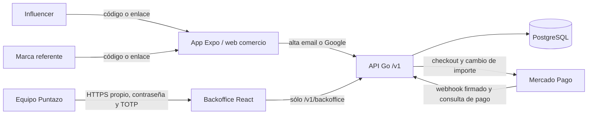

# Referidos con Backoffice independiente

**Estado al 27 de septiembre de 2026:** implementación en ramas de trabajo de
`app-loyalty`, `app-fidelidad` y `puntazo-preview`, más una web React/TypeScript
`puntazo-backoffice`. La validación local no equivale a un despliegue. El
Backoffice aún no tiene hostname HTTPS asignado, cuentas internas de operación
ni datos reales del piloto. El estado histórico de las demás páginas de este
portal corresponde a otra línea base y no prueba este candidato.

Cambios fuente revisables: `app-loyalty`
`78108b6a0b61c2d338de77dbbf349f70e19da94d` y `app-fidelidad`
`91d7731a12e9051c0f1284bcc9ec04f5fb1887ab`. La rama
`puntazo-preview/feat/referrals-preview` los integra con su código propio
de preview en `6518020ac68f17231f266884bcd6a359ef872cc1`. Estos
identificadores son de código, no de una versión servida.

La decisión de este piloto sólo abarca **referidos para Sellos**. No aprueba las
reglas generales de suscripciones y Backoffice marcadas `PROPUESTA CODEX`
`PC-02` y `PC-03` en la documentación principal.

## Contenedores y límites

`puntazo-preview` empaqueta `web`, `backoffice`, API y migraciones como
servicios separados. El proxy del Backoffice sólo permite el prefijo
`/v1/backoffice/`; API y PostgreSQL no tienen puertos públicos. La sesión
interna usa cookie HttpOnly, Secure y SameSite=Strict en HTTPS y un encabezado
de solicitud para mutaciones. Las cuentas de clientes y comerciantes no son
cuentas internas.

| Actor | Lectura | Cambios |
|---|---|---|
| `ADMIN_SISTEMA` | Campañas, influencers, códigos, atribuciones y recompensas | Crear y pausar campañas/códigos; crear influencers |
| `FINANZAS` | Resultados, recompensas y créditos | Registrar liquidación en efectivo o aplicación manual de crédito con evidencia |
| Influencer | Recibe código y reportes del equipo | Sin acceso al Backoffice |
| Marca referente | Ve y comparte sus códigos en la app | Sin acceso a campañas ni liquidaciones |

## Alta y datos

Email y Google aceptan `referral_code` opcional en el alta de marca. El enlace
de registro lo precarga y la pantalla permite ingresarlo o corregirlo. La API
valida que código y campaña estén activos, dentro de fechas y para el programa
elegido. Una marca tiene una sola atribución; guarda una copia de porcentajes
y cantidades en `referral_attributions`. Pausar un código bloquea nuevas altas
sin modificar atribuciones anteriores. Cada marca recibe un código para
referir otros comercios durante una campaña activa.

El referente comparte `?ref=CODIGO`; la app lo lleva al alta email o Google.
La API valida la campaña y, en la misma transacción del alta, crea marca,
atribución única y código propio. La respuesta llega con las condiciones ya
congeladas en PostgreSQL.

El piloto propuesto se crea desde Backoffice con una ventana de **90 días**,
programa `SELLOS`, `discount_bps=5000`, `discount_charges=3`,
`reward_bps=2000` y `reward_charges=12`. El precio de prueba es **ARS 25.000 por
sucursal activa**. La campaña no se crea automáticamente: el equipo debe fijar
fecha de inicio y fin antes de abrir las altas. Los porcentajes y duraciones
pueden cambiarse en campañas nuevas sin alterar las atribuciones existentes.

## Cobros y recompensas

Durante el acceso gratuito se registran altas y atribuciones, sin saldo
pagadero. Al habilitar facturación, la app muestra el precio vigente antes del
checkout. La API verifica notificaciones de pago recurrente contra los recursos
del proveedor y registra cada factura/pago de forma idempotente. Los primeros
tres cobros aprobados usan 50% de descuento; después del tercero se solicita
al proveedor el importe completo para el cuarto. Los primeros doce cobros
aprobados generan 20% del importe efectivamente cobrado. Pagos fallidos o
períodos gratis no generan recompensa. Una devolución anula una recompensa
pendiente; si ya se liquidó, queda una recuperación por resolver.

El saldo de un influencer es una comisión en efectivo, liquidada por Finanzas
después de una transferencia externa. La recompensa de una marca referente es
un crédito auditable. **Mercado Pago no tiene en esta integración una operación
documentada que garantice descontar un crédito de la próxima factura recurrente.**
Finanzas puede registrar una compensación manual contra una factura ya pagada,
con referencia externa e idempotencia. Esto todavía no equivale a un descuento
automático en la factura de Mercado Pago y debe comunicarse así al comercio.

El resumen del piloto muestra marcas atribuidas, pagadoras, continuadoras,
primer cobro a precio completo, referidos de comercios y costo de descuentos y
recompensas. Se debe seguir la cohorte durante las altas de 90 días hasta su
primer cobro completo. La conversión a pago y continuidad se calculan sobre
los cobros verificados, no sobre suscripciones anunciadas por el proveedor.

## Gates antes de abrir el piloto

1. Revisar migraciones, contrato OpenAPI, roles y auditoría en la rama integrada.
2. Ejecutar pruebas de altas email/Google, atribución única, pausa y congelación
   de beneficios, así como las de cobros 1 a 4 y 12 a 13, fallos y devoluciones.
3. Verificar la imagen del Backoffice y su proxy en un hostname HTTPS propio;
   crear cuentas internas con TOTP y comprobar que cuentas comerciales no entran.
4. Configurar secretos de Mercado Pago, completar una ronda de sandbox con
   webhooks firmados y comparar importes facturados antes de activar cobros.
5. Registrar el SHA obtenido del HEAD remoto actual al construir y desplegar.
   La rama de trabajo, un build local o una ruta OpenAPI no son evidencia de
   versión servida en testing.

**Pendiente de aceptación operativa:** hostname y control de acceso interno,
cuentas del equipo, campaña de 90 días, sandbox de cobros y procedimiento de
compensación manual de créditos. No hay portal para influencers en esta versión.
