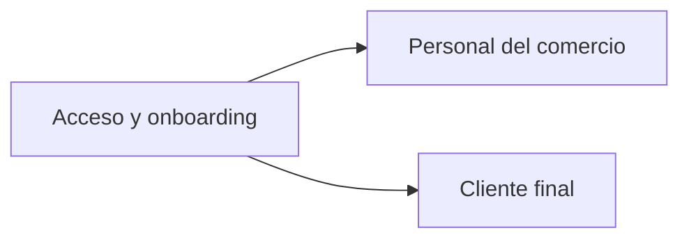

# Flujos del frontend

Los flujos están separados por intención de usuario y no por carpeta técnica.

```mermaid
flowchart LR
    AUTH["Acceso y onboarding"]
    MERCHANT["Personal del comercio"]
    CUSTOMER["Cliente final"]

    AUTH --> MERCHANT
    AUTH --> CUSTOMER

    click AUTH href "#/flow-auth" "Abrir acceso"
    click MERCHANT href "#/merchant-flows" "Abrir comercio"
    click CUSTOMER href "#/customer-flows" "Abrir cliente"
```
