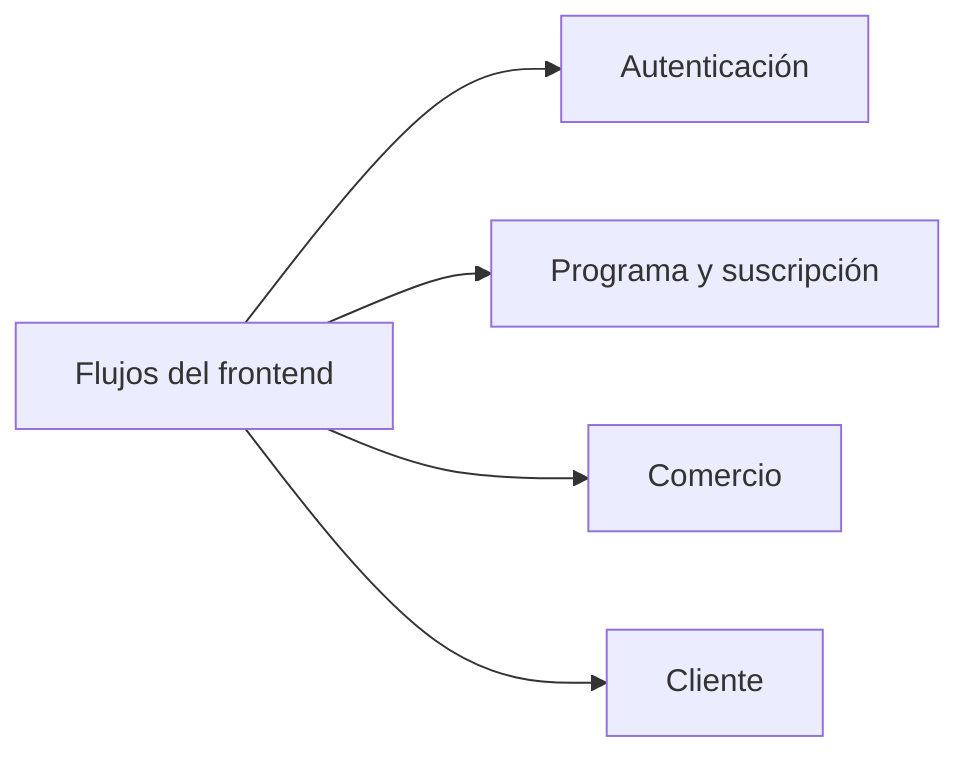

# Flujos del frontend

Revisión de fuentes y runtime del **02/10/2026, 22:30–22:33 UTC**. Los SHA y las diferencias por ambiente están en [Estado observado](#/runtime-snapshot). Esta revisión describe arquitectura e integración; no certifica todos los invariantes de negocio ni ejecuta operaciones sobre cuentas reales.

- [Autenticación](#/flow-auth)
- [Programa y suscripción](#/flow-plan-selection)
- [Comercio](#/merchant-flows)
- [Cliente](#/customer-flows)

## Referencias de código

- [Router y navegación](https://github.com/gonzalotev/app-fidelidad/blob/main/app/(tabs)/_layout.tsx)
