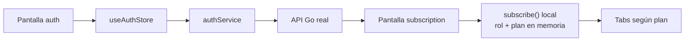

# Frontend · Acceso y onboarding

La autenticación es real. La selección de plan posterior al login es local y todavía no llama al backend.

## Referencias de código

- [La pantalla navega siempre a suscripción](https://github.com/gonzalotev/app-fidelidad/blob/afec4792729b48de4646168846ab221c96352f51/app/(auth)/index.tsx#L31-L76)
- [Auth service conectado](https://github.com/gonzalotev/app-fidelidad/blob/afec4792729b48de4646168846ab221c96352f51/src/features/auth/services/authService.ts#L82-L121)
- [Mutación local de plan y rol](https://github.com/gonzalotev/app-fidelidad/blob/afec4792729b48de4646168846ab221c96352f51/src/features/auth/store/useAuthStore.ts#L66-L98)
