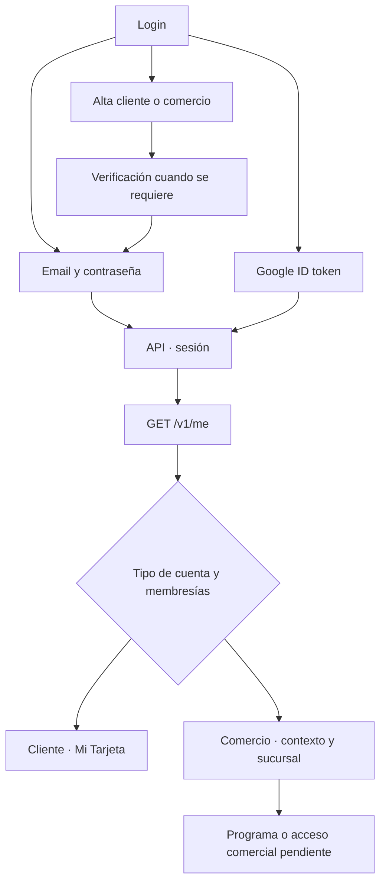

# Autenticación y onboarding

```mermaid
flowchart TD
 A[Login] --> E[Email y contraseña]
 A --> G[Google ID token]
 A --> R[Alta cliente o comercio]
 R --> V[Verificación cuando se requiere]
 E --> API[API · sesión]
 G --> API
 V --> E
 API --> ME[GET /v1/me]
 ME --> C{Tipo de cuenta y membresías}
 C --> U[Cliente · Mi Tarjeta]
 C --> M[Comercio · contexto y sucursal]
 M --> P[Programa o acceso comercial pendiente]
```

El alta de cliente usa `/v1/auth/register`; el alta comercial usa `/v1/demo/comercios`, con clave idempotente. Google tiene su propia validación y selección de tipo cuando corresponde. Si la respuesta requiere verificar email, el frontend conserva el resultado pendiente y no inventa una sesión. Tras login consulta identidad y marcas. Primer login/trial se registran en backend; no se reinician desde una selección local.

Ver [registro](#/sequence-register), [login](#/sequence-login), [Google](#/sequence-google) y [restauración](#/sequence-restore).

Revisión de fuentes y runtime del **02/10/2026, 22:30–22:33 UTC**. Los SHA y las diferencias por ambiente están en [Estado observado](#/runtime-snapshot). Esta revisión describe arquitectura e integración; no certifica todos los invariantes de negocio ni ejecuta operaciones sobre cuentas reales.

## Referencias de código

- [Implementación frontend](https://github.com/gonzalotev/app-fidelidad/blob/main/src/features/auth/store/useAuthStore.ts)
- [Rutas API](https://github.com/am-p/app-loyalty/blob/main/cmd/server/router.go)
