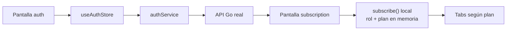

# Frontend · Acceso y onboarding

## Actualización de códigos · rama pendiente de integrar

Nombre y apellido se capturan por separado y permanecen en memoria durante la
elección del tipo. Clientes envían apellido; propietarios owner_last_name;
Google completa faltantes del perfil verificado. Los logins existentes no piden
apellido ni convierten tipo de cuenta.

Fuente y estado: [reconciliación de códigos](#/user-codes-reconciliation).
Implementado y probado en las ramas seleccionadas; no desplegado.

## Referencia histórica anterior a esta entrega

El material siguiente describe la revisión documental anterior. No confirma
el estado actual de main ni del runtime; contrastar con la rama elegida.

```mermaid
flowchart LR
    FORM["Pantalla auth"] --> STORE["useAuthStore"]
    STORE --> SERVICE["authService"]
    SERVICE --> API["API Go real"]
    API --> PLAN["Pantalla subscription"]
    PLAN --> LOCAL["subscribe() local\nrol + plan en memoria"]
    LOCAL --> TABS["Tabs según plan"]

    click API href "#/sequence-register" "Ver registro backend"
    click PLAN href "#/flow-plan-selection" "Ver selección de plan"
```

La autenticación es real. La selección de plan posterior al login es local y todavía no llama al backend.

## Referencias de código

- [La pantalla navega siempre a suscripción](https://github.com/gonzalotev/app-fidelidad/blob/main/app/(auth)/index.tsx#L31-L76)
- [Auth service conectado](https://github.com/gonzalotev/app-fidelidad/blob/main/src/features/auth/services/authService.ts#L82-L121)
- [Mutación local de plan y rol](https://github.com/gonzalotev/app-fidelidad/blob/main/src/features/auth/store/useAuthStore.ts#L66-L98)
