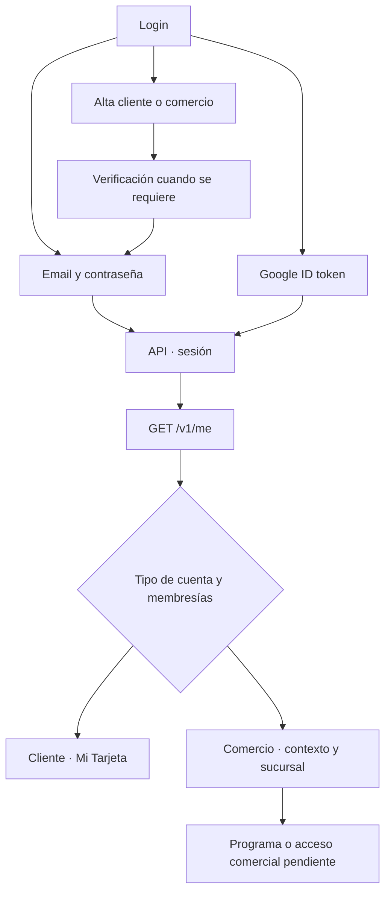

# Autenticación y onboarding

```mermaid
flowchart TD
 A[Login] --> E[Email y contraseña]
 A --> G[Google ID token]
 A --> R[Alta cliente o comercio]
 R --> V[Verificación cuando se requiere]
 E --> API[API · sesión]
 G --> API
 V --> E
 API --> ME[GET /v1/me]
 ME --> C{Tipo de cuenta y membresías}
 C --> U[Cliente · Mi Tarjeta]
 C --> M[Comercio · contexto y sucursal]
 M --> P[Programa o acceso comercial pendiente]
```

El alta de cliente usa `/v1/auth/register`; el alta comercial usa `/v1/demo/comercios`, con clave idempotente. Google valida el ID token y resuelve la cuenta sin autovincular por coincidencia de email. El candidato backend añade vinculación explícita (`POST /v1/auth/google/link`, contraseña Puntazo + ID token) y reautenticación (`POST /v1/auth/reauthenticate`, contraseña o ID token del mismo `sub`); una colisión requiere acción explícita y no reemplaza identidades. Si la respuesta requiere verificar email, el frontend conserva el resultado pendiente y no inventa una sesión. Tras login consulta identidad y marcas. Primer login/trial se registran en backend; no se reinician desde una selección local.

Ver [registro](#/sequence-register), [login](#/sequence-login), [Google](#/sequence-google) y [restauración](#/sequence-restore).

Revisión base de fuentes y runtime del **02/10/2026, 22:30–22:33 UTC**; remediación de identidad integrada en candidato backend al **07/10/2026**, API testing desplegada como `3d77120b…`, ready/healthy schema0035; flujo de Google real todavía no probado. Un ejercicio de recent-auth/delete registró 401 `RECENT_AUTH_REQUIRED` para sesión antigua, reauth 200, token anterior 401 y delete 202 con `access_revoked=true`; `ledger_preserved=false` es el resultado esperado del privacy overlay testing `0035` (borra historial/tarjetas propias, conserva ledger ajeno con operador anonimizado; fuente legacy sin overlay difiere). SQL read-only confirmó el fixture 4: una cuenta sintética inactiva, credenciales password/Google/QR limpiadas, `auth_version > 1`, cuatro sesiones totales/cero no revocadas, journal 1/cards 0/operator attribution 0. El arnés no hizo un GET bearer post-delete; la revocación está verificada por SQL y middleware. Evidencia: `artifacts/testing-sensitive-action-acceptance.json` y `artifacts/recent-auth-fixture4-readonly.jsonl`. Los SHA y las diferencias por ambiente están en [Estado observado](#/runtime-snapshot). Esta revisión describe arquitectura, integración y health del servicio; no certifica todos los invariantes de negocio ni implica una prueba Google real en runtime.

## Referencias de código

- [Implementación frontend](https://github.com/gonzalotev/app-fidelidad/blob/main/src/features/auth/store/useAuthStore.ts)
- [Rutas API](https://github.com/am-p/app-loyalty/blob/main/cmd/server/router.go)
