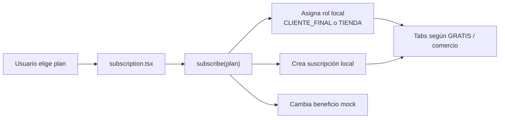

# Frontend · Selección de plan

No existe hoy un `POST` de suscripción. Tampoco se envía al backend si el registro corresponde a cliente final o personal de marca. Ésta es una diferencia deliberadamente visible con el contrato objetivo.

## Referencias de código

- [Pantalla y opciones de plan](https://github.com/gonzalotev/app-fidelidad/blob/1db7717e1aa28c2c1be7ba3538bfe9e22e0d0a01/app/(auth)/subscription.tsx#L10-L114)
- [Suscripción local y cambio de rol](https://github.com/gonzalotev/app-fidelidad/blob/1db7717e1aa28c2c1be7ba3538bfe9e22e0d0a01/src/features/auth/store/useAuthStore.ts#L66-L98)

## Contrato objetivo

`PR-01` reemplaza esta pantalla en la primera release: el cliente final continúa
gratuito y el alta comercial usa un código de acceso. El backend fija el acceso en
cero, no crea billing y no acepta precio, renovación ni estado de pago desde el
cliente. `PC-03` y toda suscripción comercial permanecen diferidos.
